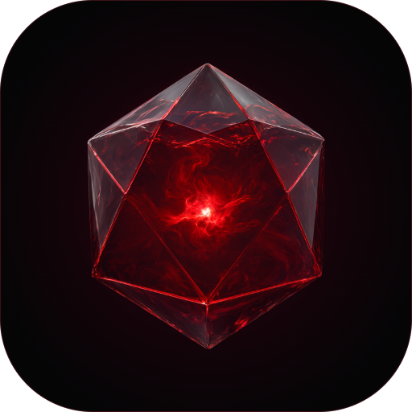
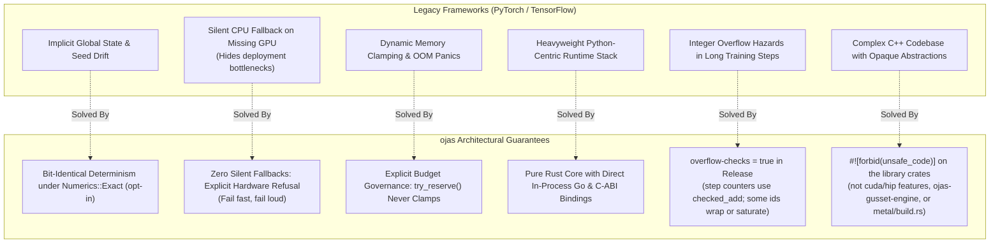
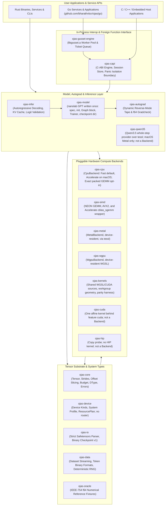
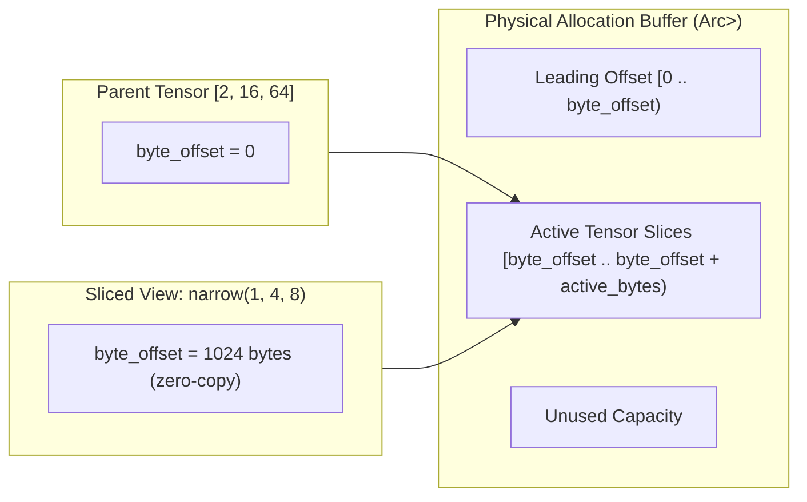
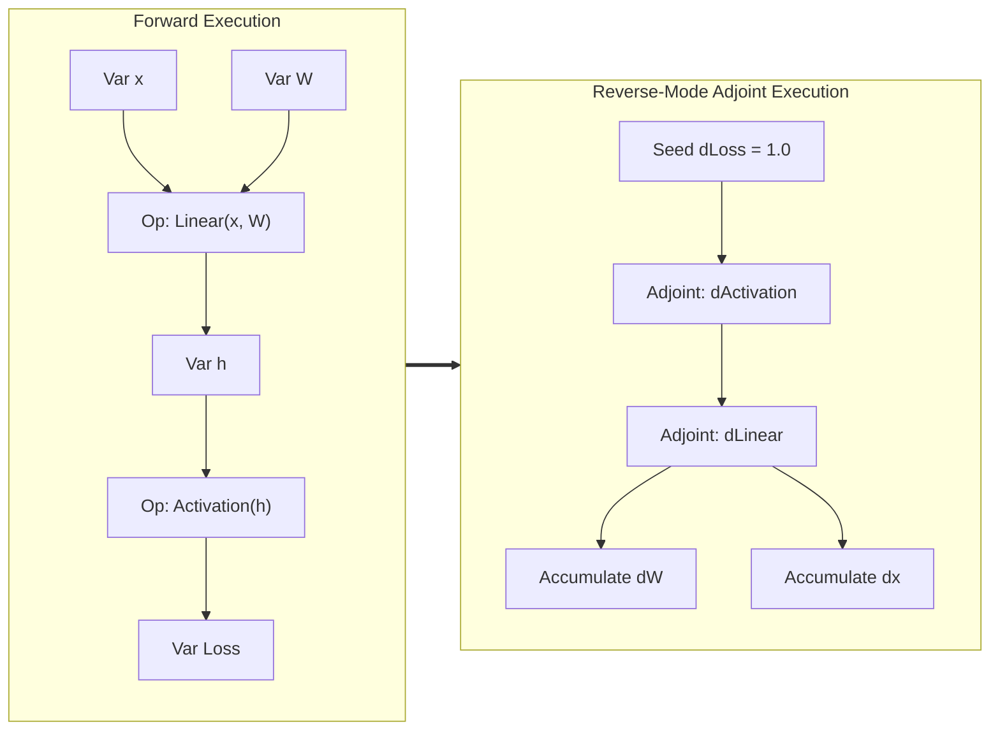
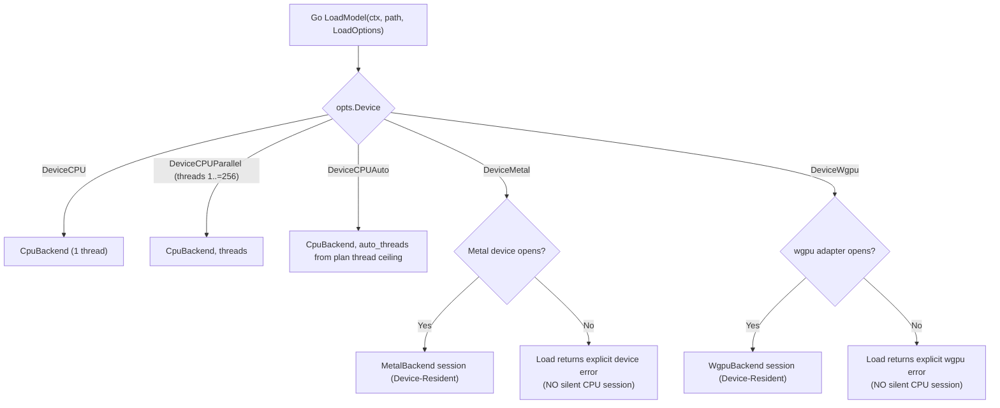
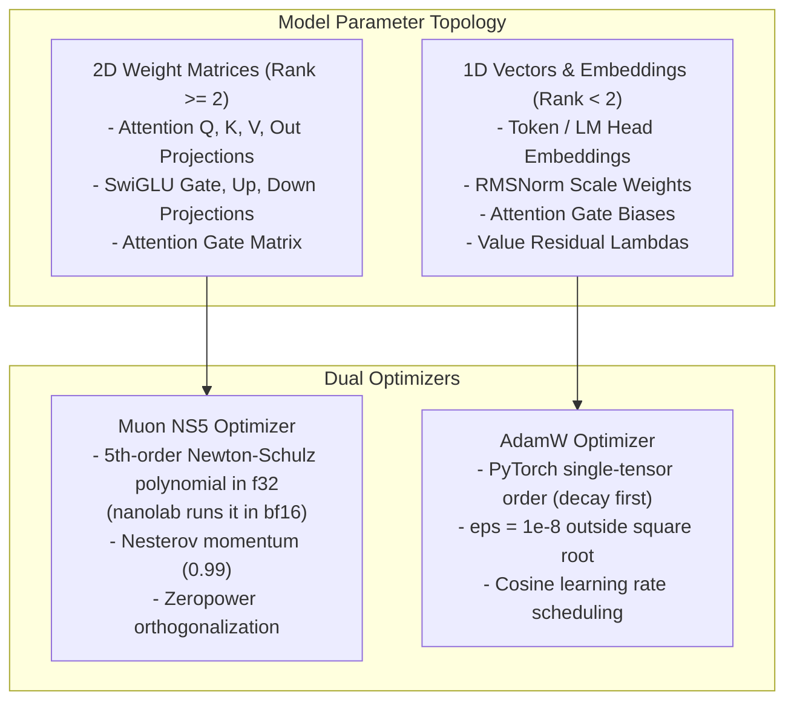
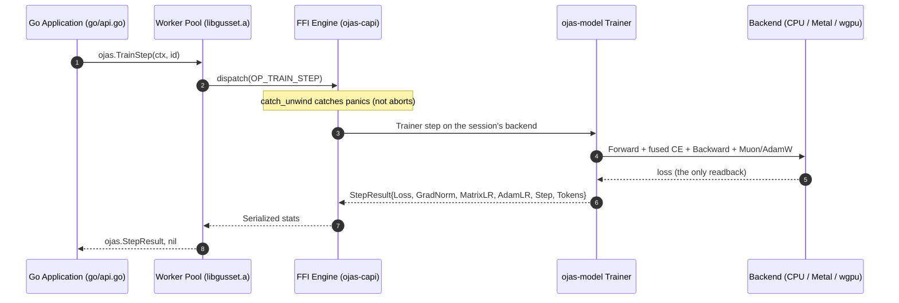

# ojas

<p align="center">
  
</p>

**ojas** (vital energy, the essence training spends) is a deterministic, high-performance **Rust deep learning engine and framework** designed as a safe, modern alternative to PyTorch and TensorFlow for systems research and, as the gaps below close, training and edge inference.

ojas pairs a compile-time safe Rust engine with an in-process Go API via `gusset`, zero-copy tensor views, reverse-mode automatic differentiation, and strict memory budgeting.

**What runs today:**
- Every `Backend` op runs on the CPU, on Apple Silicon Metal, and on wgpu: forward, backward, permute, clip, AdamW and Muon.
- The autograd `Tape` gradchecks a multi-head attention block.
- `ojas-model` defines the nanolab GPT once (spec, `state_dict` names, order-independent init, the block) and runs it two ways: recorded on the `Tape` for training, eagerly through `Eval` for decoding. Its `Trainer` takes Muon + AdamW steps on any `Backend` and saves and resumes a checkpoint directory.
- The Go API drives that model in process: `LoadModel` or `NewModel` (`DeviceCPU`, `DeviceCPUParallel`, `DeviceCPUAuto`, `DeviceMetal`, `DeviceWgpu`), `OpenTrainer`, `TrainStep`, `SaveCheckpoint` and `Resume`, a GPT-2 tokenizer, and sampled `GenerateIDs`. Metal and wgpu fail closed when no device opens.
- `ojas-infer` decodes a nanolab-architecture model on the CPU, greedy or sampled, with a KV cache.
- `ojas-qwen35` (macOS only) runs a Qwen3.5 whole training step through tessl's Metal kernels. It is a provider, not a `Backend`.

**What does not run yet:**
- bf16 compute: every backend computes in `f32`.
- A CUDA or HIP `Backend`: `ojas-cuda` and `ojas-hip` are probes.
- Everything else on the ranked gap list below.

The ranked list of gaps, and what has closed since it was written, is in [`docs/pytorch-parity-plan.md`](docs/pytorch-parity-plan.md).

**Against PyTorch MPS on the GPU** ([`docs/bench-gpu-vs-torch.md`](docs/bench-gpu-vs-torch.md), measured under heavy external GPU load, so only direction is verified):
- ojas is slower on most rows. In round 3 (the latest), a nanolab block forward + backward ran at 0.92× torch's speed on Metal (mixed) and 0.41× on wgpu; the earlier optimization rounds measured 0.37× and 0.18×. Round 3's GPU read 100% busy, so only the direction is verified.
- It is faster on Metal attention backward, `clip_grad_norm` and AdamW. CUDA is one affine kernel behind a feature, and HIP is a copy probe; neither implements `Backend`.

```
Status:          Kernel set, backends, nanolab model, trainer, adaptive resource planning and Go API built; remaining gaps in docs/pytorch-parity-plan.md
Verification:    adaptive lane gate E (docs/adaptive-resources.md), 2026-10-02: 1100+ passed across workspace crates; ojas-capi 77/77; ojas-device 72/72; ojas-model 78/78; Go 41/41; clippy -D warnings clean
Host Target:     Apple M5 Pro (Metal 4), macOS 27 (Darwin 27.0.0 arm64)
Interactive App: https://ojas.vbcr.dev (Alternate: https://bharath.vbcr.dev/ojas)
License:         MIT OR Apache-2.0
```

> **Explore the Interactive Web Experience:** The [**ojas interactive documentation**](https://ojas.vbcr.dev) has live labs for each guarantee: bit-identical reductions across thread counts, memory budget refusal, no silent device fallback, the Go panic firewall, and checked shape arithmetic, plus the CPU versus PyTorch timings.

---

## Why ojas? (A PyTorch & TensorFlow Alternative)

Mainstream frameworks like PyTorch and TensorFlow carry decades of legacy baggage: hidden global state, silent CPU fallbacks that mask hardware misconfigurations, nondeterministic multithreaded reductions, memory fragmentation, and cumbersome multi-language bindings that rely on heavyweight Python runtimes.

ojas is engineered from first principles with radical architectural guarantees:



> [!IMPORTANT]
> **Deterministic Bit-Identicality:** `CpuBackend` defaults to `Numerics::Fast`: FMA, and on macOS Accelerate for GEMMs of at least 2^13 multiply-adds (`ojas_cpu::FAST_WHOLE_CALL_MACS`), as PyTorch's CPU `linear` does. Opt into `Numerics::Exact` with `.with_numerics(Numerics::Exact)` for single-threaded-order, index-increasing accumulation. Under Exact, identical seeds give identical bits across thread counts and machines. The C/Go API has no numerics selector, so C and Go callers get Fast.
> 
> **Zero Silent Fallback:** Selecting a GPU backend (Metal, wgpu, CUDA, HIP) that cannot be initialized returns an explicit error immediately. It will **never silently downgrade to CPU execution**.

---

## Framework Architecture

ojas is structured as a modular stack of focused, single-responsibility crates:



---

## Core Capabilities & Subsystems

### 1. General-Purpose Tensor Engine (`ojas-core`)
* **Zero-Copy Views:** Tensor representations track an explicit `byte_offset`. Sub-views created via `.narrow()` adjust byte offsets without memory re-allocation or buffer copying.
* **Strict Memory Budgets:** Memory consumption is governed by an explicit `Budget`. When an allocation exceeds limits, `try_reserve()` returns `OjasError::CapacityExceeded` immediately rather than swapping or resizing.
* **Type System:** `DType` tags `F32`, `Bf16`, `F16` and `U32`. Every backend computes in `F32` (token ids in `U32`) and refuses other dtypes. `ojas-io` decodes BF16/F16 safetensors to `f32` and encodes back with round-to-nearest-even. There is no bf16 compute path yet.
* **Device Tensors:** `Tensor::from_device` wraps a backend's buffer. `to_host` copies it back and is counted by `device_readbacks()`. `device_buffer_mut` requires sole ownership of the storage. The default `Backend::upload` returns `Unsupported` for a host tensor on a non-CPU backend; there is no CPU fallback.



> [!NOTE]
> All tensor allocations must request permits from a `Budget`. If an allocation exceeds available capacity, `try_reserve()` returns `Err(OjasError::CapacityExceeded)`. Infallible runtime calls (`vec!`, `format!`, `thread::spawn`) operate outside this budget and can still abort if physical host RAM is exhausted.

---

### 2. Reverse-Mode Automatic Differentiation (`ojas-autograd`)
* **Tape-Based Computation Graph:** Dynamic tape recording variable nodes (`Var`) and operational adjoints for forward and reverse sweeps.
* **Numerical Gradcheck Oracle:** Analytical f32 gradients are verified against double-precision (`f64`) central finite differences, ensuring mathematical soundness down to machine tolerances.
* **Device Tape Residency:** On non-CPU backends (`MetalBackend`, `WgpuBackend`), `leaf` and input tensors are uploaded once. Reshape is a zero-copy view. The backward seed is uploaded, and non-root cross-entropy gradients are scaled on the device using rank-1 linears. Intermediate activations stay resident on GPU; the loss download is the only audited readback.



---

### 3. Native & Portable Hardware Backends
* **CPU (`ojas-cpu`):** `CpuBackend` defaults to `Numerics::Fast`; `Numerics::Exact` (opt-in) uses a packed GEMM on a persistent thread pool; bit-identical to pre-change golden digests at thread counts 1, 2, 3, 7, 16, and 18. `Numerics::Fast` on macOS sends products of $\ge 2^{13}$ multiply-adds (`FAST_WHOLE_CALL_MACS`) to Apple Accelerate `cblas_sgemm`; smaller Fast products stay on `tile_fast`. Off macOS the cutoff is $2^{21}$.
* **SIMD (`ojas-simd`):** Fast-tier GEMM kernels including ARM64 NEON (~110 GFLOP/s single thread), x86_64 AVX2+FMA, portable FMA fallback, and Apple Accelerate wrapper.
* **Metal (`ojas-metal`):** `MetalBackend` implements every `Backend` op on device tensors through `tessl` GEMM and its own `.metal` kernels. Causal attention is a tiled TensorOps forward plus a FlashAttention-2-style backward, with no `T×T` scores stored, at head dims up to 128. Numerics `Fast`.
* **wgpu (`ojas-wgpu`):** `WgpuBackend` keeps tensors device-resident and executes portable WGSL compute shaders. Numerics `Fast`, tolerance 1e-4 relative against CPU. Muon NS5 runs in f32 and is checked against `CpuBackend` (`ojas-wgpu/tests/muon.rs`). A non-finite result is reported at the next `sync`, `download` or `clip_grad_norm`, naming the first op that produced it (`ojas-wgpu/tests/faults.rs`).
* **Kernels (`ojas-kernels`):** WGSL shader modules for `WgpuBackend` (`ojas-kernels/src/wgsl/`), workgroup grid calculations, and a parity harness whose comparison fails on any non-finite value.
* **CUDA & HIP (`ojas-cuda`, `ojas-hip`):** Isolated probes behind optional compile flags (`--features cuda`, `--features hip`). Neither implements `Backend` and neither is reachable from Go.



> [!WARNING]
> Metal and wgpu attention enforce a strict head dimension limit ($d_{\text{head}} \le 128$, `METAL_MAX_HEAD_DIM`). A larger head dimension returns `Err(OjasError::UnsupportedHeadDim)`; nothing is clamped or truncated. The tiny Metal training step in `ojas-metal/src/gpu.rs` keeps its own limit of 64.

---

### 4. Dual Optimizer Architecture (`ojas-cpu`)

Model parameters are automatically partitioned across two distinct optimizers based on tensor rank:



* **Step Counter Safety:** `next_step` performs checked integer addition, returning `OjasError::OutOfRange` at `u64::MAX`.
* **Safe Gradient Clipping:** Global gradient norm clipping includes a regularizer (`CLIP_GRAD_NORM_EPS = 1e-6`) to prevent division by zero.
* **Moment Protection:** If an update evaluates to non-finite numbers, the step aborts before optimizer moments are modified.

---

### 5. In-Process Multi-Language Integration (`go/`, `ojas-capi`)
* **Zero-IPC Overhead:** Go calls the Rust engine in-process through CGO and `gusset`. Go sends paths, token ids and options; the engine holds each model on its device. The calls are `LoadModel`/`NewModel`, `OpenTrainer`, `TrainStep`, `SaveCheckpoint`/`Resume`, `LoadTokenizer`/`Tokenize`/`Detokenize`, `GenerateIDs`, `SystemProfile`, `SetMemoryCeiling`, `Free`, and `Close` (see [`go/README.md`](go/README.md)). The old stub `Step` opcode is retired.
* **Device Selection:** `LoadOptions.Device` selects `DeviceCPU`, `DeviceCPUParallel`, `DeviceCPUAuto`, `DeviceMetal` or `DeviceWgpu`. `DeviceCPUAuto` automatically sizes CPU pool threads to the system thread ceiling (usable CPUs capped by cgroup quota). A GPU backend that cannot open is an error, never a CPU model. A step reads back only its loss.
* **One Memory Ceiling & Pressure Admission:** Every model's `BudgetBytes` is a child of a process-wide ceiling (default 1 GiB, or machine hard limit `hard_memory_limit` if smaller). `SetMemoryCeiling` raises it and is refused for 0, while any model is open, or if `bytes` exceeds physical RAM/cgroup limits (`ErrCapacity`). Under critical kernel memory pressure (`ErrPressure`), calls that allocate are refused before starting while `SaveCheckpoint` and `Free` continue to run.
* **Preflight & Step Budget Tracking:** Model load/new preflights parameter size against session budget before device allocation; `Trainer` preflights total state and optimizer scratch (`optimizer_scratch_bytes`), measuring high-water peak usage (`Budget::peak_bytes`) per step without memory leaks.
* **Panic Boundary Isolation:** Rust panics on worker threads are caught by `catch_unwind`, preventing host Go process crashes. The handle is then poisoned (`gusset.ErrPoisoned`) until closed.



> [!CAUTION]
> If a worker thread panics while holding the `ojas-capi` session table lock, the next lock acquisition **clears every session in the table** to prevent stale state corruption. `catch_unwind` cannot catch OS process aborts, stack overflows, or infallible memory allocation panics.

---

### 6. Target Model: nanolab Default GPT

The v1 target is the **124M parameter nanolab default GPT** (12 layers, width 768, 12 heads of 64, SwiGLU 2048, vocabulary 50304, tied embedding). [`ojas-model`](ojas-model) implements it once: `ModelSpec::nanolab_124m` and a small CI `ModelSpec::tiny`, nanolab `state_dict` names (so torch exports load unchanged), the block over a `Graph` trait, and a `Trainer`. CI runs the tiny spec and a checked-in 40 KB fixture (2 layers, d 16, vocabulary 64); docs/status.md records no full 124M training run. [`docs/framework-design.md`](docs/framework-design.md) has the design and [`docs/shape-contract.md`](docs/shape-contract.md) the shape rules every backend shares. `CpuGpt` in `ojas-infer` is the fast CPU decoder. The Metal training step in `ojas-metal/src/gpu.rs` is a separate tiny pre-norm block at width 128 with two heads, vocabulary at most 128 and sequence at most 16. The block below is the nanolab layer:

```mermaid
flowchart TD
    subgraph TransformerBlock["nanolab GPT Transformer Layer"]
        In["Input x [B, T, D]"] --> Norm1["RMSNorm (eps = 1e-6)"]
        
        subgraph AttnBlock["Gated Causal Attention Mixer"]
            Norm1 --> QKV["Q, K, V Projections [B, T, H, d]"]
            QKV --> RoPE["Half-Split RoPE"]
            RoPE --> QKN["RMS QK-Norm"]
            QKN --> SDPA["Causal Scaled Dot-Product Attention"]
            
            Norm1 --> Gate["Linear Gate + Bias: sigmoid(x W_g + b_g)"]
            SDPA --> GatedAttn["Per-Head Gated Attn = SDPA * Gate"]
            Gate --> GatedAttn
            
            GatedAttn --> VR["Value Residual: lerp(Attn, V0, sigmoid(vr_lambda))"]
            VR --> OutProj["Output Projection"]
        end
        
        OutProj --> ResAdd1["Residual Add (+)"]
        In --> ResAdd1
        
        subgraph MLPBlock["SwiGLU MLP Mixer"]
            ResAdd1 --> Norm2["Post-RMSNorm"]
            Norm2 --> SwiGLU["SwiGLU: (x W_gate) * silu(x W_up) W_down"]
        end
        
        SwiGLU --> ResAdd2["Residual Add (+)"]
        ResAdd1 --> ResAdd2
        ResAdd2 --> Next["Next Layer Activations"]
    end
```



---

## Workspace Crate Catalog

Test counts are verified on this tree (adaptive lane Gate E / test suites, 2026-10-02): `cargo test -p <crate> -- --test-threads=2` and `cargo test -p <crate> --release --no-fail-fast -- --test-threads=1` with clippy `-D warnings` clean across the workspace. The Go count is `go test -a -tags gusset_pkgconfig ./...`. Details are in [`docs/adaptive-resources.md`](docs/adaptive-resources.md) and [`docs/status.md`](docs/status.md).

| Crate | Purpose | Key Symbols | Tests Run |
| :--- | :--- | :--- | :--- |
| [`ojas-core`](file:///Users/bharath/Code/research/ojas/ojas-core) | Core tensor engine & invariants | `Tensor` (host & device, typed host storage), `Backend` (`optimizer_scratch_bytes`), `Numerics`, `Budget` (`peak_bytes`, `reset_peak`, `check_room`), `DType`, `OjasError`, `shapes` validators | 113 passed, 2 ignored |
| [`ojas-cpu`](file:///Users/bharath/Code/research/ojas/ojas-cpu) | High-performance CPU backend | `CpuBackend`, `with_threads`, `with_numerics`, packed GEMM, Accelerate BLAS, cosine and WSD schedules, budget scratch & pool stress | 213 passed, 12 ignored |
| [`ojas-simd`](file:///Users/bharath/Code/research/ojas/ojas-simd) | SIMD GEMM kernels | NEON GEMM, AVX2, `sgemm_accelerate` | 20 passed |
| [`ojas-metal`](file:///Users/bharath/Code/research/ojas/ojas-metal) | Apple Silicon Metal backend | `MetalBackend` (every `Backend` op; tiled attention, D ≤ 128; deferred faults) | 154 passed |
| [`ojas-wgpu`](file:///Users/bharath/Code/research/ojas/ojas-wgpu) | Portable WGSL backend | `WgpuBackend` (device-resident WGSL compute; Muon NS5; named first fault) | 124 passed, 3 ignored |
| [`ojas-kernels`](file:///Users/bharath/Code/research/ojas/ojas-kernels) | Shared kernel geometry & sources | Launch geometry, kernel source, NaN-safe parity harness | 11 passed |
| [`ojas-autograd`](file:///Users/bharath/Code/research/ojas/ojas-autograd) | Reverse-mode tape & gradcheck | `Tape`, `Var`, `backward_seeded`, `take_grad`, fused head, `central_diff` (f64 oracle) | 67 passed |
| [`ojas-model`](file:///Users/bharath/Code/research/ojas/ojas-model) | The nanolab GPT, written once | `ModelSpec`, `param_table`, `init_params`, `Graph`, `Eval`, `block`, `Trainer` (`save`, `resume_from`, preflight room checks, step peak tracking) | 78 passed |
| [`ojas-io`](file:///Users/bharath/Code/research/ojas/ojas-io) | Formats & serialization | Streaming safetensors (F32/BF16/F16/I64/U16), Checkpoint v1, `replace_dir_with` | 76 passed |
| [`ojas-data`](file:///Users/bharath/Code/research/ojas/ojas-data) | Dataset ingestion & tokenization | Token bins, seeded resumable batch sampler, GPT-2 BPE, counter-based RNG | 26 passed |
| [`ojas-infer`](file:///Users/bharath/Code/research/ojas/ojas-infer) | Autoregressive inference | `CpuGpt` (nanolab block, GQA), KV cache, greedy and temperature/top-k/top-p sampling | 40 passed |
| [`ojas-qwen35`](file:///Users/bharath/Code/research/ojas/ojas-qwen35) | Qwen3.5 whole-step training provider | Config reader that refuses unsupported fields, tensor-name pre-flight, parameter groups, state on disk; tessl Metal only, not a `Backend`, empty off macOS | 26 passed, 8 ignored |
| [`ojas-capi`](file:///Users/bharath/Code/research/ojas/ojas-capi) | C-ABI dispatch & session store | `dispatch` opcodes (load, new, train, save, resume, tokenize, sample, system profile, memory ceiling), `DeviceCPUAuto`, preflight validation, typed error kinds (`ErrPressure`), panic firewall | 77 passed |
| [`ojas-gusset-engine`](file:///Users/bharath/Code/research/ojas/ojas-gusset-engine) | Go link archive | Umbrella staticlib `libgusset.a` for Go CGO integration | 0 tests (the Go suite covers it) |
| [`go/`](file:///Users/bharath/Code/research/ojas/go) | Go client SDK | `LoadModel`, `NewModel`, `OpenTrainer`, `TrainStep`, `SaveCheckpoint`, `Resume`, `GenerateIDs`, `SystemProfile`, `SetMemoryCeiling`, `Free`, `Close`; `DeviceCPUAuto`, `ErrPressure` | 41 passed |
| [`ojas-device`](file:///Users/bharath/Code/research/ojas/ojas-device) | Device kinds, system profile & resource planning | `Device`, `probe_system` (memory, CPU clusters, caches, unified memory, pressure), `measure_bandwidth` (bounded 2 shared buffers, row-split copy), `ResourcePolicy`, `ResourcePlan`, `GemmBlocks` | 72 passed (macOS; 66 on Linux) |
| [`ojas-oracle`](file:///Users/bharath/Code/research/ojas/ojas-oracle) | Mathematical fixtures | IEEE-754 f64 oracle data fixtures | 40 passed, 1 ignored |
| [`ojas-cuda`](file:///Users/bharath/Code/research/ojas/ojas-cuda) | CUDA probe | One affine kernel behind feature `cuda`; not a `Backend` | 8 passed (feature off) |
| [`ojas-hip`](file:///Users/bharath/Code/research/ojas/ojas-hip) | HIP probe | Copy probe behind feature `hip`; no kernel; not a `Backend` | 8 passed (feature off) |

The dropped scaffold crates `ojas-nn`, `ojas-optim` and `ojas-engine` are gone; the model layer lives in `ojas-model`.

---

## Verification & Test Commands

The per-crate command below is how the counts above were produced (run 4: 1071 passed, 0 failed). `cargo clippy --workspace --all-targets -- -D warnings` and `cargo fmt --all --check` are clean across the workspace. `ojas-qwen35` needs macOS with Apple silicon and the sibling `tessl` checkout.

```bash
# Run one crate's suite in release mode (how docs/status.md counts are taken)
cargo test -p ojas-model --release --no-fail-fast -- --test-threads=1

# Run the complete workspace test suite in release mode
cargo test --workspace --release -- --test-threads=1
```

### In-Process Go Client Tests

```bash
# 1. Build the umbrella Rust static library archive
cargo build -p ojas-gusset-engine

# 2. Run the Go tests with pkg-config linking against target/debug/libgusset.a
cd go && PKG_CONFIG_PATH="$PWD" go test -a -tags gusset_pkgconfig -count=1 -timeout 15m ./...
```

> [!CAUTION]
> The `-a` flag is **mandatory** when testing Go bindings because Go's build cache does not monitor changes to `libgusset.a`. `go/gusset.pc` links Apple frameworks; on Linux systems use `PKG_CONFIG_PATH="$PWD/linux"`.

---

## Documentation & Web Directory

* [**Interactive Documentation**](https://ojas.vbcr.dev) ([`site/index.html`](file:///Users/bharath/Code/research/ojas/site/index.html)) — Live labs for determinism, memory budgets, device refusal, the panic firewall, and checked shapes, plus the benchmark comparison.
* [`docs/web-and-domain.md`](file:///Users/bharath/Code/research/ojas/docs/web-and-domain.md) — Domain architecture, CNAME routing (`ojas.vbcr.dev`), and deployment topology.
* [`docs/architecture.md`](file:///Users/bharath/Code/research/ojas/docs/architecture.md) — Comprehensive architectural specification and memory layout.
* [`docs/status.md`](file:///Users/bharath/Code/research/ojas/docs/status.md) — Verification run logs, test matrices, and machine profile.
* [`docs/adaptive-resources.md`](file:///Users/bharath/Code/research/ojas/docs/adaptive-resources.md) — System profiling, adaptive resource planning, CPU topology, cache sizing, copy bandwidth, and unified memory governance.
* [`docs/bench-cpu-vs-torch.md`](file:///Users/bharath/Code/research/ojas/docs/bench-cpu-vs-torch.md) — Benchmarks against PyTorch 2.13 CPU (tiny and larger step, single linear), plus Fast/Accelerate, Metal, and wgpu numbers taken under machine load.
* [`docs/op-coverage.md`](file:///Users/bharath/Code/research/ojas/docs/op-coverage.md) — Mathematical specification of core operators and reference models.
* [`docs/checkpoint-v1.md`](file:///Users/bharath/Code/research/ojas/docs/checkpoint-v1.md) — Binary checkpoint specification and framing.
* [`docs/dtype-policy.md`](file:///Users/bharath/Code/research/ojas/docs/dtype-policy.md) — Data types, precision policies, and epsilon invariants.
* [`docs/backends.md`](file:///Users/bharath/Code/research/ojas/docs/backends.md) — Hardware support matrix, adopted libraries, and backend dispatch.
* [`docs/framework-design.md`](file:///Users/bharath/Code/research/ojas/docs/framework-design.md) — The approved framework layer: `ojas-model`, the `Graph` block, the trainer, names, init and the checkpoint directory.
* [`docs/pytorch-parity-plan.md`](file:///Users/bharath/Code/research/ojas/docs/pytorch-parity-plan.md) — Ranked gaps against what training and inference need, with verified, inferred and unverified labels.
* [`docs/shape-contract.md`](file:///Users/bharath/Code/research/ojas/docs/shape-contract.md) — One shape validator per `Backend` op, run before any budget or dispatch.
* [`docs/typed-storage-plan.md`](file:///Users/bharath/Code/research/ojas/docs/typed-storage-plan.md) — Typed host storage (`f32`, `u32`, `u16`) and the bounded readback and load pieces.
* [`docs/metal-deferred-faults.md`](file:///Users/bharath/Code/research/ojas/docs/metal-deferred-faults.md) — Metal's deferred-fault contract, matching wgpu.
* [`docs/bench-gpu-vs-torch.md`](file:///Users/bharath/Code/research/ojas/docs/bench-gpu-vs-torch.md) — Metal and wgpu against PyTorch MPS at nanolab shapes.
* [`docs/cuda-backend-scoping.md`](file:///Users/bharath/Code/research/ojas/docs/cuda-backend-scoping.md) — Design-only scoping of a CUDA backend (no kernel written).
* [`docs/audit-resources.md`](file:///Users/bharath/Code/research/ojas/docs/audit-resources.md) — What the resource governor locks, with verified and reported rows. Earlier audits: [`audit-phase2`](file:///Users/bharath/Code/research/ojas/docs/audit-phase2.md), [`audit-phase3`](file:///Users/bharath/Code/research/ojas/docs/audit-phase3.md), [`audit-close`](file:///Users/bharath/Code/research/ojas/docs/audit-close.md), [`audit-cpu-hot`](file:///Users/bharath/Code/research/ojas/docs/audit-cpu-hot.md), [`audit-larger-step`](file:///Users/bharath/Code/research/ojas/docs/audit-larger-step.md).
* [`docs/audit.md`](file:///Users/bharath/Code/research/ojas/docs/audit.md) — Defect analysis of upstream engines and ojas defensive countermeasures.
* [`docs/baseline.md`](file:///Users/bharath/Code/research/ojas/docs/baseline.md) — Benchmarks, toolchain baselines, and Apple Accelerate BLAS measurements.

---

## License

Dual-licensed under either **MIT** ([`LICENSE-MIT`](file:///Users/bharath/Code/research/ojas/LICENSE-MIT)) or **Apache-2.0** ([`LICENSE-APACHE`](file:///Users/bharath/Code/research/ojas/LICENSE-APACHE)) at your option.
