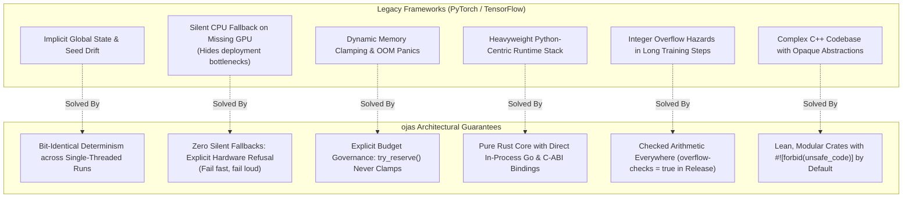
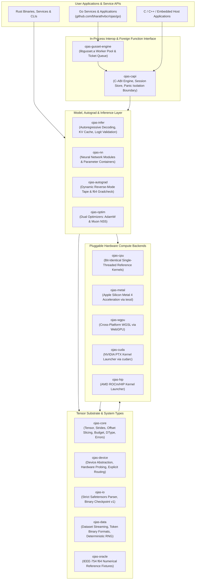
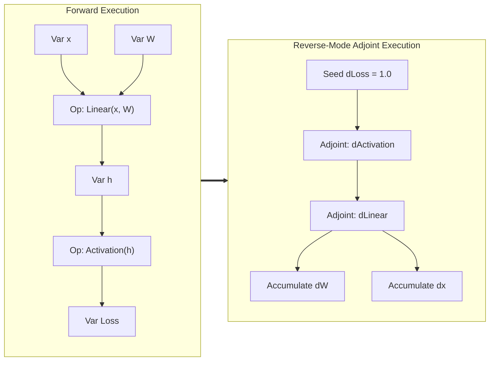
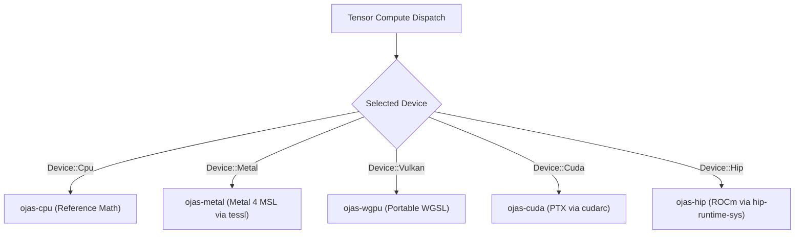
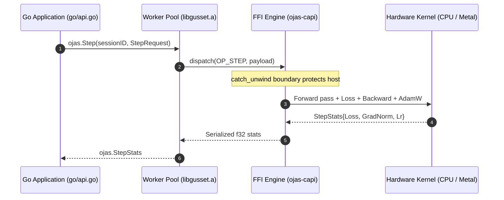

# ojas

**ojas** (vital energy, the essence training spends) is a deterministic, high-performance **Rust deep learning engine and framework** designed as a safe, modern alternative to PyTorch and TensorFlow for systems research, production training, and edge inference.

ojas pairs a compile-time safe Rust engine with an in-process Go API via `gusset`, zero-copy tensor views, reverse-mode automatic differentiation, strict memory budgeting, and native hardware acceleration across Apple Silicon Metal 4, WebGPU (WGSL), NVIDIA CUDA, and AMD ROCm/HIP.

```
Status:          Active Core & Multi-Backend Engine
Verification:    189 Workspace Tests + 11 Go Tests Passed
Host Target:     Apple M5 Pro (Metal 4), macOS 27 (Darwin 27.0.0 arm64)
License:         MIT OR Apache-2.0
```

---

## Why ojas? (A PyTorch & TensorFlow Alternative)

Mainstream frameworks like PyTorch and TensorFlow carry decades of legacy baggage: hidden global state, silent CPU fallbacks that mask hardware misconfigurations, nondeterministic multithreaded reductions, memory fragmentation, and cumbersome multi-language bindings that rely on heavyweight Python runtimes.

ojas is engineered from first principles with radical architectural guarantees:



---

## Framework Architecture

ojas is structured as a modular stack of focused, single-responsibility crates:



---

## Core Capabilities & Subsystems

### 1. General-Purpose Tensor Engine (`ojas-core`)
* **Zero-Copy Views:** Tensor representations track an explicit `byte_offset`. Sub-views created via `.narrow()` adjust byte offsets without memory re-allocation or buffer copying.
* **Strict Memory Budgets:** Memory consumption is governed by an explicit `Budget`. When an allocation exceeds limits, `try_reserve()` returns `OjasError::CapacityExceeded` immediately rather than swapping or resizing.
* **Type System:** First-class support for `F32`, `Bf16`, `F16`, and `U32` types with explicit promotion and precision rules.

### 2. Reverse-Mode Automatic Differentiation (`ojas-autograd`)
* **Tape-Based Computation Graph:** Dynamic tape recording variable nodes (`Var`) and operational adjoints for forward and reverse sweeps.
* **Numerical Gradcheck Oracle:** Analytical f32 gradients are verified against double-precision (`f64`) central finite differences, ensuring mathematical soundness down to machine tolerances.



### 3. Native & Portable Hardware Backends
* **Single-Threaded CPU (`ojas-cpu`):** Guaranteed bit-identical mathematical reference implementing matrix multiplication, normalizations, rotary positional embeddings, causal attention, gating, and optimizers.
* **Apple Silicon Metal 4 (`ojas-metal`):** High-throughput execution using Apple's latest Metal API via `tessl` and custom Metal Shading Language (`.metal`) kernels.
* **Portable WebGPU (`ojas-wgpu`):** Cross-platform shaders written in WGSL executing across Vulkan, Metal, and DX12.
* **NVIDIA CUDA & AMD ROCm (`ojas-cuda`, `ojas-hip`):** Native driver and runtime launch pipelines with compile-time feature gates (`--features cuda`, `--features hip`) and explicit refusal when hardware is absent.



### 4. Advanced Optimizer Suite (`ojas-optim`, `ojas-cpu`)
* **Dual Optimizer Architecture:**
  * **Muon NS5:** Orthogonalized matrix optimization using quintic 5th-order Newton-Schulz iterations with bf16 compute for 2D hidden weight matrices.
  * **AdamW:** PyTorch single-tensor order (decay first, bias correction, $\varepsilon = 10^{-8}$ outside the square root) for 1D parameters, embeddings, and normalization scales.
* **Safe Counters:** Step counters utilize checked integer math, refusing to wrap at `u64::MAX`.
* **Safe Clipping:** Gradient norm clipping with denominator regularizer (`CLIP_GRAD_NORM_EPS = 1e-6`) to prevent zero division.

### 5. In-Process Multi-Language Integration (`go/`, `ojas-capi`)
* **Zero-IPC Overhead:** Execute high-performance neural network workloads directly inside Go applications via in-process CGO and `gusset`.
* **Panic Boundary Isolation:** Rust panics are intercepted at the C-ABI boundary via `std::panic::catch_unwind`, cleanly dropping corrupted session state without aborting the host process.



### 6. Reference Model Implementations
* **v1 Flagship Model:** A 124M parameter nanolab default GPT (12 layers, 768 width, 12 heads, 64 head dimension, vocab 50,304, SwiGLU, rotary embeddings, QK-norm, causal attention, per-head sigmoid output gate, value residual connection, and tied embeddings).
* **Extensible Architecture:** Designed for modular construction of arbitrary neural network topologies (vision transformers, diffusion backbones, recurrent models, and MoE architectures).

---

## Workspace Crate Catalog

| Crate | Purpose | Key Symbols | Status |
| :--- | :--- | :--- | :---: |
| [`ojas-core`](file:///Users/bharath/Code/research/ojas/ojas-core) | Core tensor engine & invariants | `Tensor`, `Backend`, `Budget`, `DType`, `OjasError`, `CheckpointV1` | **Verified** |
| [`ojas-cpu`](file:///Users/bharath/Code/research/ojas/ojas-cpu) | Deterministic reference compute | `CpuBackend`, exact mathematical kernels, single-thread loop | **Verified** (18 tests) |
| [`ojas-metal`](file:///Users/bharath/Code/research/ojas/ojas-metal) | Apple Silicon Metal 4 backend | `tiny_train_step`, `per_head_gate.metal`, causal attention | **Verified** (10 tests) |
| [`ojas-autograd`](file:///Users/bharath/Code/research/ojas/ojas-autograd) | Reverse-mode tape & gradcheck | `Tape`, `Var`, `central_diff`, f64 finite difference validation | **Verified** (5 tests) |
| [`ojas-io`](file:///Users/bharath/Code/research/ojas/ojas-io) | Formats & serialization | Safetensors parser (F32/I64/U16), Checkpoint v1 binary codec | **Verified** (12 tests) |
| [`ojas-data`](file:///Users/bharath/Code/research/ojas/ojas-data) | Dataset ingestion & tokenization | Binary token streams, Fineweb format, deterministic RNG | **Verified** (5 tests) |
| [`ojas-infer`](file:///Users/bharath/Code/research/ojas/ojas-infer) | Autoregressive inference engine | `CpuGpt`, KV cache, greedy decoding, logit validation | **Verified** (4 tests) |
| [`ojas-capi`](file:///Users/bharath/Code/research/ojas/ojas-capi) | C-ABI dispatch & foreign host API | `dispatch`, `install_engine`, session store, panic boundary | **Verified** (10 tests) |
| [`ojas-gusset-engine`](file:///Users/bharath/Code/research/ojas/ojas-gusset-engine) | Go link archive | Umbrella staticlib `libgusset.a` for Go CGO integration | **Verified** |
| [`go/`](file:///Users/bharath/Code/research/ojas/go) | Go client SDK | Package `ojas`: `Load`, `Step`, `GenerateGreedy`, `Close` | **Verified** (7 tests) |
| [`ojas-device`](file:///Users/bharath/Code/research/ojas/ojas-device) | Hardware discovery | `Device` probe, explicit backend routing without fallbacks | **Verified** (3 tests) |
| [`ojas-wgpu`](file:///Users/bharath/Code/research/ojas/ojas-wgpu) | Portable WGSL shaders | WGSL compute pipeline, Metal/Vulkan HAL execution | **Verified** (7 tests) |
| [`ojas-oracle`](file:///Users/bharath/Code/research/ojas/ojas-oracle) | Mathematical fixtures | IEEE-754 f64 oracle data for exact op verification | **Verified** (2 tests) |
| [`ojas-cuda`](file:///Users/bharath/Code/research/ojas/ojas-cuda) | NVIDIA CUDA backend | Optional feature `cuda`; explicit device validation | **Verified** (2 tests) |
| [`ojas-hip`](file:///Users/bharath/Code/research/ojas/ojas-hip) | AMD ROCm/HIP backend | Optional feature `hip`; explicit device validation | **Verified** (2 tests) |
| [`ojas-nn`](file:///Users/bharath/Code/research/ojas/ojas-nn) | High-level neural modules | Module abstractions for neural network layers | Scaffold |
| [`ojas-optim`](file:///Users/bharath/Code/research/ojas/ojas-optim) | Standalone optimizers | Optimizer interfaces (reference math lives in `ojas-cpu`) | Scaffold |
| [`ojas-engine`](file:///Users/bharath/Code/research/ojas/ojas-engine) | Standalone daemon | Engine daemon scaffolding | Scaffold |

---

## Verification & Test Commands

### 1. Workspace Test Suite
```bash
cargo test --workspace --release -- --test-threads=1
```
*Verification:* **189 passed; 0 failed; 0 ignored** across all Rust crates.

### 2. In-Process Go Client Tests
```bash
cargo build -p ojas-gusset-engine
cd go && PKG_CONFIG_PATH="$PWD" go test -tags gusset_pkgconfig -v -count=1
```
*Verification:* **11 passed; 0 failed; 0 skipped** (`TestPathEscapeAndMissingFile`, `TestDoubleFree`, `TestSessionCap`, `TestCloseEmpty`, `TestStepLossAndShape`, `TestStepRejectsMixedLogitAndTokenFields`, `TestConcurrentLoadStepGenerateFreeOneHandle`, `TestConcurrentSessionStress`, `TestMalformedInputsAreErrors`, `TestGenerateNaN`, `TestPoisonDropsSession`).

---

## Documentation Directory

* [`docs/architecture.md`](file:///Users/bharath/Code/research/ojas/docs/architecture.md) — Comprehensive architectural specification and memory layout.
* [`docs/status.md`](file:///Users/bharath/Code/research/ojas/docs/status.md) — Verification run logs, test matrices, and machine profile.
* [`docs/op-coverage.md`](file:///Users/bharath/Code/research/ojas/docs/op-coverage.md) — Mathematical specification of core operators and reference models.
* [`docs/checkpoint-v1.md`](file:///Users/bharath/Code/research/ojas/docs/checkpoint-v1.md) — Binary checkpoint specification and framing.
* [`docs/dtype-policy.md`](file:///Users/bharath/Code/research/ojas/docs/dtype-policy.md) — Data types, precision policies, and epsilon invariants.
* [`docs/backends.md`](file:///Users/bharath/Code/research/ojas/docs/backends.md) — Hardware support matrix, adopted libraries, and backend dispatch.
* [`docs/audit.md`](file:///Users/bharath/Code/research/ojas/docs/audit.md) — Defect analysis of upstream engines and ojas defensive countermeasures.
* [`docs/baseline.md`](file:///Users/bharath/Code/research/ojas/docs/baseline.md) — Benchmarks, toolchain baselines, and Apple Accelerate BLAS measurements.

---

## License

Dual-licensed under either **MIT** ([`LICENSE-MIT`](file:///Users/bharath/Code/research/ojas/LICENSE-MIT)) or **Apache-2.0** ([`LICENSE-APACHE`](file:///Users/bharath/Code/research/ojas/LICENSE-APACHE)) at your option.
