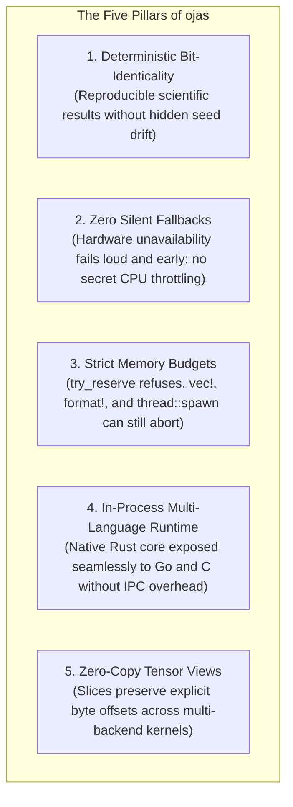
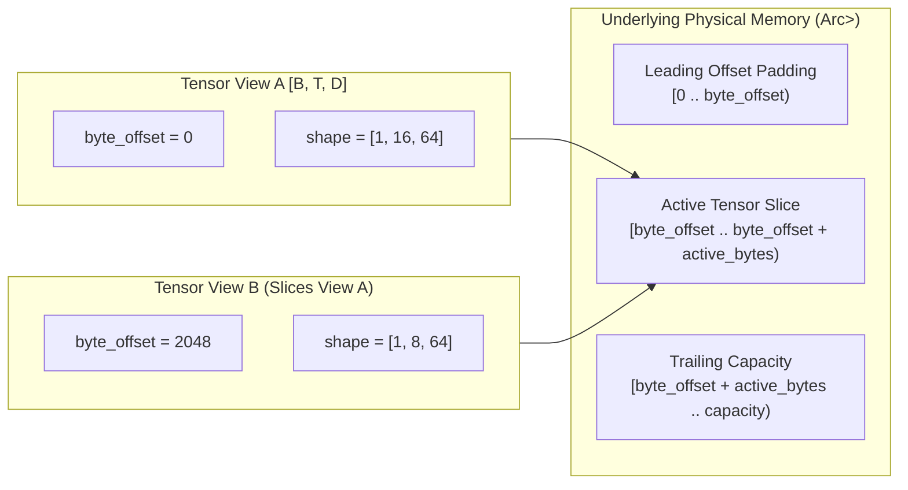
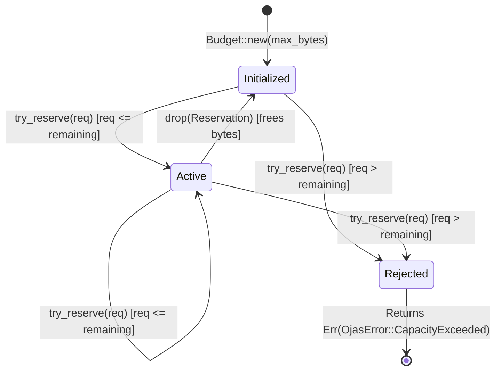
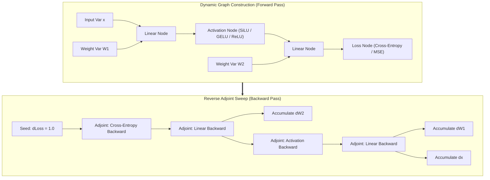
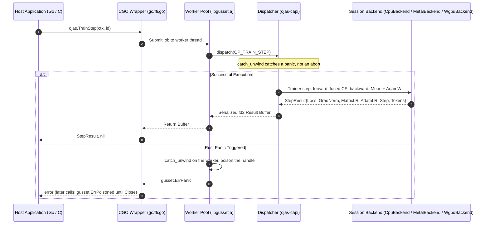
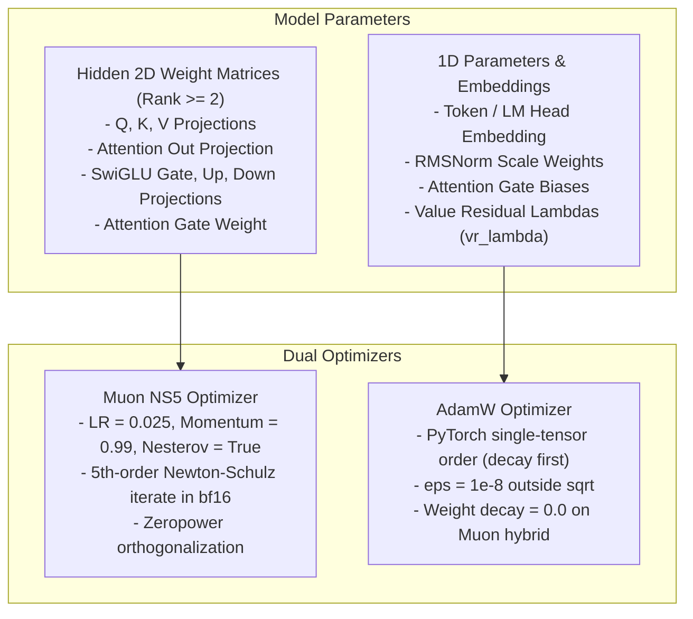

# ojas Architecture & System Design

This document specifies the technical architecture, memory model, execution graphs, and invariants of **ojas** as a modern, deterministic deep learning framework and PyTorch/TensorFlow alternative.

---

## 1. System Philosophy: A Modern DL Engine

ojas is architected from first principles to overcome fundamental design flaws common in legacy machine learning frameworks:

> [!IMPORTANT]
> **Radical Determinism:** Deep learning research requires exact reproducibility. ojas enforces bit-identical outputs across single-threaded CPU runs and across SIMD backends in the Exact tier, avoiding nondeterministic thread reduction tree races.
> 
> **Zero Silent Fallback Guarantee:** When an accelerator backend is selected (Metal, wgpu, CUDA, HIP), driver initialization failures produce immediate, explicit errors—**never silently falling back to host CPU execution**.

---

## 2. Framework Decomposition

ojas separates concerns into decoupled layers with unidirectional dependencies:

```mermaid
flowchart TD
    subgraph Layer5["5. Language Bindings & Client Applications"]
        GoPkg["Go API (github.com/bharathvbcr/ojas/go)"]
        RustApps["Rust Client Applications"]
        ForeignHost["C / C++ Embeddings"]
    end

    subgraph Layer4["4. In-Process Runtime & FFI Bridge"]
        Gusset["ojas-gusset-engine (Worker Pool & Ticket Management)"]
        CAPI["ojas-capi (C-ABI Engine, Session Store, Panic Boundaries)"]
    end

    subgraph Layer3["3. Models, Autograd & High-Level Primitives"]
        Infer["ojas-infer (KV Cache, Greedy and Sampled Decode, Logit Guard; CPU)"]
        Model["ojas-model (nanolab GPT written once: spec, init, Graph block, Eval, Trainer, checkpoint dir)"]
        Qwen35["ojas-qwen35 (Qwen3.5 whole-step provider over tessl; macOS Metal only; not a Backend)"]
        Autograd["ojas-autograd (Reverse-Mode Tape; uploads on GPU)"]
    end

    subgraph Layer2["2. Hardware Compute Acceleration Backends"]
        CPU["ojas-cpu (CpuBackend: Exact packed GEMM, or Fast with Accelerate)"]
        SIMD["ojas-simd (NEON GEMM, AVX2, Accelerate cblas_sgemm, vDSP / vForce)"]
        Metal["ojas-metal (MetalBackend via tessl & MSL, device-resident)"]
        WGPU["ojas-wgpu (WgpuBackend, device-resident WGSL)"]
        Kernels["ojas-kernels (Shared WGSL/CUDA sources, workgroup geometry)"]
        CUDA["ojas-cuda (one affine kernel, feature cuda; not a Backend)"]
        HIP["ojas-hip (copy probe, feature hip; not a Backend)"]
    end

    subgraph Layer1["1. Core Substrates & Data Ingestion"]
        Core["ojas-core (Tensor host & device, Layout, Budget, DType, Numerics, OjasError)"]
        Device["ojas-device (Device kinds, host probe, ResourcePolicy; no router)"]
        IO["ojas-io (Safetensors Reader/Writer, Checkpoint v1 Binary Codec)"]
        Data["ojas-data (Dataset Binary Streaming, Deterministic Counter RNG)"]
        Oracle["ojas-oracle (IEEE-754 f64 Analytical Reference Data)"]
    end

    Layer5 --> Layer4
    Layer4 --> Layer3
    Layer3 --> Layer2
    Layer2 --> Layer1
    Layer3 --> Layer1
```

Inside layer 3, `ojas-model` sits on `ojas-autograd`, `ojas-io` and `ojas-data`, and `ojas-infer` sits on `ojas-model`. `ojas-capi` depends on the model, inference, io, data, cpu, wgpu, metal and device crates. `ojas-qwen35` depends only on `ojas-core`, `ojas-io` and tessl, and is empty off macOS. The design is in [`framework-design.md`](framework-design.md).

---

## 3. General-Purpose Tensor Engine & Memory Model

### 3.1 Tensor View Model
A `Tensor` in `ojas-core` is an immutable or mutably borrowable view into a contiguous byte storage backing (`Arc<Vec<u8>>` or a backend's device buffer). `Tensor::from_device` wraps a device buffer; `to_host` copies it back and is counted by `device_readbacks()`; `device_buffer_mut` requires sole ownership. Host accessors such as `to_f32_vec` refuse a device tensor rather than reading it back implicitly.

$$\text{Element Index}(\mathbf{i}) = \text{byte\_offset} + \sum_{k=0}^{\text{rank}-1} i_k \cdot \text{strides}[k] \cdot \text{dtype.size\_bytes}()$$

> [!NOTE]
> `Tensor::narrow(dim, start, len)` creates a new zero-copy view by calculating the new `byte_offset` and updating dimensions. It never copies underlying buffer elements or causes memory fragmentation.

---

### 3.2 Memory Budgeting State Machine
All tensor allocations in `ojas` must request permits from a `Budget`. Memory cannot be silently resized, overcommitted, or swapped:

> [!IMPORTANT]
> If an allocation exceeds remaining budget limits, `try_reserve()` returns `Err(OjasError::CapacityExceeded)` immediately. The engine **refuses to silently swap to disk or resize limits**. `check_room(bytes)` allows checking capacity ahead of multi-step execution without reserving, and `peak_bytes()` / `reset_peak()` enable exact phase-by-phase peak memory measurement. Infallible system allocators (`vec!`, `format!`, `thread::spawn`) operate outside this software budget and can still abort if physical host memory is exhausted.

---

## 4. Dynamic Reverse-Mode Autograd Tape

`ojas-autograd` implements a dynamic tape-based automatic differentiation engine. On a CPU backend the tensors stay as given and the cross-entropy seed is scaled on the host. On any other backend, `leaf` and the saved inputs are uploaded, reshape is a zero-copy `Tensor::view`, and the backward seed is uploaded. A non-root cross-entropy gradient is scaled with two rank-1 linears and a multiply, all on that backend.

### 4.1 Numerical Verification Oracle (`central_diff`)
Every gradient calculation is mathematically tested against an offline `f64` numerical oracle using central finite differences:

$$\frac{\partial f}{\partial x_i} \approx \frac{f(\mathbf{x} + h \mathbf{e}_i) - f(\mathbf{x} - h \mathbf{e}_i)}{2h}$$

Where $h = 10^{-5}$ in double precision (`f64`). Analytical gradients must match within specified absolute and relative tolerances (`atol`, `rtol`), otherwise tests fail fast with detailed coordinate diagnostics.

---

## 5. In-Process Multi-Language Bridge (`gusset` + `ojas-capi`)

Rather than relying on Python runtimes with global interpreter locks (GIL), `ojas` supports seamless in-process foreign language integration (e.g. Go, C):

The Go surface is `LoadModel` or `NewModel` (`DeviceCPU`, `DeviceCPUParallel`, `DeviceCPUAuto`, `DeviceMetal`, `DeviceWgpu`), `OpenTrainer`, `TrainStep`, `SaveCheckpoint` and `Resume`, `LoadTokenizer`, `Tokenize`, `Detokenize`, `GenerateIDs`, `SystemProfile`, `SetMemoryCeiling`, `Free` and `Close`. The opcodes are in `ojas-capi/src/engine.rs`; the old stub step opcode (2) is retired. Every model's byte budget is a child of one process-wide ceiling (default 1 GiB, or machine hard limit `hard_memory_limit` if smaller), which `SetMemoryCeiling` raises up to physical/cgroup limits and which cannot change while a model is open. Failures cross the boundary as typed kinds (`ErrCapacity`, `ErrNonFinite`, `ErrDeviceLost`, `ErrBusy`, `ErrPoisoned`, `ErrPressure`), listed in [`go/README.md`](../go/README.md).

> [!CAUTION]
> A panic on a gusset worker is caught by `catch_unwind` and poisons the entire gusset handle: subsequent calls return `gusset.ErrPoisoned` until the handle is closed. If the panic occurred while holding the session table lock, the next lock acquisition **drops every session in the table** (`ojas-capi/src/session.rs`) to prevent corruption. Note that `catch_unwind` cannot intercept OS process aborts or stack overflows.

---

## 6. Flagship Reference Architecture: nanolab Default GPT

To validate full-stack training, `ojas` targets the 124M nanolab default GPT (12 layers, width 768, 12 heads of 64, SwiGLU 2048, vocabulary 50304, tied embedding) as its v1 vertical slice. `ojas-model` writes the model once. The `Graph` trait has one method per op, and two executors implement it: `ojas_autograd::Tape` records for training and `Eval` runs eagerly for decoding, so training and decoding share one block. Parameter names are nanolab `state_dict` keys, init is order-independent (one counter RNG per name), and `Trainer` saves and resumes a checkpoint directory. CI exercises `ModelSpec::tiny` and a 40 KB fixture; no full 124M run is recorded in [`status.md`](status.md). The block:

```mermaid
flowchart TD
    subgraph TransformerBlock["Transformer Block with Gated Attention & Value Residual"]
        In["Input x [B, T, D]"] --> PreNorm["RMSNorm (eps=1e-6)"]
        
        PreNorm --> QKV["Q, K, V Projections"]
        QKV --> RoPE["Half-Split RoPE"]
        RoPE --> QKN["RMS QK-Norm"]
        QKN --> SDPA["Causal Scaled Dot-Product Attention (scale=1/8)"]
        
        PreNorm --> Gate["Linear Gate + Bias: sigmoid(x W_g + b_g)"]
        SDPA --> GatedAttn["Per-Head Gated Attn = SDPA * Gate"]
        Gate --> GatedAttn
        
        GatedAttn --> VR["Value Residual Blend: lerp(Attn, V0, sigmoid(vr_lambda))"]
        VR --> OutProj["Linear Output Projection"]
        OutProj --> ResAdd1["Residual Add (+)"]
        In --> ResAdd1
        
        ResAdd1 --> PostNorm["RMSNorm (eps=1e-6)"]
        PostNorm --> SwiGLU["SwiGLU MLP: (x W_g) * silu(x W_up) W_down"]
        SwiGLU --> ResAdd2["Residual Add (+)"]
        ResAdd1 --> ResAdd2
    end
```

### Dual Optimizer Topology

* **Matrices ($\text{rank} \ge 2$):** Optimized via **Muon NS5** (Nesterov momentum, quintic Newton-Schulz iterate in `bf16`).
* **Vectors & Embeddings ($\text{rank} < 2$):** Optimized via **AdamW** (PyTorch single-tensor order, decay first, $\varepsilon=10^{-8}$ outside square root).

---

## 7. Web Documentation, Identity & Domain Ecosystem

### 7.1 Web Application Architecture
The site ([`site/index.html`](file:///Users/bharath/Code/research/ojas/site/index.html), mirrored to [`docs/index.html`](file:///Users/bharath/Code/research/ojas/docs/index.html)) is one page. The labs, why, benchmarks, roadmap, and guide are sections of it:
* **Guarantee labs:** a determinism lab that sums the same float32 values with split-k and with the Exact order, plus memory budget, device refusal, panic firewall, and checked shape and view labs. Each prints the error text from the source.
* **Why ojas:** the reasons, the author's account of the defects in `docs/audit.md` that led to ojas, and what it is and is not ready for.
* **Benchmarks:** the 2026-10-02 CPU plots (block forward + backward, both recorded training-step runs, and the ops where ojas is slower) beside the scorecard tables.
* **Roadmap:** the model and trainer have landed. What is left is proof at full size, speed against PyTorch, and breadth.
* **Developer docs:** quickstart (with Rust and Go snippets compiled against this tree), core concepts, feature reference, Go API reference, architecture and crates, status and limits, and contributing rules.
* **Command palette:** `⌘K` or `/` searches the labs and every section.

### 7.2 Visual Identity (ojas)
One logo: a regular icosahedron of dark red liquid glass with a glowing core, in the same material as the LiquiTask logo. [`docs/brand/ojas-logo-source.png`](brand/ojas-logo-source.png) is the only source; [`docs/brand/render.sh`](brand/render.sh) derives the transparent logo, the tile, the favicon, touch and manifest icons, and the 1200×630 social card from it. Asset list and regeneration: [`web-and-domain.md`](web-and-domain.md#2-visual-identity-one-logo).

### 7.3 Domain Wiring & Deployment Topology
* **Canonical Domain:** [`https://ojas.vbcr.dev/`](https://ojas.vbcr.dev/) via [`site/CNAME`](file:///Users/bharath/Code/research/ojas/site/CNAME) and [`.github/workflows/deploy-pages.yml`](file:///Users/bharath/Code/research/ojas/.github/workflows/deploy-pages.yml).
* **Integrated Portfolio Route:** [`https://bharath.vbcr.dev/ojas`](https://bharath.vbcr.dev/ojas) resolved via `APP_ROUTES['ojas']` and `PROJECT_SITES['ojas']` (`p41`) in the portfolio engine.
