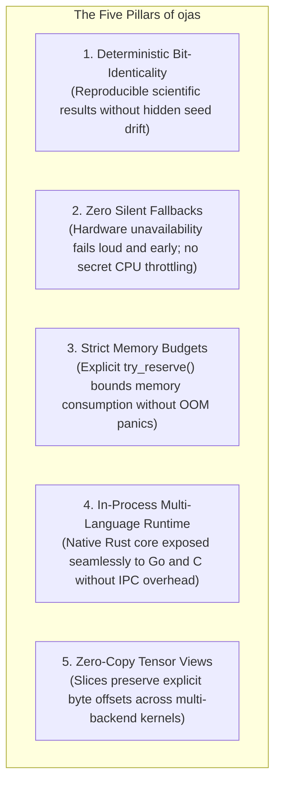
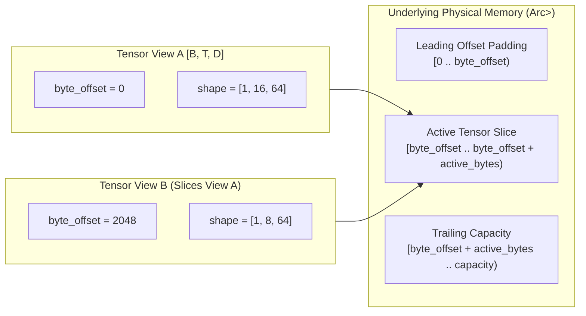
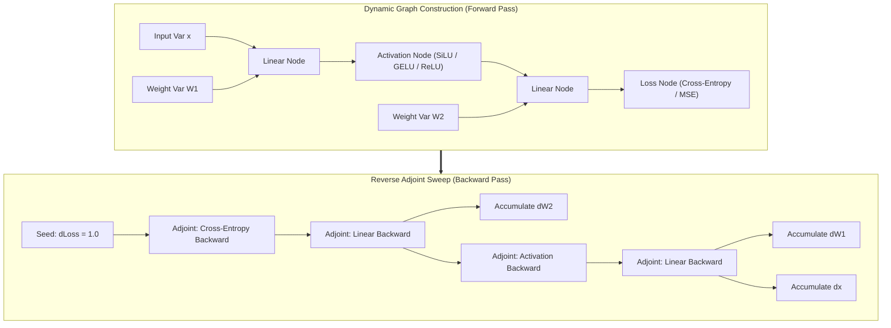
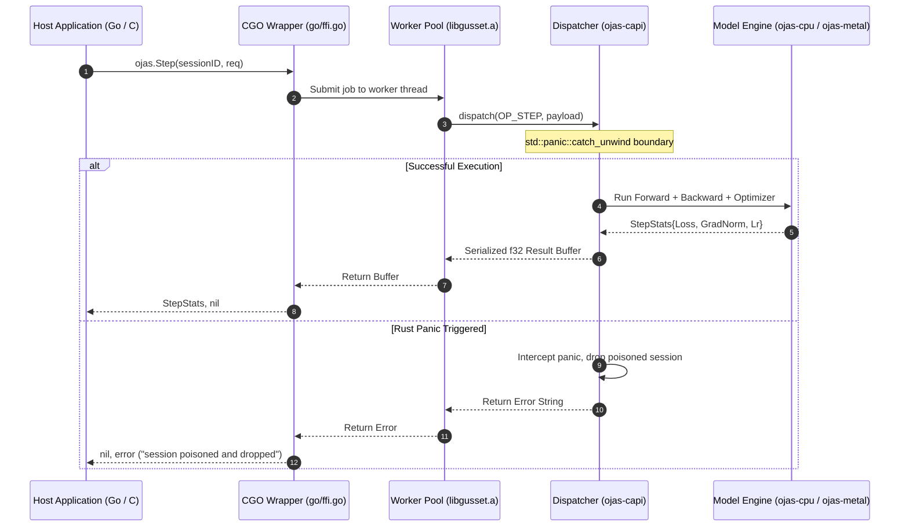

# ojas Architecture & System Design

This document specifies the technical architecture, memory model, execution graphs, and invariants of **ojas** as a modern, deterministic deep learning framework and PyTorch/TensorFlow alternative.

---

## 1. System Philosophy: A Modern DL Engine

ojas is architected from first principles to overcome fundamental design flaws common in legacy machine learning frameworks:



---

## 2. Framework Decomposition

ojas separates concerns into decoupled layers with unidirected dependencies:

```mermaid
flowchart TD
    subgraph Layer5["5. Language Bindings & Client Applications"]
        GoPkg["Go API (github.com/bharathvbcr/ojas/go)"]
        RustApps["Rust Client Applications"]
        ForeignHost["C / C++ Embeddings"]
    end

    subgraph Layer4["4. In-Process Runtime & FFI Bridge"]
        Gusset["ojas-gusset-engine (Worker Pool & Ticket Management)"]
        CAPI["ojas-capi (C-ABI Engine, Session Store, Panic Boundaries)"]
    end

    subgraph Layer3["3. Models, Autograd & High-Level Primitives"]
        Infer["ojas-infer (KV Cache, Greedy & Sampling Decode, Logit Guard)"]
        NN["ojas-nn (Modular Layers: Linear, Conv, Norm, Attention, MLP)"]
        Autograd["ojas-autograd (Dynamic Reverse-Mode Tape, Var, f64 Gradcheck)"]
        Optim["ojas-optim (AdamW, Muon NS5, Parameter Groups)"]
    end

    subgraph Layer2["2. Hardware Compute Acceleration Backends"]
        CPU["ojas-cpu (Single-Threaded Reference Math, SIMD-aligned)"]
        Metal["ojas-metal (Apple Silicon Metal 4 via tessl & Native MSL)"]
        WGPU["ojas-wgpu (Cross-Platform Portable WGSL via WebGPU)"]
        CUDA["ojas-cuda (NVIDIA PTX Launch via cudarc)"]
        HIP["ojas-hip (AMD ROCm/HIP Launch via hip-runtime-sys)"]
    end

    subgraph Layer1["1. Core Substrates & Data Ingestion"]
        Core["ojas-core (Tensor, Layout, Budget, DType, OjasError)"]
        Device["ojas-device (Device Enumeration, Hardware Probing)"]
        IO["ojas-io (Safetensors Reader/Writer, Checkpoint v1 Binary Codec)"]
        Data["ojas-data (Dataset Binary Streaming, Deterministic Counter RNG)"]
        Oracle["ojas-oracle (IEEE-754 f64 Analytical Reference Data)"]
    end

    Layer5 --> Layer4
    Layer4 --> Layer3
    Layer3 --> Layer2
    Layer2 --> Layer1
    Layer3 --> Layer1
```



---

## 3. General-Purpose Tensor Engine & Memory Model

### 3.1 Tensor View Model
A `Tensor` in `ojas-core` is an immutable or mutably borrowable view into a contiguous byte storage backing (`Arc<Vec<u8>>` or hardware buffer):

$$\text{Element Index}(\mathbf{i}) = \text{byte\_offset} + \sum_{k=0}^{\text{rank}-1} i_k \cdot \text{strides}[k] \cdot \text{dtype.size\_bytes}()$$



### 3.2 Memory Budgeting State Machine
All tensor allocations in `ojas` must request permits from a `Budget`. Memory cannot be silently resized, overcommitted, or swapped:

```mermaid
stateDiagram-v2
    [*] --> Initialized: Budget::new(max_bytes)
    
    Initialized --> Active: try_reserve(req) [req <= remaining]
    Active --> Active: try_reserve(req) [req <= remaining]
    Active --> Initialized: drop(Reservation) [frees bytes]
    
    Initialized --> Rejected: try_reserve(req) [req > remaining]
    Active --> Rejected: try_reserve(req) [req > remaining]
    
    Rejected --> [*]: Returns Err(OjasError::CapacityExceeded)
```

---

## 4. Dynamic Reverse-Mode Autograd Tape

`ojas-autograd` implements a dynamic tape-based automatic differentiation engine capable of constructing and executing reverse sweeps for arbitrary neural architectures:



### 4.1 Numerical Verification Oracle (`central_diff`)
Every gradient calculation is mathematically tested against an offline `f64` numerical oracle using central finite differences:

$$\frac{\partial f}{\partial x_i} \approx \frac{f(\mathbf{x} + h \mathbf{e}_i) - f(\mathbf{x} - h \mathbf{e}_i)}{2h}$$

Where $h = 10^{-5}$ in double precision (`f64`). Analytical gradients must match within specified absolute and relative tolerances (`atol`, `rtol`), otherwise tests fail fast with detailed coordinate diagnostics.

---

## 5. In-Process Multi-Language Bridge (`gusset` + `ojas-capi`)

Rather than relying on Python runtimes with global interpreter locks (GIL), `ojas` supports seamless in-process foreign language integration (e.g. Go, C):



---

## 6. Flagship Reference Architecture: nanolab Default GPT

To validate full-stack training performance, `ojas` implements the 124M nanolab default GPT as its v1 vertical slice:

```mermaid
flowchart TD
    subgraph TransformerBlock["Transformer Block with Gated Attention & Value Residual"]
        In["Input x [B, T, D]"] --> PreNorm["RMSNorm (eps=1e-6)"]
        
        PreNorm --> QKV["Q, K, V Projections"]
        QKV --> RoPE["Half-Split RoPE"]
        RoPE --> QKN["RMS QK-Norm"]
        QKN --> SDPA["Causal Scaled Dot-Product Attention (scale=1/8)"]
        
        PreNorm --> Gate["Linear Gate + Bias: sigmoid(x W_g + b_g)"]
        SDPA --> GatedAttn["Per-Head Gated Attn = SDPA * Gate"]
        Gate --> GatedAttn
        
        GatedAttn --> VR["Value Residual Blend: lerp(Attn, V0, sigmoid(vr_lambda))"]
        VR --> OutProj["Linear Output Projection"]
        OutProj --> ResAdd1["Residual Add (+)"]
        In --> ResAdd1
        
        ResAdd1 --> PostNorm["RMSNorm (eps=1e-6)"]
        PostNorm --> SwiGLU["SwiGLU MLP: (x W_g) * silu(x W_up) W_down"]
        SwiGLU --> ResAdd2["Residual Add (+)"]
        ResAdd1 --> ResAdd2
    end
```



### Dual Optimizer Topology
* **Matrices ($\text{rank} \ge 2$):** Optimized via **Muon NS5** (Nesterov momentum, quintic Newton-Schulz iterate in `bf16`).
* **Vectors & Embeddings ($\text{rank} < 2$):** Optimized via **AdamW** (PyTorch single-tensor order, decay first, $\varepsilon=10^{-8}$ outside square root).
