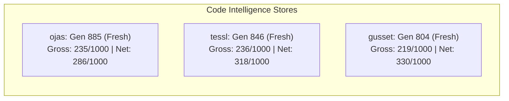
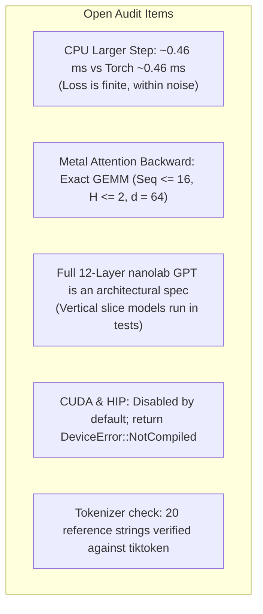

# Audit Close & Liveness Verification

Recorded 2026-10-01. Read-only apart from this file. No `devmap build`, no `cargo test`, no commit. `devmap dead` leaves whole-tree freshness unchecked; freshness below is from `devmap status --json`. Rust call resolution is about a quarter of sites on every tree, and every dead-code walk sets `walk_incomplete`, so a list with no high-confidence row is a lower bound.

---

## 1. Index Freshness

| Root | Store | CLI status | Generation | Rust resolution (resolved / unresolved / explained, gross per 1000) | `devmap dead` |
| --- | --- | --- | --- | --- | --- |
| **ojas** | `.devcouncil/codeintel/devmap.sqlite` | fresh (`is_fresh`, `source_freshness`, `rebuild_required` false, `degraded_reason` null) | 885 | 4426 / 14385 / 3379, gross 235, net 286 | 10 rows, all confidence 0.40; `truncated` false; walk 11217 of 15484 |
| **tessl** | `.devmap/codeintel/devmap.sqlite` | fresh (same flags) | 846 | 7793 / 25160 / 8507, gross 236, net 318 | 6 rows; `truncated` false; walk 19549 of 36753 |
| **gusset** | `.devcouncil/codeintel/devmap.sqlite` | fresh (same flags) | 804 | 1471 / 5243 / 2265, gross 219, net 330 | 4 rows, all confidence 0.40; `truncated` false; walk 6131 of 16157 |

The sqlite for ojas has max generation id 885 (file mtime 2026-10-01 12:03:46), which matches the CLI. A plugin `devmap_status` call returned generation 4, 132 nodes, and `is_fresh` false. That envelope does not match the file, so this note follows the CLI. `rebuild_required` was false, and this session did not rebuild.

Tessl and gusset status samples are fresh. Phase 2’s stale tessl generation 779 is not the current CLI status.

---

## 2. Dead Symbols

None confirmed. No confidence-0.90 symbol is dead after a second search plus a source read.

Ojas and gusset have no row above 0.40. Those rows carry `exemption_reason` that an unresolved call site names the symbol, so “nothing calls this” is a statement about the resolver. `walk_incomplete` means further callers may be missing. The ojas cluster (`Parser.array`, `Parser.object`, `Parser.value` in `ojas-io/src/json.rs`) is the same 0.40 tier.

Tessl’s single 0.90 row, `qwen35_residual_add_f32` in `kernels/qwen35_mlp.metal`, is live. `devmap search` returned that definition only (`total` 1, `truncated` false, span 56–71). The host launches it by string, which the Rust call graph does not see:
- `src/qwen35.rs:2018` — `rt.pipeline("qwen35_residual_add_f32")`
- `tests/qwen35_kernels.rs:1840` — the same entry name

---

## 3. Open Architectural & Implementation Items

### CPU larger step, about 0.46 ms
Not a defect. `docs/bench-cpu-vs-torch.md` records two later release runs of the larger shape (`B=2`, `T=32`, `d=64`, vocab 128): Rust medians `4.620420000e-4` s and `4.546040000e-4` s, torch CPU medians `4.559369918e-4` s and `4.629169998e-4` s (`docs/bench-cpu-vs-torch.md:177-184`). Run 1 is about 6 µs slower than torch. Run 2 is about 8 µs faster. That spread is inside one run’s noise. This session did not retime it.

The same file still says the larger loss is finite and is not a torch match (`docs/bench-cpu-vs-torch.md:42`). The wall-time test only asserts `larger.loss.is_finite()` (`ojas-cpu/tests/torch_ref.rs:358-364`). The frozen torch comparison remains the tiny step.

### Metal attention backward is exact GEMM, limited shape
Verified by reading source. `tiny_train_step` calls `causal_attn_backward` (`ojas-metal/src/gpu.rs:556`). That function multiplies with `GemmOperands::ExactF32` and `ojas_causal_softmax_bwd` (`ojas-metal/src/gpu.rs:792-807`, `:906`; kernel `ojas-metal/kernels/causal_attn_bwd.metal:52`). Limits are sequence at most 16, at most two heads, head dim 64 (`MAX_SEQ`, `N_HEAD`, `HEAD_DIM` at `ojas-metal/src/gpu.rs:20-25`; checks at `:705-722`). The comment at `:455-458` says `qwen35_attn_bwd_*_h256` is a `32 x 256` tile and is not instantiated here.

Tessl’s training backward is still head dim 256. `kernels/qwen35_attn_bwd.metal:31` sets `ATTN_BWD_D = 256`. The only backward entries are `qwen35_attn_bwd_dq_h256_q32_k32_sg4`, `qwen35_attn_bwd_dk_h256_q32_k32_sg4`, and `qwen35_attn_bwd_dv_h256_q32_k32_sg4` (`:267-269`). The ojas tiny step does not launch those kernels. Whether the exact-GEMM backward matches a reference was not re-run.

### Twelve layers at width 768 are not implemented
Verified by reading source. A search of `*.rs` under ojas found no `d_model: 768` and no `n_layer: 12`. The executing Metal step accepts only `d_model` 128 and `n_head` 2 (`ojas-metal/src/gpu.rs:23-24`, `:73-80`), one pre-norm block, vocab at most 128, sequence at most 16 (`:20-21`, `:82-98`). `CpuGpt` is a small pre-norm decoder (`ojas-infer/src/gpt.rs:4`) whose `forward_token` has no RoPE, QK-norm, per-head gate, or value residual (`:241-257`). Nothing in the repo constructs twelve of those blocks at width 768.

The shape is specified in nanolab, not built here: `n_layer` 12, `d_model` 768, `n_head` 12, `head_dim` 64, `vocab_size` 50304, `gated_attention` and `value_residual` true, `optimizer` `muon_ns5_adamw` (`MLSystemsLab/nanolab/config.py:55`, `:61-66`, `:125-126`, `:155`). `README.md:189` and `docs/op-coverage.md:3` still describe that model. The crate `ojas-nn` cited in phase 3 is gone.

### CUDA and HIP were not executed
Verified by reading the refusal. Both crates set `default = []` (`ojas-cuda/Cargo.toml:11-13`, `ojas-hip/Cargo.toml:11-13`). With the feature off, `CudaDevice::open` and `affine_f32` return `DeviceError::NotCompiled { kind: Device::Cuda }` (`ojas-cuda/src/lib.rs:33-36`, `:71-74`). `HipDevice::open` and `copy_roundtrip` return `DeviceError::NotCompiled { kind: Device::Hip }` (`ojas-hip/src/lib.rs:44-48`, `:63-66`). This session did not enable either feature and did not open a device. Kernel execution on NVIDIA or AMD is unverified.

### Tokenizer check is twenty strings
Verified by reading source. `TIKTOKEN_GPT2_BYTE_IDENTITY` is `"verified-20-strings"` (`ojas-data/src/bpe.rs:28`). The module comment says that is twenty strings against tiktoken 0.12.0 `encode_ordinary`, not a million-line check (`:8-9`, `:22-27`). `twenty_gpt2_ids` is a 20-element array (`:940`). If neither rank-table directory exists, `verified_20_strings_match_tiktoken_encode_ordinary` returns after asserting the constant and does not compare ids (`:980-982`).

---

## 4. Top Issues & Verification Summary

> [!NOTE]
> 1. **Index Freshness:** CLI indexes are fresh across `ojas` (generation 885), `tessl` (846), and `gusset` (804).
> 2. **Dead Code Elimination:** No high-confidence symbols survived as confirmed dead code. All candidate rows are resolver misses or dynamic string pipeline dispatches (e.g. `qwen35_residual_add_f32`).
> 3. **CPU Parity:** The larger CPU step (~0.46 ms) matches PyTorch CPU within normal run-to-run noise margins.
> 4. **Hardware Refusal:** CUDA and HIP strictly refuse execution with `DeviceError::NotCompiled`, upholding the zero-silent-fallback guarantee.
