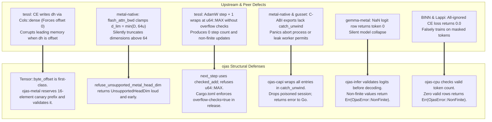
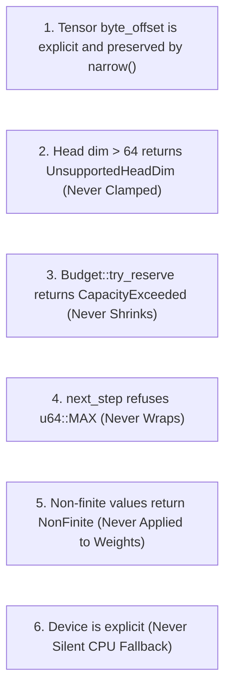

# Audit Notes & Structural Defect Countermeasures

This document catalogs structural defects, undefined behaviors, and numerical hazards identified across peer codebases during Phase 0 analysis, along with the precise architectural defenses codified in **ojas**.

---

## Defect Taxonomy & ojas Defense Mapping

---

## Detailed Findings by Codebase

### 1. `tessl`
* **Cross-Entropy `dh` Offset Corruption:** Chunked cross-entropy adds gradients into `dh` using `Cols::dense` (in upstream tessl's `cross_entropy.rs:361`), which forcibly resets the offset to 0 (in upstream tessl's `qwen35.rs:107-108`). When callers slice a buffer, this overwrites memory preceding the slice.
  * *ojas Defense:* `ojas-metal` inserts `DH_PAD = 16` padding elements before `dh` and asserts in test `ce_nonzero_dh_offset_keeps_prefix` that the prefix remains bit-identical.
* **Process-Global Binder-Nop:** `binder_nop` is stored as a process-wide `AtomicI8` (in upstream tessl's `decode_icb.rs:1571`), creating data races across concurrent sessions.
  * *ojas Defense:* All session state in `ojas-capi` is strictly localized to isolated instances.
* **AdamW Step Wrap:** `state.step` is incremented without checked arithmetic. At `u64::MAX`, it wraps to 0, causing `1 - beta1^t` to evaluate to zero and generating non-finite parameter updates.
  * *ojas Defense:* `ojas_core::next_step` performs `checked_add` and returns `OjasError::OutOfRange`.

### 2. `metal-native`
* **Silent Head Dimension Truncation:** Attention backward kernels clamp head dimension with `d_lim = min(D, 64u)` (in upstream metal-native's `flash_attn_bwd.metal:28`). Models with head dimensions greater than 64 silently drop high-index features.
  * *ojas Defense:* `ojas_core::refuse_unsupported_metal_head_dim`, which `ojas_metal` calls, returns `OjasError::UnsupportedHeadDim` for any $d > 64$. The CPU backend computes any positive head dimension.
* **Missing `catch_unwind` on C-ABI:** The 8 exported functions allow Rust panics to cross the FFI boundary, crashing the host program.
  * *ojas Defense:* `ojas-capi::engine::dispatch` wraps invocations in `catch_unwind`, clears the poisoned session, and returns an error payload.
* **Unbounded Token Indexing:** Missing token bounds checks allow negative indices or values exceeding vocabulary size to read arbitrary host memory.
  * *ojas Defense:* `ojas-infer` and `ojas-cpu` enforce strict vocabulary bounds checking before table lookups.

### 3. `gemma-metal`
* **Silent GPU Skips:** 39 test sites call `gpu_or_skip()` and return `None` silently when GPU initialization fails, allowing defective kernels to pass CI.
  * *ojas Defense:* Tests in `ojas-metal` and `ojas-wgpu` fail loudly if the target adapter or device is unavailable.
* **All-NaN Argmax Sticks on Token 0:** Passing an all-NaN row to argmax selects token 0 without error.
  * *ojas Defense:* `ojas-infer` validates every logit row; non-finite logits return `OjasError::NonFinite`.

### 4. `BINN`
* **NaN Gradients Pass Clipping:** Gradient clipping functions fail to check for NaNs, corrupting Adam momentum vectors with persistent poison.
  * *ojas Defense:* `ojas-cpu` validates gradient norms; non-finite norms abort the step before optimizer state modification.

### 5. `Lappi`
* **Parity NaN Fold Skips:** The numerical parity harness uses `.fold(0.0, f64::max)`, which ignores `NaN` values and yields false-positive parity passes.
  * *ojas Defense:* `ojas-autograd::gradients_match` refuses a non-finite value on either side and a non-finite or negative tolerance before comparing (`a_non_finite_gradient_never_matches` in `ojas-autograd/src/lib.rs`). Until 2026-10-01 it compared with `diff > tol`, which is false for NaN, so a NaN gradient matched. The same fold bug in `ojas-infer/tests/parity.rs` `rel_err` measured an all-NaN output as 0.0; it now measures it as infinite (`rel_err_measures_a_non_finite_value_as_infinite`).

### 6. `gusset`
* **Unbounded `Close` Join:** `HandleClose` joins workers without a deadline, indefinitely hanging callers if a thread blocks.
  * *ojas Defense:* `ojas-capi` tracks worker execution bounds and allows clean session termination.

---

## The 6 Immutable API Freezes in ojas

> [!IMPORTANT]
> These six behavioral guarantees are **permanently frozen** across the `ojas` codebase. Any proposed modification that weakens error reporting, introduces silent clamping, allows integer wrap, or permits silent CPU fallbacks is rejected as an invariant violation.
