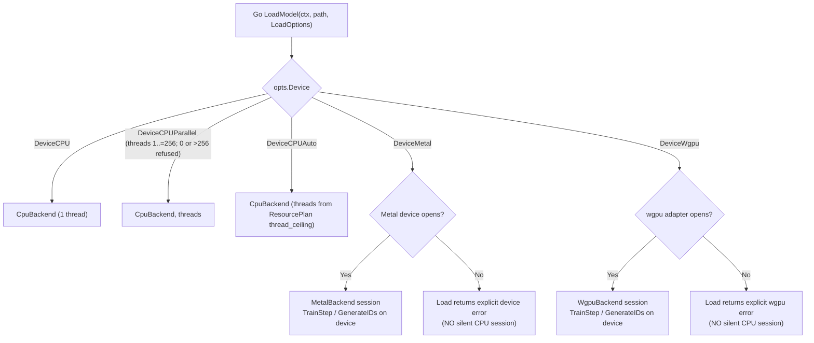
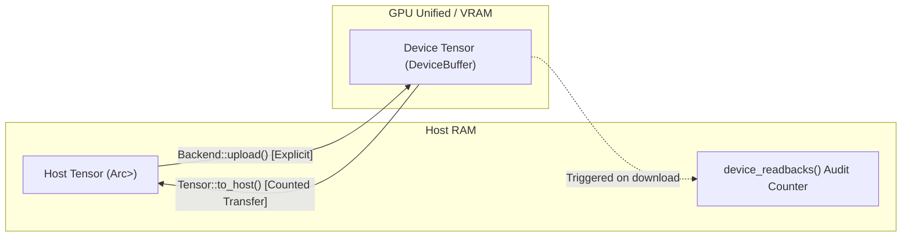
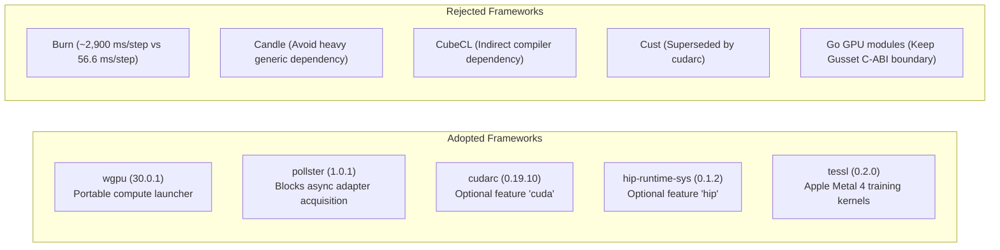

# Hardware Backends & Device Architecture

Survey date: 2026-10-01.

This machine is an **Apple M5 Pro** (`system_profiler`: Metal 4, 20 GPU cores, vendor Apple `0x106b`). Neither `nvcc` nor `/opt/rocm` is present.

---

## Who Selects the Device

There is no device router in Rust. `ojas-device` defines the `Device` kinds (`Cpu`, `Metal`, `Cuda`, `Hip`, `Vulkan`), `require_kind` (returns `DeviceMismatch` when two kinds differ), `probe()` (host CPU only; GPU probes live in the crates that link those runtimes), and memory planning (`ResourcePlan`, `ResourcePolicy`). It does not open a GPU and does not choose a backend.

A caller chooses a backend by constructing it in Rust (`CpuBackend`, `MetalBackend`, `WgpuBackend`), or through the Go `LoadModel(ctx, path, LoadOptions{Device: ...})` or `NewModel` call, which `ojas-capi` turns into a session on one backend at load time:

> [!IMPORTANT]
> **Zero Silent Fallback Policy:** CUDA and HIP have no Go device selector and do not implement `Backend`. If Metal or wgpu cannot open their respective hardware contexts, `LoadModel` or `NewModel` returns an immediate error—**it will never silently substitute a CPU session**.
>
> **CPU Auto Thread Selection:** `DeviceCPUAuto` automatically queries `ResourcePlan::thread_ceiling` (usable host CPUs capped by cgroup CPU quota) to configure the CPU thread pool. If the host CPU count is unreadable, load is refused rather than guessed.

On a GPU session, `TrainStep` reads back only the loss; the device tape keeps activations resident. `to_host` reads in 1 MiB pieces and checkpoint load in 64 KiB pieces, so the peak is the window plus one piece ([`typed-storage-plan.md`](typed-storage-plan.md)). Every backend validates shapes through one shared contract before reserving budget ([`shape-contract.md`](shape-contract.md)), and Metal reports device faults at the next `sync` like wgpu ([`metal-deferred-faults.md`](metal-deferred-faults.md)). Every backend implements `optimizer_scratch_bytes` so training preflights memory requirements before optimizer updates take place.

Device tensors: `Tensor::from_device` wraps a backend buffer, `to_host` copies it back and is counted by `device_readbacks()`, and `device_buffer_mut` requires sole ownership. The default `Backend::upload` returns `Unsupported` for a host tensor on a non-CPU backend, so a backend that has not implemented upload does not silently compute on the host.

---

## Memory Residency & Zero-Copy Lifecycle

> [!CAUTION]
> Host tensor accessors (`to_f32_vec`, `as_slice`) refuse device-resident tensors immediately rather than reading them back implicitly across the bus. This prevents unmetered PCIe/memory bus bottlenecks from corrupting latency profiles.

---

## Backend Status (2026-10-04, Apple M5 Pro)

| Backend | Implements `Backend` | Numerics | Tests | Notes |
| :--- | :--- | :--- | :--- | :--- |
| `CpuBackend` (`ojas-cpu`) | Yes | `Fast` default; `Exact` opt-in | 261 passed, 12 ignored | Exact: packed GEMM, persistent thread pool, bit-identical to golden digests across thread counts. Fast on macOS: $\ge 2^{13}$ multiply-adds (`FAST_WHOLE_CALL_MACS`) dispatch to Accelerate `cblas_sgemm`; smaller stay on `tile_fast`. Off macOS cutoff $2^{21}$. Hardened layout, pointwise parallelization across scoped worker threads, in-place AdamW, and embedding lookup |
| `ojas-simd` | No (kernels for `ojas-cpu`) | — | 36 passed | NEON ~110 GFLOP/s single thread; Accelerate ~1.4–1.9 TFLOP/s on medium/large GEMMs. Apple Accelerate vDSP/vForce vectorization, vector sign/abs/neg, and IEEE 754 edge float handling |
| `MetalBackend` (`ojas-metal`) | Yes, every op, device-resident | `Fast` | 136 passed | Tiled causal attention, head dim above 256 refused. Faults surface at the next `sync` ([`metal-deferred-faults.md`](metal-deferred-faults.md)). Attention forward/backward, device-resident training step |
| `WgpuBackend` (`ojas-wgpu`) | Yes, device-resident | `Fast`, 1e-4 relative tolerance | 208 passed, 3 ignored | Muon NS5 in f32, checked against CPU. Tiled FlashAttention-2, head dim above 256 refused. Gradient accumulation (`accumulate_grad`), KV cache writes, tiled linear cross-entropy (`linear_ce`), and deferred fault reporting at next `sync` |
| `ojas-kernels` | No (shared geometry and sources) | — | 11 passed | Launch geometry (`gemm_grid`, `attention_tiles`, `ATTENTION_MAX_HEAD_DIM`), WGSL modules in `src/wgsl/`, NaN-safe parity harness |
| `ojas-cuda` | No | — | 8 passed (feature off) | One affine kernel behind `--features cuda` |
| `ojas-hip` | No | — | 8 passed (feature off) | Copy probe behind `--features hip`; no kernel |

> [!WARNING]
> Both `MetalBackend` and `WgpuBackend` enforce $d_{\text{head}} \le 256$ for attention operations (`METAL_MAX_HEAD_DIM`; `ATTENTION_MAX_HEAD_DIM` for wgpu). A larger head dimension raises `OjasError::UnsupportedHeadDim` loud and early. The tiny Metal training step in `ojas-metal/src/gpu.rs` keeps its own limit of 64. Causal SDPA accepts grouped-query head counts on CPU, Metal and wgpu.

---

## Package Adoption Decisions

### Adopted

| Package | Version | License | Role | Decision | Rationale |
| :--- | :--- | :--- | :--- | :---: | :--- |
| `wgpu` | `30.0.1` | MIT OR Apache-2.0 | Portable compute launcher | **Adopt** | Executes portable WGSL across Vulkan, Metal, and DX12. |
| `pollster` | `1.0.1` | MIT OR Apache-2.0 | Future blocker | **Adopt** | Minimal future executor for `request_adapter()`. |
| `cudarc` | `0.19.10` | MIT OR Apache-2.0 | CUDA driver & NVRTC bindings | **Adopt (Feature)** | Modern safe CUDA bindings. Feature `cuda` off by default. |
| `hip-runtime-sys` | `0.1.2` | MIT OR Apache-2.0 | AMD HIP runtime bindings | **Adopt (Feature)** | Direct C-ABI bindings for ROCm/HIP. Feature `hip` off by default. |
| `tessl` | `0.2.0` | MIT OR Apache-2.0 | Apple Metal 4 kernels | **Keep** | Native Apple Silicon GEMM and normalization. |

### Rejected

| Package | Version | Reason for Rejection |
| :--- | :--- | :--- |
| `burn` | `0.21.0` | Heavy runtime; measured ~2,900–3,400 ms/step vs 56.6 ms/step native. |
| `candle-core` | `0.11.0` | Avoid broad general runtime dependency on performance-critical paths. |
| `cubecl` | `0.10.0` | JIT kernel compiler layer; ojas relies on static native Metal & WGSL shaders. |
| `cust` | `0.3.2` | Unmaintained legacy rust-cuda bindings; superseded by `cudarc`. |
| Go GPU modules | — | Go GPU engines (`gorgonia`, `gocu`) add GC interference. The in-process gusset C-ABI boundary keeps compute in Rust. |

---

## CUDA and HIP Verification Status

**Reported** from an earlier session; not re-run on 2026-10-01.

| Check | Command | Reported Result |
| :--- | :--- | :--- |
| **CUDA Default** | `cargo test -p ojas-cuda` | **Passed:** `tests::default_build_reports_not_compiled` |
| **CUDA Bindings** | `cargo check -p ojas-cuda --features cuda` | **Passed:** Typecheck only (dynamic loading; `nvcc` absent) |
| **CUDA Execution** | Kernel launch | **Skipped:** No NVIDIA GPU present |
| **HIP Default** | `cargo test -p ojas-hip` | **Passed:** `tests::default_build_reports_not_compiled` |
| **HIP Bindings** | `cargo check -p ojas-hip --features hip` | **Skipped:** Build stopped in `hip-runtime-sys` (no `/opt/rocm`) |
| **HIP Execution** | Copy probe (there is no HIP kernel) | **Skipped:** `--features hip` was not built; no `/opt/rocm` and no AMD GPU |
