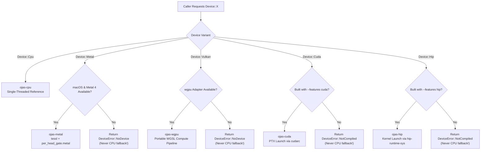
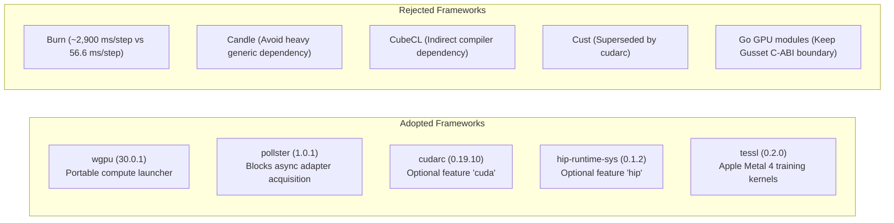

# Hardware Backends & Device Architecture

Survey date: 2026-10-01.

This machine is an **Apple M5 Pro** (`system_profiler`: Metal 4, 20 GPU cores, vendor Apple `0x106b`). Neither `nvcc` nor `/opt/rocm` is present.

---

## Device Routing Pipeline

ojas strictly forbids silent fallbacks. If a GPU execution is requested and the hardware or compile-time feature is absent, execution fails immediately with an explicit error:



---

## What Ran on This Machine

`cargo test -p ojas-device -p ojas-wgpu -p ojas-cuda -p ojas-hip` passed 14 unit tests (3 + 7 + 2 + 2):

```
ojas-wgpu adapter: Apple M5 Pro vendor=Apple (wgpu vendor field 0) hal=Metal
```

* **wgpu Adapter:** Verified name `Apple M5 Pro`, HAL `Metal`.
* **Zero Dispatch on Empty:** Empty inputs return `Ok` with `dispatched == false` without executing command encoders.
* **NaN Propagation:** Passing `f32::NAN` through affine scale properly propagates NaNs.
* **Overflow Protection:** Buffers exceeding `u32::MAX` byte length return `DeviceError::NoDevice`.
* **Strict Rejection:** Passing `Device::Cuda` to the wgpu pipeline returns `DeviceError::DeviceMismatch`, not a fallback.

---

## Package Adoption Decisions



### Adopted

| Package | Version | License | Role | Decision | Rationale |
| :--- | :--- | :--- | :--- | :---: | :--- |
| `wgpu` | `30.0.1` | MIT OR Apache-2.0 | Portable compute launcher | **Adopt** | Executes portable WGSL across Vulkan, Metal, and DX12. |
| `pollster` | `1.0.1` | MIT OR Apache-2.0 | Future blocker | **Adopt** | Minimal future executor for `request_adapter()`. |
| `cudarc` | `0.19.10` | MIT OR Apache-2.0 | CUDA driver & NVRTC bindings | **Adopt (Feature)** | Modern safe CUDA bindings. Feature `cuda` off by default. |
| `hip-runtime-sys` | `0.1.2` | MIT OR Apache-2.0 | AMD HIP runtime bindings | **Adopt (Feature)** | Direct C-ABI bindings for ROCm/HIP. Feature `hip` off by default. |
| `tessl` | `0.2.0` | MIT OR Apache-2.0 | Apple Metal 4 kernels | **Keep** | Native Apple Silicon GEMM and normalization. |

### Rejected

| Package | Version | Reason for Rejection |
| :--- | :--- | :--- |
| `burn` | `0.21.0` | Heavy runtime; measured ~2,900–3,400 ms/step vs 56.6 ms/step native. |
| `candle-core` | `0.11.0` | Avoid broad general runtime dependency on performance-critical paths. |
| `cubecl` | `0.10.0` | JIT kernel compiler layer; ojas relies on static native Metal & WGSL shaders. |
| `cust` | `0.3.2` | Unmaintained legacy rust-cuda bindings; superseded by `cudarc`. |
| Go GPU modules | — | Go GPU engines (`gorgonia`, `gocu`) add GC interference. Gusset IPC cleanly isolates compute. |

---

## CUDA and HIP Verification Status

| Check | Command | Verified Result |
| :--- | :--- | :--- |
| **CUDA Default** | `cargo test -p ojas-cuda` | **Passed:** `tests::default_build_reports_not_compiled` |
| **CUDA Bindings** | `cargo check -p ojas-cuda --features cuda` | **Passed:** Typecheck only (dynamic loading; `nvcc` absent) |
| **CUDA Execution** | Kernel launch | **Skipped:** No NVIDIA GPU present |
| **HIP Default** | `cargo test -p ojas-hip` | **Passed:** `tests::default_build_reports_not_compiled` |
| **HIP Bindings** | `cargo check -p ojas-hip --features hip` | **Skipped:** Build stopped in `hip-runtime-sys` (no `/opt/rocm`) |
| **HIP Execution** | Kernel launch | **Skipped:** No AMD GPU present |
