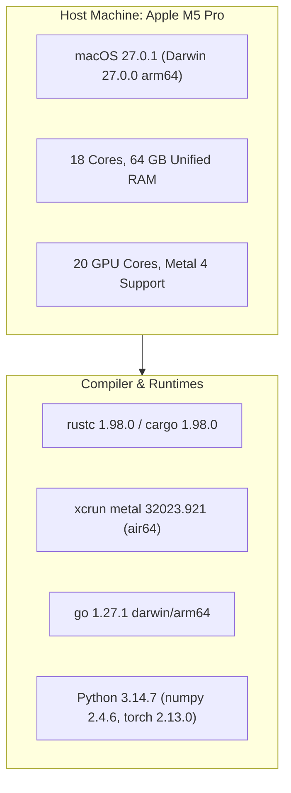
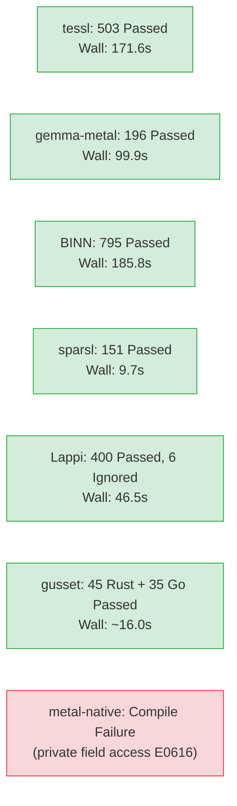
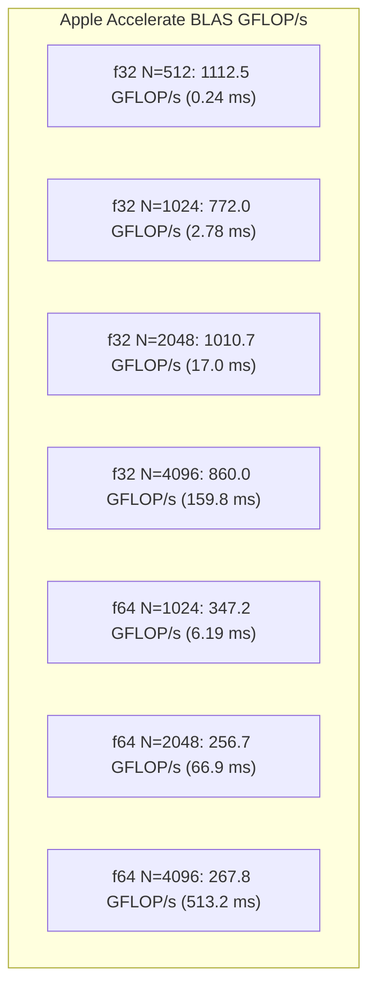

# p0-env Baseline

Recorded 2026-09-30 evening, CDT. All metrics originate from commands executed directly on the host machine. Suites ran sequentially wrapped in process-group timeouts.

---

## Machine & Toolchain Profile



| Metric | Command | Verified Value |
| :--- | :--- | :--- |
| **Date** | `date` | Wed Sep 30 23:22:45 CDT 2026 |
| **rustc** | `rustc --version` | rustc 1.98.0 (88d9e12ae 2026-08-18) |
| **cargo** | `cargo --version` | cargo 1.98.0 (797e8a9bc 2026-08-05) |
| **Go** | `go version` | go version go1.27.1 darwin/arm64 |
| **OS** | `sw_vers` | macOS 27.0.1, build 26A434 |
| **Kernel** | `uname -a` | Darwin 27.0.0, arm64, `xnu-13432.1.9~1/RELEASE_ARM64_T6050` |
| **Hardware** | `sysctl` | 68,719,476,736 bytes (64 GB), 18 cores, Apple M5 Pro |
| **GPU** | `system_profiler` | Apple M5 Pro, 20 cores, Metal 4 |
| **Metal** | `xcrun metal --version` | version 32023.921, target air64-apple-darwin27.0.0 |
| **Python** | `python3 --version` | Python 3.14.7 |

---

## Suite Execution Summary



| Suite | Command | Wall Time | Results |
| :--- | :--- | ---: | :--- |
| **tessl** | `cargo test --release -- --test-threads=1` | 171.6 s | **503 passed**, 0 failed, 8 ignored |
| **metal-native** | `cargo test --release` | 31.0 s | **Compile failed** (E0616: private field access on `Tensor`) |
| **gemma-metal** | `cargo test --release` | 99.9 s | **196 passed**, 0 failed, 0 ignored |
| **BINN** | `cargo test --workspace` | 185.8 s | **795 passed**, 0 failed, 0 ignored |
| **sparsl** | `cargo test` | 9.7 s | **151 passed**, 0 failed, 0 ignored |
| **Lappi** | `cargo test --workspace` | 46.5 s | **400 passed**, 0 failed, 6 ignored (snapshot models) |
| **gusset** | `cargo test -p gusset --lib` & `go test .` | 16.0 s | **45 Rust passed**; **35 Go top-level / 239 subtests passed** |

---

## CPU Matmul Performance (Apple Accelerate BLAS)

Measured using Python 3.14.7, NumPy 2.4.6 (`Accelerate` BLAS/LAPACK):

$$\text{GFLOP/s} = \frac{2 \cdot n^3}{\text{best\_seconds} \cdot 10^9}$$



| DType | Matrix Size $N$ | Best Time (s) | GFLOP/s (Best) | GFLOP/s (Median) |
| :--- | ---: | ---: | ---: | ---: |
| **float32** | 512 | 0.000241 s | **1112.5** | 568.2 |
| **float32** | 1024 | 0.002782 s | **772.0** | 585.9 |
| **float32** | 2048 | 0.016998 s | **1010.7** | 763.7 |
| **float32** | 4096 | 0.159807 s | **860.0** | — |
| **float64** | 512 | 0.001781 s | **150.8** | 98.6 |
| **float64** | 1024 | 0.006186 s | **347.2** | 266.4 |
| **float64** | 2048 | 0.066928 s | **256.7** | 224.9 |
| **float64** | 4096 | 0.513245 s | **267.8** | — |

*Baseline CPython loop (no BLAS, $N=64$):* **0.0147 s (0.0357 GFLOP/s)**.

---

## PyTorch Reference Baseline (`nanolab`)

* Command:
  ```bash
  WANDB=0 python3 -m nanolab.train --preset cpu_smoke --out_dir /tmp/nanolab-baseline-out --device cpu
  ```
* Wall clock: **4.8 s**, Exit 0.
* Output: `DONE best_val_loss=2.6143 final_val_loss=2.6143 tokens=41.0K time=0m01s`.
* Total Parameters: `436.1K`.
