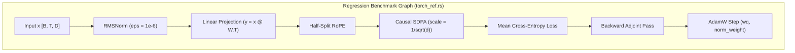
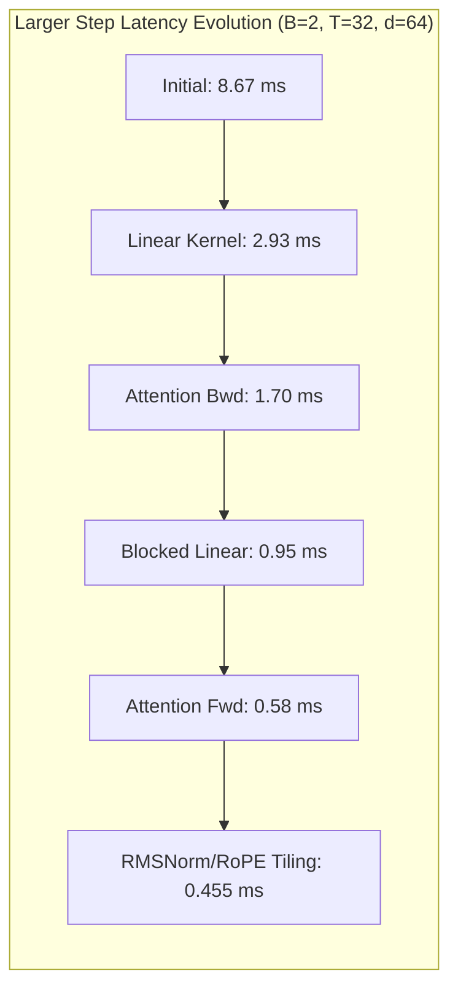
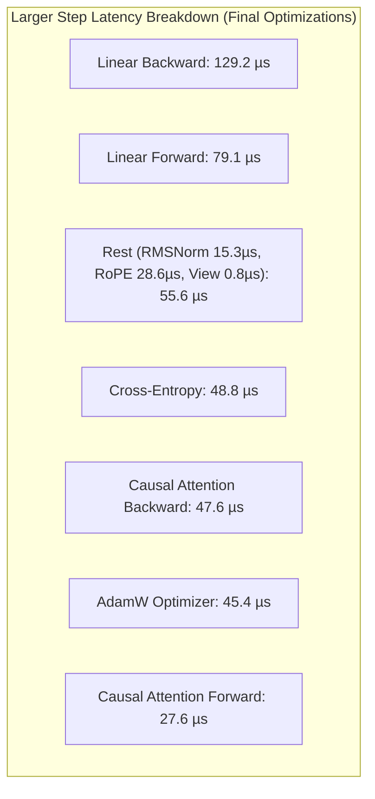

# CPU Reference versus PyTorch CPU Benchmarks

Wall time of one forward, backward, and AdamW step. The graph is the regression test in `ojas-cpu/tests/torch_ref.rs`: RMSNorm (eps `1e-6`), bias-free linear `y = x @ W.T`, half-split RoPE, causal SDPA with scale `1/sqrt(d)` and one head, mean cross-entropy, backward, then AdamW on `wq` (weight decay 0.1) and the norm weight (weight decay 0). The learning rate is `6e-4` times the cosine multiplier at step 8 (warmup 4, total 20). `wk`, `wv`, and `wo` receive weight gradients and are not written by AdamW. Moments start at zero.



Both timers use CPU. Torch uses `SDPBackend.MATH`. The tensors in the torch run were on `cpu`. This torch build also has MPS compiled in; the timed step did not move tensors there.

> [!IMPORTANT]
> Numbers below are **verified** from the commands in this file, on this machine, 2026-10-01. Two full runs were recorded. The within-run median is the median after dropping the warmup calls listed below. The second process did not repeat the first median closely on the tiny torch step, so both runs are listed and no single speedup is stated.

---

## Toolchain & System Profile

| Component | Verified Value |
| :--- | :--- |
| **rustc** | `rustc 1.98.0 (88d9e12ae 2026-08-18)` |
| **cargo** | `cargo 1.98.0 (797e8a9bc 2026-08-05)` |
| **Python** | 3.14.7, `/opt/homebrew/opt/python@3.14/bin/python3.14` |
| **torch** | 2.13.0, `/Users/bharath/Library/Python/3.14/lib/python/site-packages/torch/__init__.py` |
| **torch CPU threads** | `torch.get_num_threads() == 6`, interop threads 18 |
| **Rust threads** | Evaluated with 1 thread up to 6 threads via `CpuBackend::with_threads` |

Release profile from the workspace `Cargo.toml`: `panic = "unwind"`, `overflow-checks = true`.

---

## Commands

```bash
cd /Users/bharath/Code/research/ojas
cargo test -p ojas-cpu --release --test torch_ref -- --nocapture --test-threads=1
python3 /tmp/ojas_cpu_bench.py
```

The second invocation repeated `one_step_wall_time` only, then the same python script. `ojas-cpu` already built; criterion was not added.

The Rust clock wraps `tiny_step` / `regression_graph`, which builds every tensor from host slices, runs the step, and copies the loss and the updated `wq` and norm back to host vectors. `std::hint::black_box` is applied to that loss and those two vectors.

The torch clock wraps the forward, backward, and `AdamW.step`. Gradients are cleared inside that region. Weights are copied back and the AdamW state is cleared before the clock starts, so each call is one step from the initial parameters.

---

## Mathematical Correctness

The tiny Rust loss on the frozen `torch_ref` inputs stayed within `1e-4` of the frozen `LOSS`. The wall-time test printed `loss=3.4650407` and `loss_err=2.384e-7`. `one_step_matches_torch_2_13_float32` also passed, which checks that same loss and the other frozen tensors at `1e-4`.

The torch tiny loss, seed 0, matched the frozen bits before timing: `0x405dc33b`, absolute error `0`.

The larger shape has no frozen tensor file. The Rust run checked that its loss was finite (`4.852497` with the test's own generator). That value is not a torch match.

---

## Progression of Latency Optimizations



### Initial Baseline Medians

* Tiny: `B=1`, `T=4`, `d=16`, 1 head, `vocab=32`. 200 calls, drop the first 20, median of 180.
* Larger: `B=2`, `T=32`, `d=64`, 1 head, `vocab=128`. 20 calls, drop the first 4, median of 16.

| Run | Shape | Rust median | Torch CPU median |
| :--- | :--- | ---: | ---: |
| 1 | tiny | `4.572900000e-5` s | `1.755520498e-3` s |
| 1 | larger | `7.833208000e-3` s | `1.923291500e-3` s |
| 2 | tiny | `5.968750000e-5` s | `9.818130056e-4` s |
| 2 | larger | `8.672417000e-3` s | `1.707812495e-3` s |

*Readable scale:* Rust tiny ~46–60 µs vs Torch tiny ~0.98–1.76 ms. Rust larger ~7.83–8.67 ms vs Torch larger ~1.71–1.92 ms.

---

### Final Optimized Step Latency (Linear Tiles, RMSNorm, RoPE, View Reshape)

After applying contiguous register tiling, slice-based RMSNorm/RoPE, and zero-copy `Tensor::view` reshapes:

| Run | Shape | Rust median | Torch CPU median |
| :--- | :--- | ---: | ---: |
| 1 | tiny | `2.245800000e-5` s (~22.5 µs) | `3.540420003e-4` s (~354 µs) |
| 1 | larger | `4.620420000e-4` s (~462 µs) | `4.559369918e-4` s (~456 µs) |
| 2 | tiny | `2.245900000e-5` s (~22.5 µs) | `4.868955002e-4` s (~487 µs) |
| 2 | larger | `4.546040000e-4` s (~455 µs) | `4.629169998e-4` s (~463 µs) |



---

## Single Linear Projection Benchmark

Evaluating single `linear` operations at training dimensions. Both timers measure forward (`y = x @ W.T`) or backward (`grad_x` and `grad_w`). Rust uses `CpuBackend::with_threads(..., 6)`. Torch uses `torch.nn.functional.linear` with 6 threads.

### Earlier medians (Exact only, before the 2026-10-01 overhead work)

| Shape | Rust fwd | Torch fwd | Rust bwd | Torch bwd |
| :--- | ---: | ---: | ---: | ---: |
| **64×64×128** | 35.2 µs | 5.2 µs | 51.4 µs | 16.2 µs |
| **256×256×256** | 0.407 ms | 0.047 ms | 0.545 ms | 0.103 ms |
| **512×768×768** | 4.35 ms | 1.23 ms | 5.98 ms | 2.45 ms |

### 2026-10-01: both tiers, symmetric min-of-N

Apple M5 Pro (6 P-cores, 12 E-cores), load average 21–33 from other applications, so read the columns against each other, not as absolute speeds. Every cell is the minimum over 4 interleaved process pairs (baseline, current, baseline, ...), each itself a min of 30 forward and 15 backward calls. Torch is the same statistic (min of 30), run in the same window. "Before" is a frozen copy of the tree taken before this work; it is not a commit, so it cannot be rebuilt from git.

| 6 threads | Exact before | Exact now | Fast before | Fast now | Torch |
| :--- | ---: | ---: | ---: | ---: | ---: |
| 64×64×128 fwd | 27 µs | 28 µs | 25 µs | 19 µs | 5 µs |
| 64×64×128 bwd | 41 µs | 33 µs | 32 µs | 23 µs | 18 µs |
| 256³ fwd | 0.245 ms | 0.190 ms | 0.141 ms | 0.092 ms | 0.062–0.072 ms |
| 256³ bwd | 0.454 ms | 0.368 ms | 0.244 ms | 0.171 ms | 0.144 ms |
| 512×768×768 fwd | 3.07 ms | 2.50 ms | 1.52 ms | 0.77 ms ¹ | 1.17–1.20 ms ¹ |
| 512×768×768 bwd | 5.82 ms | 5.07 ms | 2.47 ms | 2.55 ms | 2.25–2.29 ms |

¹ Three independent runs, each 4 interleaved pairs with torch run in the same window. Fast forward at 512×768×768: before 1.52 / 1.23 / 1.14 ms, now 0.77 / 0.62 / 0.66 ms, torch 1.17–1.20 / 1.26–1.31 / 0.81–0.87 ms. Fast forward was faster than torch in all three runs. Fast backward was 2.55 / 2.47 / 1.32 ms against torch 2.25–2.29 / 2.50–2.76 / 1.72–2.29 ms: parity within the noise, not a win. An earlier A/B by the CPU lane read "no change" at this shape (1.386 → 1.390 ms). That compared the minima of the two sides, and the baseline's minimum was one outlier pair. In 4 of its 5 six-thread pairs the live tree was faster (1.39–1.50 ms against 1.74–1.92 ms), and its harness was built at 16:32, before the lane's last allocation changes landed (`target-lane-cpu/prof-out/live1.txt`). Exact gains were 1.13–1.29× in every run.

At 18 threads, Exact 512×768×768 went from 1.85 to 1.44 ms forward and from 3.58 to 2.94 ms backward.

Committed reproduction of the "now" and "Torch" columns (medians rather than minimums):

```bash
OJAS_BENCH_THREADS=6 cargo test -p ojas-cpu --release --test bench_cpu -- --ignored --nocapture --test-threads=1 linear_wall_time_matrix
```

```bash
python3 ojas-cpu/benches/torch_linear.py --threads 6
```

What changed: `Tensor::to_f32_vec` and `to_u32_vec` decode with a vector copy, about 8× faster (`ojas-core/tests/bench_decode.rs`). Finite scans got cheaper. Transposed operands pack 4×4 at a time. The first reduction block starts from zero instead of loading C. `plan` makes up to 6 tiles per thread instead of 2. Linear outputs are charged to the budget for as long as they are held.

**Why Exact cannot reach torch here.** Torch's CPU `linear` on this build calls Accelerate (`BLAS_INFO=accelerate`), which runs on the matrix unit. Accelerate alone does 512×768×768 in 0.41 ms (`cargo run --release -p ojas-simd --example bench --features accelerate`, about 1.47 TFLOP/s). The Exact contract (separate multiply and add, ascending `k`) takes two vector instructions per multiply-add. Its micro-kernel measured 33.2 GMAC/s per P-core on L1-resident panels, against 63.5 for the FMA kernel; that is the FP-pipe bound for each. Six P-cores at 33 GMAC/s put a floor of about 1.5 ms on 512×768×768. Exact is the reproducible reference tier; Fast is the tier to compare with torch. Since 2026-10-01 Fast is the `CpuBackend` default and Exact is opt-in (`.with_numerics(Numerics::Exact)`).

**Where Fast still loses.** At 512×768×768, Fast backward is about 80% inside Accelerate (`sample` profile). The rest is the input finite scans, the output copy into a `Tensor`, and the input decode. All three come from the byte-backed `Tensor` storage, which needs a decoded copy per operand. Since 2026-10-01 the macOS cutoff is 2¹³ multiply-adds, not 2²¹ (`ojas_cpu::FAST_WHOLE_CALL_MACS`); see the next section.

**Small and decode GEMMs (2026-10-01).** `gemm.rs::bench_packed_against_accelerate` times the packed FMA kernel against one Accelerate call on the same operands, interleaved, at 6 threads and at 1. The two tie at 4K–8K multiply-adds (16×16×32: 0.41–0.53 against 0.47 µs over two runs). Above that Accelerate wins: 1.6× at 24³, 5× at 64×64×128, and 27–41× at 1×768×768, where the packed path re-packs the whole weight for one row. Fast now sends every product of at least 2¹³ multiply-adds to Accelerate on macOS. Below that, and for every product off macOS below 2²¹, the bits are the packed FMA chain and do not depend on the thread count.

One-row linears (decode, nanolab widths, 6 threads, minimum over 3 interleaved rounds, load 12–13):

| Op | Cutoff 2²¹ | Cutoff 2¹³ | Torch |
| :--- | ---: | ---: | ---: |
| 1×768→768 fwd / bwd | 174 / 299 µs | **58 / 167 µs** | 8.1 / 58 µs |
| 1×768→2048 fwd / bwd | 487 / 902 µs | **177 / 480 µs** | 18 / 209 µs |
| 1×2048→768 fwd / bwd | 503 / 772 µs | **169 / 547 µs** | 18 / 172 µs |

The outputs are bit-identical to torch's, since both call Accelerate's `sgemm` (`--parity` max_abs 0). Accelerate itself takes about 4.5 µs of the 58 µs forward. Most of the rest was copying and NaN-scanning the 2.4 MB weight on every call. [Typed storage](typed-storage-plan.md) step 2 removed the copy (2026-10-02): 1×768→768 forward 56→35 µs against the step-1 build, 5 interleaved rounds at load 21–34. The NaN scan of the weight went with the cached finite flag (2026-10-02, `Tensor::all_finite_cached`): a weight is scanned once and then not again until it is written. These decode rows have not been re-timed since. Training-shape rows did not move: attention and the block were already above 2²¹ (SDPA fwd 2.70 against 2.93 ms, block step 123.7 against 122.8 ms, within noise).

Reproduce:

```bash
cargo test -p ojas-cpu --release --lib bench_packed_against_accelerate -- --ignored --nocapture --test-threads=1
```

```bash
OJAS_BENCH_OPS=linear_dec_qkvo,linear_dec_up,linear_dec_down OJAS_BENCH_THREADS=6 cargo test -p ojas-cpu --release --test bench_ops -- --ignored --nocapture --test-threads=1
```

---

## Nanolab Block and Per-Op Benchmark (2026-10-01)

One nanolab block: d=768, 12 heads × 64, T=1024, B=1, SwiGLU hidden 2048, QK-norm, RoPE, per-head gate, value residual. `CpuBackend` is Fast with 6 threads; torch 2.13 CPU also uses 6 threads. Every cell is the minimum over 3 interleaved rounds (frozen ojas, current ojas, torch), each itself a min of 10 calls. Load average was 18–24 from other applications.

| | ojas before | ojas now | torch, MATH SDPA | torch, default (flash) SDPA |
| :--- | ---: | ---: | ---: | ---: |
| Block forward | 71.4–73.0 ms | 41.0–42.1 ms | 32.4–45.9 ms | 34.8–35.9 ms |
| Block forward + backward | 224–230 ms | **121–125 ms** | 125–131 ms | 109–110 ms |

"Before" is the binary the measurement lane froze before the kernel work (`target-lane-measure/frozen/bench_ops`, not rebuildable from git; it was deleted in a disk-full cleanup on 2026-10-01, so the "before" cells can no longer be re-measured). Parity of every op and of the block's output and 16 gradients against torch autograd is checked by the same harness (`--parity`).

What moved the block, by op, 6 threads, ms. Each row is from the lane that did the work, measured interleaved against the frozen binary:

| Op | Before | Now | Torch |
| :--- | ---: | ---: | ---: |
| Causal SDPA fwd / bwd `[1,12,1024,64]` | 12.7 / 41.8 | 3.2 / 6.3 | 12.9 / 16.2 MATH, 3.0 / 7.1 flash |
| Per-head gate fwd / bwd | 6.7 / 23.0 | 0.55 / 0.93 | 0.13 / 0.31 |
| SiLU fwd / bwd `[1024,2048]` | 10.0 / 10.9 | 0.89 / 1.20 | 0.31 / 0.42 |
| Permute (0,2,1,3) | 0.98 | 0.11 | 0.04 |
| Value residual bwd | 1.75 | 0.65 | 0.26 |
| Cross-entropy fwd / bwd `[1024,50304]` | 33.4 / 40.6 | 6.5 / 8.7 | 8.2 / 8.9 |
| Embedding fwd / bwd `[50304,768]` | 5.45 / 9.22 | 1.07 / 1.88 | 0.03 / 0.85 |
| AdamW on `[50304,768]` | 64.1 | **11.2** | 15.5 (fused 5.4) |
| `clip_grad_norm`, 123.7M values, scaling every call | about 208 | **16.0** | 27.9 |

The in-place rows (AdamW, Muon, clip) run every call on a fresh copy of their inputs, made outside the timer, on both sides. Before that fix, `bench_ops.rs` reused one set of gradients, so after the first call the clip input was already clipped and the scale pass never ran. The clip "Before" cell comes from the frozen binary, which predates this fix and cannot be inspected, so whether its scale pass ran on every call is unknown.

The AdamW and clip "Now" cells are the in-place versions (2026-10-01): AdamW checks every element finite in one pass and stores the parameter and both moments in place in a second, and the clip scales each gradient where it is, so neither uses a buffer, copies a result back, or charges the budget. Fast AdamW does its element arithmetic in f32. Measured by `target-matmul/inplace_ab.sh`: the previous buffered build (the same tree with only `ojas-cpu/src/optim.rs` and `backend.rs` reverted) against the in-place build against torch, 5 interleaved rounds, 6 threads, minimum over rounds, load 30–48:

| Op | Buffered | In place | Torch default | Torch fused |
| :--- | ---: | ---: | ---: | ---: |
| AdamW `[50304,768]` | 20.8 | 11.2 | 15.5 | 5.4 |
| AdamW `[768,768]` | 0.49 | 0.31 | 0.51 | 0.15 |
| `clip_grad_norm` | 25.7 | 16.0 | 27.9 | — |

In every round the in-place build beat both the buffered build and torch's default; per-round minimums for AdamW `[50304,768]` were 11.2–16.4 ms against 20.8–26.8 buffered and 15.5–18.3 torch. Torch's fused AdamW (one multi-tensor kernel) is still about 2× faster. The bits are unchanged (`adamw_keeps_the_reference_bits_in_place_at_every_thread_count`, `clip_charges_nothing`), and `--parity` against torch passes for both AdamW variants.

Correctness found along the way:
- **Value-residual λ gradient.** It summed 786k products serially in f32, 3.2e-5 from f64; torch is 1.4e-7. Fast now sums in f64 blocks: 4.1e-8.
- **torch's own f32 norm is off at this size.** For the 38.6M-element embedding gradient it returns 3.5700 against an exact 3.5886, a 0.5% error. The ojas clip norm is 5.5e-9 from f64.

Known remaining gaps:
- **Embedding forward was bound by the NaN scan of the whole table.** Since 2026-10-02 the table is scanned once and then not again until it is written (`Tensor::all_finite_cached`): `bench_ops` embedding forward fell to 0.08 of before by min of 9 interleaved rounds (0.09 by median), under a load of about 30. The ops-table row above has not been re-timed with torch. Metal and wgpu keep their own fault checks.
- **AdamW is two in-place passes, against torch's fused one.** The first pass only checks that every element's step is finite, so a NaN is refused before anything is written; torch's fused kernel writes in one pass and does not refuse a non-finite step. Fast does the element arithmetic in f32, as torch and the Metal kernel do; Exact keeps f64.
- **Most ops still pay one copy out**: a kernel builds its result in a `Vec` and the tensor is a copy of it (typed-storage step 3). Operands are no longer copied (step 2, 2026-10-02), and mul, add, the value-residual blend and causal SDPA (forward and backward, 2026-10-02) already write straight into their output tensors.

Reproduce:

```bash
OJAS_BENCH_OPS=block OJAS_BENCH_THREADS=6 cargo test -p ojas-cpu --release --test bench_ops -- --ignored --nocapture --test-threads=1
```

The torch script reads its inputs from files that `bench_ops.rs` writes in dump mode. Its default `--dir` (`target-lane-measure/bench_ops`) was deleted in the 2026-10-01 cleanup, so write them first:

```bash
OJAS_BENCH_MODE=dump OJAS_BENCH_DIR=target-matmul/bench_fixtures OJAS_BENCH_OPS=block cargo test -p ojas-cpu --release --test bench_ops -- --ignored --nocapture --test-threads=1
```

```bash
python3 ojas-cpu/benches/torch_ops.py --dir target-matmul/bench_fixtures --threads 6 --time --ops block
```

---

## Fast Numerics with Accelerate & GPU Backends

> [!WARNING]
> GPU benchmarks below were recorded under high system load average (load 30–48) on macOS 27. Read these timings as preliminary reference figures.

### 1. CPU with Apple Accelerate (`Numerics::Fast`)
On macOS, products $\ge 2^{21}$ multiply-adds route to Accelerate `cblas_sgemm` (18 threads):

> The cutoff has since moved. `FAST_WHOLE_CALL_MACS` is now $2^{13}$ on macOS (`ojas-cpu/src/gemm.rs`); the table below was measured under the $2^{21}$ cutoff.


| Shape | ojas Fast fwd | ojas Fast bwd | Accelerate alone | Torch CPU fwd | Torch CPU bwd |
| :--- | ---: | ---: | ---: | ---: | ---: |
| **512×768×768** | ~0.89 ms | ~1.5 ms | 0.31 ms | 0.41 ms | 0.84 ms |
| **2048³** | ~15 ms | ~30 ms | 9.7 ms | 11.5 ms | 24.7 ms |

### 2. Metal (`MetalBackend`), Under Load
Compared against PyTorch MPS:

| Measurement | ojas Metal | Torch MPS |
| :--- | ---: | ---: |
| **Full step, d=768, B=4, T=128, V=50304, resident** | ~141 ms | 146 ms |
| **Linear forward, 2048³** | 3.86 ms | 2.81 ms |
| **Attention backward, T=2048** | 306 ms (old scalar kernel, superseded) | 60 ms |

The attention backward row is from the old scalar kernel. The tiled backward that replaced it is measured in [`bench-gpu-vs-torch.md`](bench-gpu-vs-torch.md).

### 3. wgpu (`WgpuBackend`)
* **GEMM 2048³ (Resident):** Operates at ~2.0 TFLOP/s (~7.5× faster than 6-thread CPU on the same shape).
* **Attention (T=2048):** Runs at approximately the same latency as CPU.
* **Tolerance:** `Fast` numerics match CPU within $10^{-4}$ relative tolerance.
