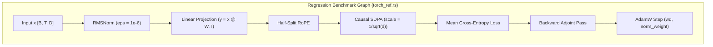
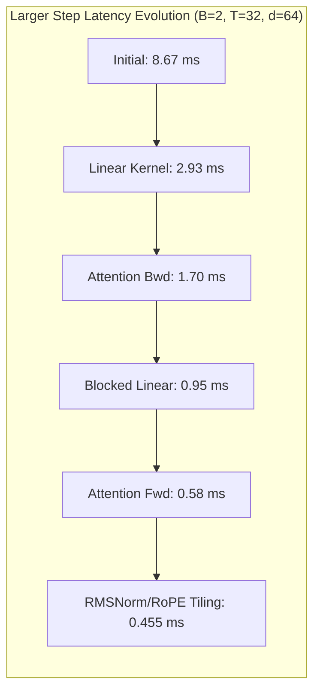
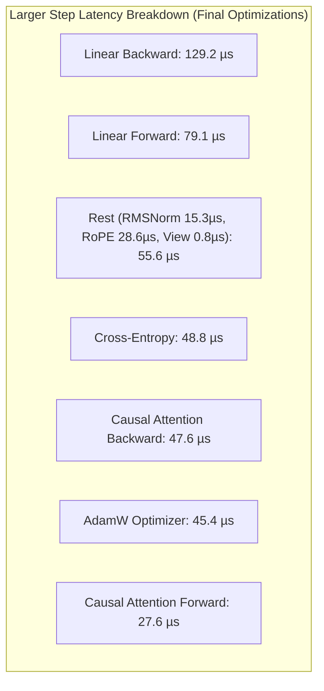
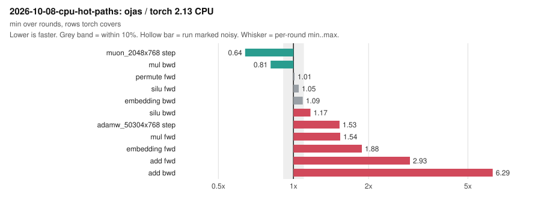

# CPU Reference versus PyTorch CPU Benchmarks

> Charts of every run in `bench/results`, one per result folder, are in [bench-plots.md](bench-plots.md).

Wall time of one forward, backward, and AdamW step. The graph is the regression test in `ojas-cpu/tests/torch_ref.rs`: RMSNorm (eps `1e-6`), bias-free linear `y = x @ W.T`, half-split RoPE, causal SDPA with scale `1/sqrt(d)` and one head, mean cross-entropy, backward, then AdamW on `wq` (weight decay 0.1) and the norm weight (weight decay 0). The learning rate is `6e-4` times the cosine multiplier at step 8 (warmup 4, total 20). `wk`, `wv`, and `wo` receive weight gradients and are not written by AdamW. Moments start at zero.



Both timers use CPU. Torch uses `SDPBackend.MATH`. The tensors in the torch run were on `cpu`. This torch build also has MPS compiled in; the timed step did not move tensors there.

> [!IMPORTANT]
> Numbers below are **verified** from the commands in this file, on this machine, 2026-10-01. Two full runs were recorded. The within-run median is the median after dropping the warmup calls listed below. The second process did not repeat the first median closely on the tiny torch step, so both runs are listed and no single speedup is stated.

---

## Toolchain & System Profile

| Component | Verified Value |
| :--- | :--- |
| **rustc** | `rustc 1.98.0 (88d9e12ae 2026-08-18)` |
| **cargo** | `cargo 1.98.0 (797e8a9bc 2026-08-05)` |
| **Python** | 3.14.7, `/opt/homebrew/opt/python@3.14/bin/python3.14` |
| **torch** | 2.13.0, `/Users/bharath/Library/Python/3.14/lib/python/site-packages/torch/__init__.py` |
| **torch CPU threads** | `torch.get_num_threads() == 6`, interop threads 18 |
| **Rust threads** | Evaluated with 1 thread up to 6 threads via `CpuBackend::with_threads` |

Release profile from the workspace `Cargo.toml`: `panic = "unwind"`, `overflow-checks = true`.

---

## Commands

```bash
cd /Users/bharath/Code/research/ojas
cargo test -p ojas-cpu --release --test torch_ref -- --nocapture --test-threads=1
python3 /tmp/ojas_cpu_bench.py
```

The second invocation repeated `one_step_wall_time` only, then the same python script. `ojas-cpu` already built; criterion was not added.

The Rust clock wraps `tiny_step` / `regression_graph`, which builds every tensor from host slices, runs the step, and copies the loss and the updated `wq` and norm back to host vectors. `std::hint::black_box` is applied to that loss and those two vectors.

The torch clock wraps the forward, backward, and `AdamW.step`. Gradients are cleared inside that region. Weights are copied back and the AdamW state is cleared before the clock starts, so each call is one step from the initial parameters.

---

## Mathematical Correctness

The tiny Rust loss on the frozen `torch_ref` inputs stayed within `1e-4` of the frozen `LOSS`. The wall-time test printed `loss=3.4650407` and `loss_err=2.384e-7`. `one_step_matches_torch_2_13_float32` also passed, which checks that same loss and the other frozen tensors at `1e-4`.

The torch tiny loss, seed 0, matched the frozen bits before timing: `0x405dc33b`, absolute error `0`.

The larger shape has no frozen tensor file. The Rust run checked that its loss was finite (`4.852497` with the test's own generator). That value is not a torch match.

---

## Progression of Latency Optimizations



### Initial Baseline Medians

* Tiny: `B=1`, `T=4`, `d=16`, 1 head, `vocab=32`. 200 calls, drop the first 20, median of 180.
* Larger: `B=2`, `T=32`, `d=64`, 1 head, `vocab=128`. 20 calls, drop the first 4, median of 16.

| Run | Shape | Rust median | Torch CPU median |
| :--- | :--- | ---: | ---: |
| 1 | tiny | `4.572900000e-5` s | `1.755520498e-3` s |
| 1 | larger | `7.833208000e-3` s | `1.923291500e-3` s |
| 2 | tiny | `5.968750000e-5` s | `9.818130056e-4` s |
| 2 | larger | `8.672417000e-3` s | `1.707812495e-3` s |

*Readable scale:* Rust tiny ~46–60 µs vs Torch tiny ~0.98–1.76 ms. Rust larger ~7.83–8.67 ms vs Torch larger ~1.71–1.92 ms.

---

### Final Optimized Step Latency (Linear Tiles, RMSNorm, RoPE, View Reshape)

After applying contiguous register tiling, slice-based RMSNorm/RoPE, and zero-copy `Tensor::view` reshapes:

| Run | Shape | Rust median | Torch CPU median |
| :--- | :--- | ---: | ---: |
| 1 | tiny | `2.245800000e-5` s (~22.5 µs) | `3.540420003e-4` s (~354 µs) |
| 1 | larger | `4.620420000e-4` s (~462 µs) | `4.559369918e-4` s (~456 µs) |
| 2 | tiny | `2.245900000e-5` s (~22.5 µs) | `4.868955002e-4` s (~487 µs) |
| 2 | larger | `4.546040000e-4` s (~455 µs) | `4.629169998e-4` s (~463 µs) |



---

## Single Linear Projection Benchmark

Evaluating single `linear` operations at training dimensions. Both timers measure forward (`y = x @ W.T`) or backward (`grad_x` and `grad_w`). Rust uses `CpuBackend::with_threads(..., 6)`. Torch uses `torch.nn.functional.linear` with 6 threads.

### Earlier medians (Exact only, before the 2026-10-01 overhead work)

| Shape | Rust fwd | Torch fwd | Rust bwd | Torch bwd |
| :--- | ---: | ---: | ---: | ---: |
| **64×64×128** | 35.2 µs | 5.2 µs | 51.4 µs | 16.2 µs |
| **256×256×256** | 0.407 ms | 0.047 ms | 0.545 ms | 0.103 ms |
| **512×768×768** | 4.35 ms | 1.23 ms | 5.98 ms | 2.45 ms |

### 2026-10-01: both tiers, symmetric min-of-N

Apple M5 Pro (6 P-cores, 12 E-cores), load average 21–33 from other applications, so read the columns against each other, not as absolute speeds. Every cell is the minimum over 4 interleaved process pairs (baseline, current, baseline, ...), each itself a min of 30 forward and 15 backward calls. Torch is the same statistic (min of 30), run in the same window. "Before" is a frozen copy of the tree taken before this work; it is not a commit, so it cannot be rebuilt from git.

| 6 threads | Exact before | Exact now | Fast before | Fast now | Torch |
| :--- | ---: | ---: | ---: | ---: | ---: |
| 64×64×128 fwd | 27 µs | 28 µs | 25 µs | 19 µs | 5 µs |
| 64×64×128 bwd | 41 µs | 33 µs | 32 µs | 23 µs | 18 µs |
| 256³ fwd | 0.245 ms | 0.190 ms | 0.141 ms | 0.092 ms | 0.062–0.072 ms |
| 256³ bwd | 0.454 ms | 0.368 ms | 0.244 ms | 0.171 ms | 0.144 ms |
| 512×768×768 fwd | 3.07 ms | 2.50 ms | 1.52 ms | 0.77 ms ¹ | 1.17–1.20 ms ¹ |
| 512×768×768 bwd | 5.82 ms | 5.07 ms | 2.47 ms | 2.55 ms | 2.25–2.29 ms |

¹ Three independent runs, each 4 interleaved pairs with torch run in the same window. Fast forward at 512×768×768: before 1.52 / 1.23 / 1.14 ms, now 0.77 / 0.62 / 0.66 ms, torch 1.17–1.20 / 1.26–1.31 / 0.81–0.87 ms. Fast forward was faster than torch in all three runs. Fast backward was 2.55 / 2.47 / 1.32 ms against torch 2.25–2.29 / 2.50–2.76 / 1.72–2.29 ms: parity within the noise, not a win. An earlier A/B by the CPU lane read "no change" at this shape (1.386 → 1.390 ms). That compared the minima of the two sides, and the baseline's minimum was one outlier pair. In 4 of its 5 six-thread pairs the live tree was faster (1.39–1.50 ms against 1.74–1.92 ms), and its harness was built at 16:32, before the lane's last allocation changes landed (`target-lane-cpu/prof-out/live1.txt`). Exact gains were 1.13–1.29× in every run.

At 18 threads, Exact 512×768×768 went from 1.85 to 1.44 ms forward and from 3.58 to 2.94 ms backward.

Committed reproduction of the "now" and "Torch" columns (medians rather than minimums):

```bash
OJAS_BENCH_THREADS=6 cargo test -p ojas-cpu --release --test bench_cpu -- --ignored --nocapture --test-threads=1 linear_wall_time_matrix
```

```bash
python3 ojas-cpu/benches/torch_linear.py --threads 6
```

What changed: `Tensor::to_f32_vec` and `to_u32_vec` decode with a vector copy, about 8× faster (`ojas-core/tests/bench_decode.rs`). Finite scans got cheaper. Transposed operands pack 4×4 at a time. The first reduction block starts from zero instead of loading C. `plan` makes up to 6 tiles per thread instead of 2. Linear outputs are charged to the budget for as long as they are held.

**Why Exact cannot reach torch here.** Torch's CPU `linear` on this build calls Accelerate (`BLAS_INFO=accelerate`), which runs on the matrix unit. Accelerate alone does 512×768×768 in 0.41 ms (`cargo run --release -p ojas-simd --example bench --features accelerate`, about 1.47 TFLOP/s). The Exact contract (separate multiply and add, ascending `k`) takes two vector instructions per multiply-add. Its micro-kernel measured 33.2 GMAC/s per P-core on L1-resident panels, against 63.5 for the FMA kernel; that is the FP-pipe bound for each. Six P-cores at 33 GMAC/s put a floor of about 1.5 ms on 512×768×768. Exact is the reproducible reference tier; Fast is the tier to compare with torch. Since 2026-10-01 Fast is the `CpuBackend` default and Exact is opt-in (`.with_numerics(Numerics::Exact)`).

**Where Fast still loses.** At 512×768×768, Fast backward is about 80% inside Accelerate (`sample` profile). The rest is the input finite scans, the output copy into a `Tensor`, and the input decode. All three come from the byte-backed `Tensor` storage, which needs a decoded copy per operand. Since 2026-10-01 the macOS cutoff is 2¹³ multiply-adds, not 2²¹ (`ojas_cpu::FAST_WHOLE_CALL_MACS`); see the next section.

**Small and decode GEMMs (2026-10-01).** `gemm.rs::bench_packed_against_accelerate` times the packed FMA kernel against one Accelerate call on the same operands, interleaved, at 6 threads and at 1. The two tie at 4K–8K multiply-adds (16×16×32: 0.41–0.53 against 0.47 µs over two runs). Above that Accelerate wins: 1.6× at 24³, 5× at 64×64×128, and 27–41× at 1×768×768, where the packed path re-packs the whole weight for one row. Fast now sends every product of at least 2¹³ multiply-adds to Accelerate on macOS. Below that, and for every product off macOS below 2²¹, the bits are the packed FMA chain and do not depend on the thread count.

One-row linears (decode, nanolab widths, 6 threads, minimum over 3 interleaved rounds, load 12–13):

| Op | Cutoff 2²¹ | Cutoff 2¹³ | Torch |
| :--- | ---: | ---: | ---: |
| 1×768→768 fwd / bwd | 174 / 299 µs | **58 / 167 µs** | 8.1 / 58 µs |
| 1×768→2048 fwd / bwd | 487 / 902 µs | **177 / 480 µs** | 18 / 209 µs |
| 1×2048→768 fwd / bwd | 503 / 772 µs | **169 / 547 µs** | 18 / 172 µs |

The outputs are bit-identical to torch's, since both call Accelerate's `sgemm` (`--parity` max_abs 0). Accelerate itself takes about 4.5 µs of the 58 µs forward. Most of the rest was copying and NaN-scanning the 2.4 MB weight on every call. [Typed storage](typed-storage-plan.md) step 2 removed the copy (2026-10-02): 1×768→768 forward 56→35 µs against the step-1 build, 5 interleaved rounds at load 21–34. The NaN scan of the weight went with the cached finite flag (2026-10-02, `Tensor::all_finite_cached`): a weight is scanned once and then not again until it is written. These decode rows have not been re-timed since. Training-shape rows did not move: attention and the block were already above 2²¹ (SDPA fwd 2.70 against 2.93 ms, block step 123.7 against 122.8 ms, within noise).

Reproduce:

```bash
cargo test -p ojas-cpu --release --lib bench_packed_against_accelerate -- --ignored --nocapture --test-threads=1
```

```bash
OJAS_BENCH_OPS=linear_dec_qkvo,linear_dec_up,linear_dec_down OJAS_BENCH_THREADS=6 cargo test -p ojas-cpu --release --test bench_ops -- --ignored --nocapture --test-threads=1
```

---

## Every `bench_ops` Case against Torch, after Typed Storage Step 3 (2026-10-02)

Same cases and shapes as the next section, now all 27, with every output written in place and each storage scanned for NaN once until written. Both sides run the same dumped inputs: `bench_ops` dump mode writes them, and `ojas-cpu/benches/torch_ops.py` reads them for parity and timing. ojas is Fast with 6 threads, torch 2.13 CPU 6 threads. Each cell is the minimum over 3 interleaved rounds (ojas, then torch), each itself a minimum over the case's calls. Load average 5–6, with no other build or benchmark running. Ratio is ojas / torch: below 1, ojas is faster. Reproduce with `bash target-matmul/cpu_vs_torch.sh 3`; the full log is `target-matmul/cpu_vs_torch.txt`.

**Parity:** 124 of 127 outputs are within tolerance of torch. The other three are the clip norm and two outputs scaled by it, where torch is the one that is off: against an f64 evaluation of the same 123.7M gradients, ojas's norm is within 5.5e-9 and torch's f32 norm is 1.6e-3 low (`PARITY_F64`).

**Training block:** step (forward and backward) 41.5 ms against torch's 43.1 ms with its default SDPA (0.96) and 55.1 ms with MATH SDPA (0.75); forward 14.4 against 14.4 (0.99).

Where ojas is behind, ms (ratio):

| Case | ojas | torch | ojas / torch |
| :--- | ---: | ---: | ---: |
| add backward | 0.099 | 0.0075 | 13.2 |
| mul forward / backward | 0.318 / 0.636 | 0.065 / 0.148 | 4.9 / 4.3 |
| add forward | 0.117 | 0.041 | 2.8 |
| AdamW against torch's fused AdamW, `[768,768]` / `[3072,768]` / `[50304,768]` | 0.23 / 0.65 / 10.3 | 0.083 / 0.30 / 4.25 | 2.8 / 2.2 / 2.4 |
| permute (0,2,1,3) | 0.083 | 0.038 | 2.2 |
| embedding forward | 0.064 | 0.034 | 1.9 |
| gate forward / backward | 0.214 / 0.332 | 0.129 / 0.234 | 1.7 / 1.4 |
| decode linear backward (qkvo / up / down) | 0.084 / 0.209 / 0.205 | 0.060 / 0.136 / 0.134 | 1.4 / 1.5 / 1.5 |
| Muon `[2048,768]` / `[3072,768]` | 29.2 / 41.8 | 20.5 / 28.3 | 1.4 / 1.5 |
| SiLU forward | 0.365 | 0.293 | 1.25 |

Within 10% of torch on this run: every prefill linear (1.00–1.08; both call Accelerate), the LM-head linear (1.03 / 1.08), decode linear forward (0.90–0.92), RMSNorm and QK-norm forward, SiLU backward, cross-entropy backward, embedding backward, Muon `[768,768]` and value-residual forward. The 2026-10-04 section re-pairs embedding backward and Muon; both stay open there.

Ahead of torch: SDPA forward / backward 0.83 / 0.82 against torch's default (flash) SDPA, RMSNorm backward 0.55, RoPE 0.63 / 0.58, value-residual backward 0.59, QK-norm backward 0.69, cross-entropy forward 0.69, clip 0.43, and AdamW 0.80–0.91 against torch's default (non-fused) AdamW.

When these numbers were taken, mul, add and permute ran on the calling thread (`pointwise.rs` `mul_forward`, `add_forward`; `layout.rs` `permute`) where torch spreads them across its pool. Later the same day, mul forward and backward, add forward and the value-residual forward were split across scoped threads, written in place (`elementwise_into`, `scoped::chunks_into_n`); the table above predates that change. Permute still runs on the calling thread.

Re-timed after the split, at load 5.2–5.7 (`bash target-matmul/s8_time.sh`, log `target-matmul/s8_time.txt`). Against the build before it (interleaved, 9 rounds, after/before by min / median): mul forward 0.72 / 0.76, mul backward 0.72 / 0.74, add forward 0.91 / 0.93, value-residual forward 0.94 / 0.97, block step 0.98 / 1.00, add backward 1.00 / 1.02. Against torch (3 rounds, min), ms (ratio): mul forward 0.226 / 0.066 (3.44), mul backward 0.477 / 0.250 (1.91; torch's own minimum was 0.148 in the step-3 run above, so this ratio is the less certain one), add forward 0.108 / 0.034 (3.19), value-residual forward 0.110 / 0.108 (1.02), block step 43.1 / 42.1 (1.02, within this run's spread of the earlier 0.96). Parity 47 of 47.

Where mul forward's 0.24 ms goes at `[1024, 2048]` (a throwaway timing test, min of 50, since deleted): the charged, zeroed output alone 0.03 ms (the same as a lazily zeroed `vec!`), the output plus the six-thread write 0.13, and the finite scan of the output, on the calling thread after the write (`validate.rs` `fill_outs`), another 0.10, 41% of the op. Scanning each part on the thread that wrote it instead cost 0.06. The scoped threads' spawn (about 37 µs a call, `pool/scoped.rs`) is in the 0.13.

Since then, `fill_outs` scans each new output with the operand scan, `validate.rs` `window_finite`: blocks of 4 MiB on scoped threads, one block on the calling thread. That gained less than the single-thread rate above predicted. Interleaved A/B against the same tree with only the serial scan restored (`target-matmul/s9-stage`, `bash target-matmul/s9_gate.sh`, 7 rounds, load 5–7.7, after/before by min / median): LM-head linear forward 0.97 / 0.97 (−1.4 ms of 47.8), backward 0.99 / 0.95, mul backward 0.94 / 0.95, value-residual backward 0.92 / 0.95, mul forward 0.99 / 0.91, add forward 0.97 / 1.00, cross-entropy forward 1.01 / 1.05 and backward 1.03 / 0.98, block forward 0.98 / 1.01, and block step 1.01 / 1.06. Block step was the one median to rise, in a run whose load climbed from 5 to 7.7; its outputs under 4 MiB scan exactly as before. Bits match (66 files). A second pass over an output the other cores have just written is not sped up much by more threads; scanning on the writer, while the values are still in its cache, is what the measurement above favours.

That is what followed: mul forward and backward, add forward and the value-residual forward now go through `validate.rs` `fill_outs_chunked`, which splits the pass itself and scans each piece on the thread that wrote it, with no second pass. Interleaved A/B against the s9 tree (`target-matmul/s9-stage`, restored to s9 exactly; `bash target-matmul/s10_gate.sh`; 9 rounds, `-j 2`, load 5.1–5.5, after/before by min / median): mul forward 0.80 / 0.79 (0.227 to 0.181 ms, the 0.04 ms the parts above predicted), mul backward 0.81 / 0.80, add forward 0.80 / 0.79, value-residual forward 0.75 / 0.74, block step 0.99 / 1.00, block forward 1.00 / 1.00, add backward 0.98 / 0.98, value-residual backward 1.03 / 1.01 (unchanged code). Bits match (61 files). The same owner then took the row-split ops (`validate.rs` `fill_rows`): SiLU forward and backward, RMSNorm forward (so QK-norm forward, two of them), RoPE forward and backward and the gate forward. Their outputs of `[1024, 768]`, 3 MB, had been scanned whole on the calling thread after the write. Against the s9 tree (`bash target-matmul/s11_gate.sh`, 9 rounds, `-j 2`, load 5.5–5.8, after/before by min / median): SiLU forward 0.75 / 0.88 and backward 0.84 / 0.90, RMSNorm forward 0.82 / 0.81, QK-norm forward 0.81 / 0.81, RoPE forward 0.80 / 0.78 and backward 0.82 / 0.83, gate forward 0.77 / 0.82, mul forward 0.78 / 0.77 (s10 and s11 together), block forward 0.97 / 0.95, block step 1.02 / 1.00. The unchanged backward kernels read 0.86–0.97 by min but 0.96–1.03 by median (RMSNorm, QK-norm, gate), which is this run's noise. Bits match (88 files). The block step, dominated by GEMMs and SDPA, does not move.

Against torch after s11 (`bash target-matmul/cpu_vs_torch.sh 3 silu,rms_norm,rope,gate,qk_norm,mul,add,vres,block`, 3 interleaved rounds, min, `-j 2` build, load 6.5–7.0; parity 65 of 65), ms (ojas / torch):

| Case | ojas | torch | ratio | at step 3 |
| :--- | ---: | ---: | ---: | ---: |
| mul forward / backward | 0.191 / 0.353 | 0.076 / 0.206 | 2.51 / 1.72 | 4.90 / 4.29 |
| add forward | 0.084 | 0.034 | 2.47 | 2.83 |
| SiLU forward / backward | 0.310 / 0.339 | 0.250 / 0.322 | 1.24 / 1.05 | 1.25 / 1.09 |
| gate forward / backward | 0.162 / 0.330 | 0.103 / 0.206 | 1.57 / 1.60 | 1.66 / 1.42 |
| value-residual forward / backward | 0.087 / 0.185 | 0.100 / 0.219 | 0.86 / 0.85 | 0.90 / 0.59 |
| RMSNorm forward / backward | 0.102 / 0.253 | 0.119 / 0.482 | 0.86 / 0.53 | 1.05 / 0.55 |
| QK-norm forward / backward | 0.202 / 0.677 | 0.253 / 1.016 | 0.80 / 0.67 | 0.96 / 0.69 |
| RoPE forward / backward | 0.101 / 0.102 | 0.214 / 0.237 | 0.47 / 0.43 | 0.63 / 0.58 |
| block forward / step (torch default SDPA) | 13.9 / 41.0 | 13.5 / 41.3 | 1.03 / 0.99 | 0.99 / 0.96 |
| add backward | 0.099 | 0.0082 | 12.1 | 13.2 |

Torch's own times moved between the two runs as much as ojas's did on unchanged code (SiLU forward 0.293 then 0.250, value-residual backward 0.300 then 0.219, gate backward 0.234 then 0.206), so a ratio within about 15% of the earlier one is not a change. RMSNorm and QK-norm forward went from par to ahead. Mul and add stay behind: each split pays a fresh scoped spawn (the crate forbids `unsafe`, so the persistent pool cannot write into one borrowed buffer), and add backward is the deliberate gradient copy.

The rest of mul forward is the scoped spawn and the write: the crate forbids `unsafe`, so its persistent pool cannot run tasks that write into one borrowed buffer, and each split pays a fresh `std::thread::scope` (`pool/scoped.rs`). Add backward copies the incoming gradient into two new tensors (`pointwise.rs` `add_backward`) where torch passes it on without a copy. That copy stays: an in-place step on a gradient (clip, accumulate) needs sole ownership of its storage, and a shared gradient would be refused or replaced. SiLU already splits across the pool, so its 1.25 is per-element cost, not threading. The pairs that followed are in the next section. `ojas-cpu` still has no `unsafe`.

---

## Scorecard pairs (2026-10-04)

Each line this section leaves open is ruled in "Open lines ruled (2026-10-08)" below. Apple Silicon, 6 threads, release. A gap closes only when an interleaved `cpu_vs_torch.sh` ratio (ojas / torch) is at most 1. In-process timers are not scorecard evidence. One round at or under 1 leaves the gap open when torch time swings. Decode linear backward, mul backward, and gate forward are at most 1 on both rounds below. The other gaps in this section stay open, so the scorecard is not complete. The tables above stay the record of the day they were taken.

Each cell is that round's minimum, in milliseconds. Two rounds are two invocations, written in order.

| Case | ojas | torch | ratio | |
| :--- | ---: | ---: | ---: | :--- |
| gate forward | 0.1401 | 0.1542 | 0.91 | 1-minute load 9.02–8.73; parity ok; not noisy; both rounds at most 1; closed |
| gate forward | 0.1428 | 0.1541 | 0.93 | 1-minute load 8.73; parity ok; not noisy; both rounds at most 1; closed |
| gate backward | 0.2311 | 0.2290 | 1.01 | open |
| gate backward | 0.2305 | 0.2149 | 1.07 | open |
| mul forward | 0.1167 | 0.1014 | 1.15 | 1-minute load 5.14–5.21; parity ok; open |
| mul forward | 0.1075 | 0.0876 | 1.23 | 1-minute load 5.25–5.39; parity ok; open |
| mul backward | 0.2273 | 0.2766 | 0.82 | 1-minute load 5.14–5.21; parity ok; both rounds at most 1; closed |
| mul backward | 0.2437 | 0.2543 | 0.96 | 1-minute load 5.25–5.39; parity ok; both rounds at most 1; closed |
| Muon `[768,768]` | 9.6399 | 9.9154 | 0.97 | two rounds under; line stays open |
| Muon `[768,768]` | 9.5854 | 9.9865 | 0.96 | two rounds under; line stays open |
| Muon `[2048,768]` | 36.9958 | 31.1159 | 1.19 | 1-minute load 7.26–8.13; parity ok; not noisy; above 1 |
| Muon `[2048,768]` | 31.7728 | 31.2013 | 1.02 | 1-minute load 6.50–6.14; parity ok; not noisy; above 1; line stays open |
| Muon `[3072,768]` | 27.58 | 31.58 | 0.87 | two rounds under; line stays open |
| Muon `[3072,768]` | 27.5074 | 32.0280 | 0.86 | two rounds under; line stays open |
| permute (0,2,1,3) | 0.0503 | 0.0612 | 0.82 | 1-minute load 5.50–5.85; parity ok; line is open |
| permute (0,2,1,3) | 0.0503 | 0.0448 | 1.12 | 1-minute load 5.78–6.36; parity ok; line is open |
| add forward | 0.0544 | 0.0423 | 1.29 | 1-minute load 3.89–4.71; parity ok; open |
| add forward | 0.0580 | 0.0468 | 1.24 | 1-minute load 3.60; parity ok; open |
| add backward | 0.0699 | 0.0088 | 7.94 | load 17–20; earlier runs |
| add backward | 0.0801 | 0.0094 | 8.52 | load 17–20; earlier runs |
| embedding forward | 0.0536 | 0.0478 | 1.12 | 1-minute load 6.26–6.51; parity ok; open |
| embedding forward | 0.0914 | 0.0467 | 1.96 | 1-minute load 6.47–6.59; parity ok; open |
| embedding backward | 0.8149 | 0.8905 | 0.92 | same invocations; torch steady, ojas swung; open |
| embedding backward | 1.0295 | 0.8899 | 1.16 | same invocations; torch steady, ojas swung; open |
| SiLU forward | 0.3650 | 0.3251 | 1.12 | 1-minute load 5.40–5.74; parity ok; not noisy; above 1; open |
| SiLU forward | 0.3675 | 0.4059 | 0.91 | 1-minute load 6.76–6.94; parity ok; not noisy; one round above 1; open |
| AdamW `[50304,768]` vs fused | 15.2515 | 13.4804 | 1.13 | 1-minute load 5.86–6.03; parity ok; not noisy; above 1; open |
| AdamW `[50304,768]` vs fused | 11.0512 | 11.9570 | 0.92 | 1-minute load 5.56–6.24; parity ok; not noisy; one round above 1; open |
| decode linear backward (qkvo / up / down) | 0.0500 / 0.1342 / 0.1388 | 0.0610 / 0.1694 / 0.1803 | 0.82 / 0.79 / 0.77 | both rounds at most 1; load average 7.29–7.79 |
| decode linear backward (qkvo / up / down) | 0.0512 / 0.1380 / 0.1467 | 0.0594 / 0.1682 / 0.1806 | 0.86 / 0.82 / 0.81 | both rounds at most 1; load average 7.29–7.79 |

Gate forward, two invocations of `cpu_vs_torch.sh 1 gate`, is 0.1401 / 0.1542 (0.91) at 1-minute load 9.02–8.73 and 0.1428 / 0.1541 (0.93) at 1-minute load 8.73. Ojas medians were 0.1480 and 0.1505 ms, neither above 1.5× its minimum. Parity on `y` was ok on both (`ok=True`). Both rounds are at most 1, so that gap is closed. Gate backward is 1.01 and 1.07. An earlier gate-backward round, 0.241 / 0.247 (0.98), is not the current pair; those backward rounds leave that gap open.

Mul forward, two invocations of `cpu_vs_torch.sh 1 mul`, is 0.1167 / 0.1014 (1.15) at 1-minute load 5.14–5.21 and 0.1075 / 0.0876 (1.23) at 1-minute load 5.25–5.39. Parity on `y` was ok on both (`ok=True`). Both rounds are above 1, so that gap stays open. Mul backward on those same invocations is 0.2273 / 0.2766 (0.82) and 0.2437 / 0.2543 (0.96). Parity on `ga` and `gb` was ok on both (`ok=True`). Both rounds are at most 1, so that gap is closed.

Muon `[768,768]` is 0.97 and 0.96. An earlier round was about 9.79 / 9.81. `[2048,768]` is 36.9958 / 31.1159 (1.19) and 31.7728 / 31.2013 (1.02) from `cpu_vs_torch.sh 1 muon_2048x768` at 1-minute load 7.26–8.13 and 6.50–6.14. Ojas medians were 37.9091 and 32.8547 ms, neither above 1.5× its minimum. Both rounds are above 1, so the shape stays open. `[3072,768]` is 0.87 and then 27.5074 / 32.0280 (0.86) from `cpu_vs_torch.sh 1 muon_3072x768` at load average 5.65–5.88, two rounds at most 1. Parity on `update` and `mom` was ok on both (`ok=True`). The Muon line stays open.

Permute, on the caller-640 / worker-384 kernel that runs, is 0.0503 / 0.0612 (0.82) at 1-minute load 5.50–5.85 and 0.0503 / 0.0448 (1.12) at 1-minute load 5.78–6.36. Ojas medians were 0.0526 and 0.0534 ms, neither above 1.5× its minimum. Parity on `y` was ok on both (`ok=True`). The second round is above 1, so the line stays open. Each 64-float head is one 8×8 block: `ldnp` loads, `trn1`/`trn2` transpose it twice, `stnp` stores.

Add forward, two invocations of `cpu_vs_torch.sh 1 add`, is 0.0544 / 0.0423 (1.29) at 1-minute load 3.89–4.71 and 0.0580 / 0.0468 (1.24) at 1-minute load 3.60. Parity on `z` was ok on both (`ok=True`). Both rounds are above 1, so the gap stays open. Add backward on the earlier load 17–20 runs is 7.94 and 8.52. The backward still writes two independent copies of the `[1024, 768]` gradient. That gap stays open.

Embedding forward, two invocations of `cpu_vs_torch.sh 1 embedding`, is 0.0536 / 0.0478 (1.12) at 1-minute load 6.26–6.51 and 0.0914 / 0.0467 (1.96) at 1-minute load 6.47–6.59. Parity on `y` was ok on both (`ok=True`). Both rounds are above 1, so the gap stays open. The second ojas minimum's median was 0.1502 ms (1.64× that minimum). Embedding backward on the earlier load 17–20 runs is 0.92 and 1.16: torch stayed near 0.89 ms and ojas moved from 0.8149 ms to 1.0295 ms. That gap stays open.

SiLU forward, two invocations of `cpu_vs_torch.sh 1 silu`, is 0.3650 / 0.3251 (1.12) at 1-minute load 5.40–5.74 and 0.3675 / 0.4059 (0.91) at 1-minute load 6.76–6.94. Ojas medians were 0.3905 and 0.4010 ms, neither above 1.5× its minimum. Parity on `y` was ok on both (`ok=True`). The first round is above 1, so the gap stays open. The earlier pairs stay in the tables above: 0.365 / 0.293 (1.25) at step 3, and 0.310 / 0.250 (1.24) after s11.

Decode linear backward (`linear_dec_qkvo`, `linear_dec_up`, `linear_dec_down`), two invocations at load average 7.29–7.79, is 0.0500 / 0.1342 / 0.1388 against 0.0610 / 0.1694 / 0.1803 (0.82 / 0.79 / 0.77) and 0.0512 / 0.1380 / 0.1467 against 0.0594 / 0.1682 / 0.1806 (0.86 / 0.82 / 0.81). Every ratio on both rounds is at most 1. Parity on `gx` and `gw` was ok for all three shapes on both invocations. The step-3 row above stays the record of that day: 0.084 / 0.209 / 0.205 against 0.060 / 0.136 / 0.134 (1.4 / 1.5 / 1.5). This line does not complete the scorecard.

AdamW `[50304,768]`, two invocations of `cpu_vs_torch.sh 1 adamw_50304x768`, is 15.2515 / 13.4804 (1.13) at 1-minute load 5.86–6.03 and 11.0512 / 11.9570 (0.92) at 1-minute load 5.56–6.24 against torch fused. Ojas medians were 19.8658 and 16.5200 ms, neither above 1.5× its minimum. Parity on `delta`, `m1`, and `m2` was ok on both (`ok=True`) for fused and for default. The first fused round is above 1, so the gap stays open. The same rounds against torch default are 15.2515 / 24.6588 (0.62) and 11.0512 / 17.1310 (0.65). The step-3 fused row remains that day's record (2.8 / 2.2 / 2.4) for `[768,768]` / `[3072,768]` / `[50304,768]`. The two-pass contract is unchanged: the check finishes before any store, and a non-finite update writes nothing.

### Progress (2026-10-04)

These notes are what the tree does. They are not scorecard closes.

The fast gate sign/−abs path is one NEON pass, and the logit finite test is in that pass. Muon `A@A` and `B@X` use six row bands except on tall `[2048,768]`, where each of those products is one `cblas_sgemm`. `X@Xᵀ` uses two bands when `k < 2m`. The nanolab permute path is a width-2 copy, tile 32. Each 64-float head is one 8×8 block: `ldnp`, two `trn1`/`trn2` passes, `stnp`. Embedding forward reserves a 768-wide output without zero-fill and stores each row with `stnp` (`ldp` loads). Other widths still use `Scratch::try_alloc` and `copy_from_slice`. Add backward still writes two new tensors. AdamW still writes nothing until every update is finite. `ojas-cpu` still has no `unsafe`.


### Open lines ruled (2026-10-08)

Each line the scorecard above left open, with the after tree of `bench/results/2026-10-08-cpu-hot-paths` (that commit's tree: in-place fan-in, seed scaling, pooled accumulate, `cblas_ssyrk` for Muon's X·Xᵀ). There, 5 interleaved rounds of base / after / torch 2.13 ran at 6 threads, parity 19 of 19. The machine was shared: 1-minute load was 17.5–82, and torch's own minima swung by up to 4.5× between rounds (permute 0.042–0.186 ms). No line meets the close rule above (every round at most 1), and none is claimed closed. Each cell is ojas / torch, the range of the five per-round ratios.


*after / base per row (min over 5 rounds, circle = median of per-round ratios, grey band = ±10% noise). Source: `bench/results/2026-10-08-cpu-hot-paths/summary.md`, drawn by `bench/plot_all.py`.*



*ojas / torch 2.13 CPU on the same run (min over rounds; the table below gives the per-round range).*

| Line | ojas / torch, 5 rounds | Ruling |
| :--- | ---: | :--- |
| mul forward | 0.86–1.54 | Won't fix without approval: the gap is the 34–37 µs scoped spawn (`pool/scoped.rs`), and removing it needs `unsafe` or a dependency. |
| add forward | 1.88–5.13 | Won't fix without approval, as mul forward. |
| add backward | 3.32–7.64 (the op) | The op is won't-fix: `residual_add_backward` returns two separate allocations by contract, so an in-place step can own each. The tape no longer calls it: since 2026-10-07 `Rec::Add` hands both inputs the one gradient and `Tape::acc` adds into whichever is unshared. Tape fan-in (`tape_bench` `fanin_8x[1024,768]`) is 1.15 by min and 0.80 by median against base, so no time saving is claimed. Its memory saving is exact: the walk's peak charge falls from 18.0 to 12.0 MiB (`tape-peak.txt`). |
| embedding forward | 0.68–1.88 | Won't fix here. The NEON `stnp` gather now covers every 64-multiple width (Qwen3.5's 2048: 0.62 of base). What is left is a one-thread 3 MB copy (inferred), and splitting it would pay the same spawn. |
| embedding backward | 0.88–1.26 | Won't fix: par within noise. The code is unchanged since 2026-10-04, and after / base is 1.11 on identical code. |
| SiLU forward | 0.91–1.05 | Won't fix: par within noise. Already row-split, so what remains is per-element cost (`exp_exact`). |
| AdamW `[50304,768]` vs fused | 1.27–1.95 (against default 0.58–0.64) | Won't fix: the two-pass contract (every update checked finite before any store, so a non-finite step writes nothing) costs a second pass that torch's fused kernel does not make. |
| Muon `[2048,768]` | 0.51–1.18 | Won't fix as a gap: 22.8 / 35.4 ms by the minimum over rounds (0.64), three of five rounds at most 1, and torch's minimum ranged 35.4–91.0 ms. After / base 0.75 by min. X·Xᵀ is one `cblas_ssyrk` (0.46–0.94 of the two-band split it replaced, same bits on this machine). The 2048×768 no-transpose gate is kept and justified in `optim.rs`. |
| permute (0,2,1,3) | 0.38–1.61 | Won't fix: 0.0420 / 0.0417 ms by the minimum over rounds (1.01), and torch's minimum ranged 0.042–0.186 ms. The nanolab pair kernel is unchanged. Qwen3.5's `[1,1024,8,256]` now takes per-head `vDSP_mmov` (0.77 of base). |

The scoped spawn is the one policy item. Re-measured at 34–37 µs minimum and about 70 µs median for five threads (`spawn.txt`), it is kept until the owner approves `unsafe` in `ojas-cpu` or a dependency such as rayon. That decision is recorded in `ojas-cpu/src/pool/scoped.rs`. Two safe, std-only mitigations are open and unmeasured. One is to spawn fewer threads for small, bandwidth-bound passes: the spawn costs about 9 µs for one thread against 35 µs for five, and the shape-only cut keeps the bits. The other is one scope around a whole optimizer or clip step, which amortises the spawn over all parameters but does not help forwards.

---

## Nanolab Block and Per-Op Benchmark (2026-10-01)

One nanolab block: d=768, 12 heads × 64, T=1024, B=1, SwiGLU hidden 2048, QK-norm, RoPE, per-head gate, value residual. `CpuBackend` is Fast with 6 threads; torch 2.13 CPU also uses 6 threads. Every cell is the minimum over 3 interleaved rounds (frozen ojas, current ojas, torch), each itself a min of 10 calls. Load average was 18–24 from other applications.

| | ojas before | ojas now | torch, MATH SDPA | torch, default (flash) SDPA |
| :--- | ---: | ---: | ---: | ---: |
| Block forward | 71.4–73.0 ms | 41.0–42.1 ms | 32.4–45.9 ms | 34.8–35.9 ms |
| Block forward + backward | 224–230 ms | **121–125 ms** | 125–131 ms | 109–110 ms |

"Before" is the binary the measurement lane froze before the kernel work (`target-lane-measure/frozen/bench_ops`, not rebuildable from git; it was deleted in a disk-full cleanup on 2026-10-01, so the "before" cells can no longer be re-measured). Parity of every op and of the block's output and 16 gradients against torch autograd is checked by the same harness (`--parity`).

What moved the block, by op, 6 threads, ms. Each row is from the lane that did the work, measured interleaved against the frozen binary:

| Op | Before | Now | Torch |
| :--- | ---: | ---: | ---: |
| Causal SDPA fwd / bwd `[1,12,1024,64]` | 12.7 / 41.8 | 3.2 / 6.3 | 12.9 / 16.2 MATH, 3.0 / 7.1 flash |
| Per-head gate fwd / bwd | 6.7 / 23.0 | 0.55 / 0.93 | 0.13 / 0.31 |
| SiLU fwd / bwd `[1024,2048]` | 10.0 / 10.9 | 0.89 / 1.20 | 0.31 / 0.42 |
| Permute (0,2,1,3) | 0.98 | 0.11 | 0.04 |
| Value residual bwd | 1.75 | 0.65 | 0.26 |
| Cross-entropy fwd / bwd `[1024,50304]` | 33.4 / 40.6 | 6.5 / 8.7 | 8.2 / 8.9 |
| Embedding fwd / bwd `[50304,768]` | 5.45 / 9.22 | 1.07 / 1.88 | 0.03 / 0.85 |
| AdamW on `[50304,768]` | 64.1 | **11.2** | 15.5 (fused 5.4) |
| `clip_grad_norm`, 123.7M values, scaling every call | about 208 | **16.0** | 27.9 |

The in-place rows (AdamW, Muon, clip) run every call on a fresh copy of their inputs, made outside the timer, on both sides. Before that fix, `bench_ops.rs` reused one set of gradients, so after the first call the clip input was already clipped and the scale pass never ran. The clip "Before" cell comes from the frozen binary, which predates this fix and cannot be inspected, so whether its scale pass ran on every call is unknown.

The AdamW and clip "Now" cells are the in-place versions (2026-10-01): AdamW checks every element finite in one pass and stores the parameter and both moments in place in a second, and the clip scales each gradient where it is, so neither uses a buffer, copies a result back, or charges the budget. Fast AdamW does its element arithmetic in f32. Measured by `target-matmul/inplace_ab.sh`: the previous buffered build (the same tree with only `ojas-cpu/src/optim.rs` and `backend.rs` reverted) against the in-place build against torch, 5 interleaved rounds, 6 threads, minimum over rounds, load 30–48:

| Op | Buffered | In place | Torch default | Torch fused |
| :--- | ---: | ---: | ---: | ---: |
| AdamW `[50304,768]` | 20.8 | 11.2 | 15.5 | 5.4 |
| AdamW `[768,768]` | 0.49 | 0.31 | 0.51 | 0.15 |
| `clip_grad_norm` | 25.7 | 16.0 | 27.9 | — |

In every round the in-place build beat both the buffered build and torch's default; per-round minimums for AdamW `[50304,768]` were 11.2–16.4 ms against 20.8–26.8 buffered and 15.5–18.3 torch. Torch's fused AdamW (one multi-tensor kernel) is still about 2× faster. The bits are unchanged (`adamw_keeps_the_reference_bits_in_place_at_every_thread_count`, `clip_charges_nothing`), and `--parity` against torch passes for both AdamW variants.

Correctness found along the way:
- **Value-residual λ gradient.** It summed 786k products serially in f32, 3.2e-5 from f64; torch is 1.4e-7. Fast now sums in f64 blocks: 4.1e-8.
- **torch's own f32 norm is off at this size.** For the 38.6M-element embedding gradient it returns 3.5700 against an exact 3.5886, a 0.5% error. The ojas clip norm is 5.5e-9 from f64.

Known remaining gaps:
- **Embedding forward was bound by the NaN scan of the whole table.** Since 2026-10-02 the table is scanned once and then not again until it is written (`Tensor::all_finite_cached`): `bench_ops` embedding forward fell to 0.08 of before by min of 9 interleaved rounds (0.09 by median), under a load of about 30. The 2026-10-04 torch pair is 0.0536 / 0.0478 (1.12) and 0.0914 / 0.0467 (1.96), and that gap stays open. Metal and wgpu keep their own fault checks.
- **AdamW is two in-place passes, against torch's fused one.** The first pass only checks that every element's step is finite, so a NaN is refused before anything is written; torch's fused kernel writes in one pass and does not refuse a non-finite step. Fast does the element arithmetic in f32, as torch and the Metal kernel do; Exact keeps f64.
- **Most ops still paid one copy out**: a kernel built its result in a `Vec` and the tensor was a copy of it. Fixed by typed-storage step 3 (2026-10-02): every op now writes straight into its output tensor (see the section above).

Reproduce:

```bash
OJAS_BENCH_OPS=block OJAS_BENCH_THREADS=6 cargo test -p ojas-cpu --release --test bench_ops -- --ignored --nocapture --test-threads=1
```

The torch script reads its inputs from files that `bench_ops.rs` writes in dump mode. Its default `--dir` (`target-lane-measure/bench_ops`) was deleted in the 2026-10-01 cleanup, so write them first:

```bash
OJAS_BENCH_MODE=dump OJAS_BENCH_DIR=target-matmul/bench_fixtures OJAS_BENCH_OPS=block cargo test -p ojas-cpu --release --test bench_ops -- --ignored --nocapture --test-threads=1
```

```bash
python3 ojas-cpu/benches/torch_ops.py --dir target-matmul/bench_fixtures --threads 6 --time --ops block
```

---

## Fast Numerics with Accelerate & GPU Backends

> [!WARNING]
> GPU benchmarks below were recorded under high system load average (load 30–48) on macOS 27. Read these timings as preliminary reference figures.

### 1. CPU with Apple Accelerate (`Numerics::Fast`)
On macOS, products $\ge 2^{21}$ multiply-adds route to Accelerate `cblas_sgemm` (18 threads):

> The cutoff has since moved. `FAST_WHOLE_CALL_MACS` is now $2^{13}$ on macOS (`ojas-cpu/src/gemm.rs`); the table below was measured under the $2^{21}$ cutoff.


| Shape | ojas Fast fwd | ojas Fast bwd | Accelerate alone | Torch CPU fwd | Torch CPU bwd |
| :--- | ---: | ---: | ---: | ---: | ---: |
| **512×768×768** | ~0.89 ms | ~1.5 ms | 0.31 ms | 0.41 ms | 0.84 ms |
| **2048³** | ~15 ms | ~30 ms | 9.7 ms | 11.5 ms | 24.7 ms |

### 2. Metal (`MetalBackend`), Under Load
Compared against PyTorch MPS:

| Measurement | ojas Metal | Torch MPS |
| :--- | ---: | ---: |
| **Full step, d=768, B=4, T=128, V=50304, resident** | ~141 ms | 146 ms |
| **Linear forward, 2048³** | 3.86 ms | 2.81 ms |
| **Attention backward, T=2048** | 306 ms (old scalar kernel, superseded) | 60 ms |

The attention backward row is from the old scalar kernel. The tiled backward that replaced it is measured in [`bench-gpu-vs-torch.md`](bench-gpu-vs-torch.md).

### 3. wgpu (`WgpuBackend`)
* **GEMM 2048³ (Resident):** Operates at ~2.0 TFLOP/s (~7.5× faster than 6-thread CPU on the same shape).
* **Attention (T=2048):** Runs at approximately the same latency as CPU.
* **Tolerance:** `Fast` numerics match CPU within $10^{-4}$ relative tolerance.
