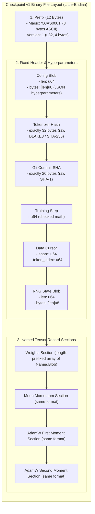
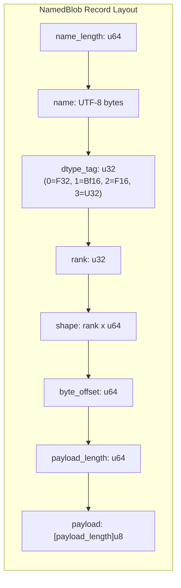

# Checkpoint v1 Specification

Little-endian binary format for persisting training state, model parameters, and optimizer moments in **ojas**.

The in-memory types are [`CheckpointV1`](file:///Users/bharath/Code/research/ojas/ojas-core/src/checkpoint.rs) and its member fields in `ojas-core`. Serialization and deserialization are implemented in [`ojas-io`](file:///Users/bharath/Code/research/ojas/ojas-io/src/checkpoint.rs) (`write_checkpoint` and `read_checkpoint`).

---

## Binary Layout Overview

> [!IMPORTANT]
> **Magic String & Version Verification:** Checkpoint v1 files begin strictly with the 8-byte ASCII string `OJAS0001` followed by little-endian `u32` value `1`. Any file with mismatched magic bytes returns `OjasError::InvalidCheckpoint` immediately—**never attempting guessing or silent migration**.

---

## NamedBlob Record Structure

Each parameter or optimizer tensor is serialized as a self-contained, offset-aware record:

### Record Fields

| Field | Type | Description |
| :--- | :--- | :--- |
| `name_length` | `u64` | Byte length of the UTF-8 encoded parameter name. |
| `name` | `[name_length]u8` | Parameter identifier (e.g., `"layers.0.attn.q_proj.weight"`). |
| `dtype_tag` | `u32` | Data type tag: `0` = F32, `1` = Bf16, `2` = F16, `3` = U32. |
| `rank` | `u32` | Number of dimensions. |
| `shape` | `[rank]u64` | Array of dimension extents. |
| `byte_offset` | `u64` | Byte offset of element 0 inside `payload`. |
| `payload_length` | `u64` | Total byte length of the stored payload buffer. |
| `payload` | `[payload_length]u8` | Raw little-endian tensor data. |

> [!WARNING]
> **Offset Preservation:** Readers that ignore `byte_offset` will corrupt tensor alignment. `ojas-io` strictly verifies that `byte_offset + payload_size <= payload_length`.

---

## Prefix Specification

| Byte Offset | Width | Type | Canonical Value |
| :--- | :--- | :--- | :--- |
| `0..8` | 8 bytes | ASCII | `OJAS0001` (`CHECKPOINT_MAGIC`) |
| `8..12` | 4 bytes | `u32` | `1` (`CHECKPOINT_VERSION`) |

---

## Body Ordering

1. **`config`**: Length-prefixed arbitrary bytes storing training hyperparameters and model specification.
2. **`tokenizer_hash`**: Fixed 32 raw bytes (BLAKE3 or SHA-256 hash of the tokenizer vocabulary).
3. **`git_sha`**: Fixed 20 raw bytes storing the repository commit SHA at checkpoint creation.
4. **`step`**: `u64` little-endian integer. Refuses values that could cause overflow (`u64::MAX`).
5. **`data_cursor.shard`**: `u64` epoch of the batch sampler (`ojas_data::BatchSampler`).
6. **`data_cursor.token_index`**: `u64` ordinal of the next window within that epoch (not a token offset). `ojas_model::Trainer::cursor` documents the same meaning.
7. **`rng_state`**: Length-prefixed state buffer for deterministic resumption.
8. **`weights`**: `u64` section byte length, `u64` record count, followed by serialized `NamedBlob` records.
9. **`optimizer.muon_momentum`**: Same framing; stores momentum buffers for 2D matrix parameters.
10. **`optimizer.adamw_first_moment`**: Same framing; stores first moments for 1D parameters.
11. **`optimizer.adamw_second_moment`**: Same framing; stores second moments for 1D parameters.

---

## Verification & Safety Guarantees

> [!CAUTION]
> 1. **Truncation Defense:** Checkpoint files truncated before an expected field boundary return `Err(OjasError::TruncatedCheckpoint)` rather than filling missing bytes with zeros.
> 2. **Integer Overflow Protection:** Dimension shapes whose product overflows `u64` or `usize` are caught during header decoding and rejected before memory allocation.
