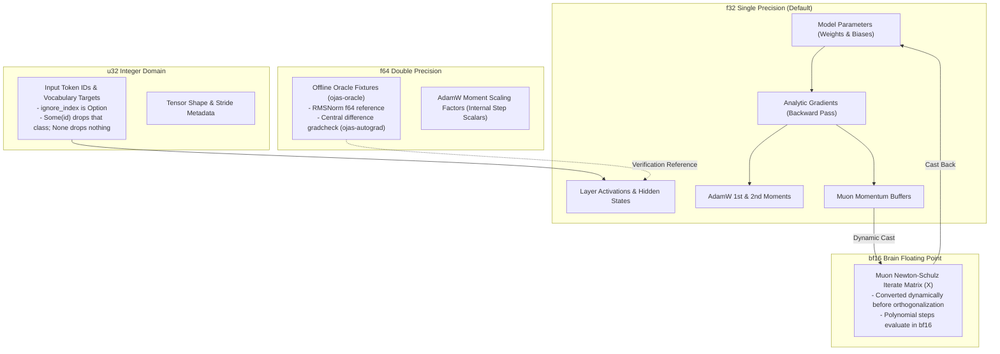
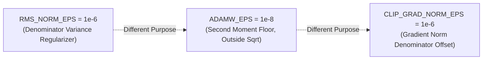

# Dtype Policy (v1)

This document formalizes numeric types, precision transitions, and epsilon constants across **ojas**.

---

## Numeric Precision Topology

---

## Tensor Data Type Matrix

| Category | Storage DType | Compute DType | Rationale & Specification |
| :--- | :--- | :--- | :--- |
| **Model Parameters** | `f32` | `f32` | Full precision maintained for stability during pre-training. |
| **Activations** | `f32` | `f32` | Kept in `f32` across all attention and MLP layers. |
| **Gradients** | `f32` | `f32` | Reverse-mode tape and fused backward accumulate in `f32`. |
| **Muon Momentum** | `f32` | `f32` | Standard first-moment buffer for matrix parameters. |
| **Muon Newton-Schulz** | — | `bf16` | As implemented in nanolab (`X = G.bfloat16()`). Reduces compute latency while maintaining spectral properties. |
| **AdamW Moments** | `f32` | `f64` (internal) | First and second moments stored as `f32`; step updates computed with `f64` scalars before casting. |
| **Tokens & Labels** | `u32` | `u32` | Accommodates vocabularies up to 50,304. `ignore_index: Option<u32>` drops rows whose target equals `Some(id)`. `None` drops nothing. Torch's `-1` is mapped to a sentinel `u32` by the loader before the call; it is not `None`. |
| **Oracle Fixtures** | `f64` | `f64` | Golden reference files stored on disk; verified against CPU kernels. |

The `DType` enumeration in [`ojas-core`](file:///Users/bharath/Code/research/ojas/ojas-core/src/dtype.rs) defines `F32`, `Bf16`, `F16`, and `U32`. `F16` exists for checkpoint format compatibility; v1 training does not compute in `F16`.

---

## Epsilon Constants: Never Interchangeable

ojas defines three distinct epsilon constants for numerical stability. They represent different physical quantities and must **never** be substituted for one another:

1. **`RMS_NORM_EPS = 1e-6`**
   * **Formula:** $y = \frac{x}{\sqrt{\frac{1}{D}\sum x_i^2 + \varepsilon_{\text{RMS}}}} \odot w$
   * **Source:** Matches `nanolab/mixers.py` default. Using machine epsilon (`f32::EPSILON` $\approx 1.19 \times 10^{-7}$) produces divergent activations on low-variance inputs.
2. **`ADAMW_EPS = 1e-8`**
   * **Formula:** $\Delta \theta = \frac{\hat{m}}{\sqrt{\hat{v}} + \varepsilon_{\text{AdamW}}}$
   * **Source:** Added **outside** the square root following PyTorch's single-tensor implementation (as seen in upstream tessl's `qwen35_adamw.metal`).
3. **`CLIP_GRAD_NORM_EPS = 1e-6`**
   * **Formula:** $\text{scale} = \min\left(1.0, \frac{\text{max\_norm}}{\|\mathbf{g}\|_2 + \varepsilon_{\text{clip}}}\right)$
   * **Source:** Prevents division by zero when gradients vanish without biasing positive norms.
