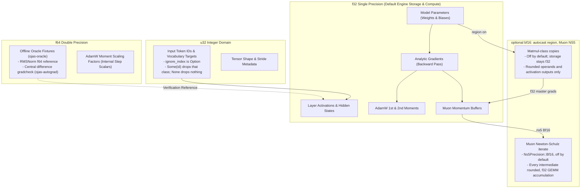
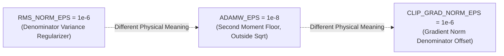

# Dtype Policy (v1)

This document formalizes numeric types, precision transitions, and epsilon constants across **ojas**.

---

## Numeric Precision Topology

---

## Tensor Data Type Matrix

| Category | Storage DType | Compute DType | Rationale & Specification |
| :--- | :--- | :--- | :--- |
| **Model Parameters** | `f32` | `f32` | Stored f32. An autocast region rounds a copy for a matmul-class op and does not rewrite the parameter. |
| **Activations** | `f32` | `f32`, or bf16-rounded inside a region | Outside a region every activation stays f32. Inside `AutocastMode::Bf16`, matmul-class outputs are rounded and tagged; norms, RoPE, embeddings and the residual stream stay f32 unless every counted input is already tagged. |
| **Gradients** | `f32` | `f32` for master weights | Weight and bias gradients stay untagged f32. Activation gradients of matmul-class ops are rounded inside a region. |
| **Muon Momentum** | `f32` | `f32` | Standard first-moment buffer for matrix parameters. |
| **Muon Newton-Schulz** | — | `f32` by default; `bf16` with `Ns5Precision::Bf16` | `MuonNs5Config.ns5` (`TrainConfig.muon_ns5`) picks it. `F32` is nanolab with `X = G.float()`. `Bf16` is stock nanolab's `X = G.bfloat16()` as torch's eager bf16 ops run it: every intermediate rounded to bf16, GEMMs on bf16 operands accumulating in f32. CPU and Metal implement it; wgpu refuses it (`Unsupported`). The momentum buffer and the parameter stay f32. |
| **AdamW Moments** | `f32` | `f64` (internal) | First and second moments stored as `f32`; step updates computed with `f64` scalars before casting. |
| **Tokens & Labels** | `u32` | `u32` | Accommodates vocabularies up to 50,304. `ignore_index: Option<u32>` drops rows whose target equals `Some(id)`. `None` drops nothing. |
| **Oracle Fixtures** | `f64` | `f64` | Golden reference files stored on disk; verified against CPU kernels. |

The `DType` enumeration in [`ojas-core`](file:///Users/bharath/Code/research/ojas/ojas-core/src/dtype.rs) defines `F32`, `Bf16`, `F16`, and `U32`. `F16` exists for checkpoint format compatibility; v1 training does not compute in `F16`. Training storage stays `F32`. `TrainConfig.autocast` defaults to off, and an off config omits the key from `to_json`, so existing run ids stay valid. `Bf16` enters an `Autocast` region around the forward, the backward and `take_grad` only. The optimizer, the loss sum and `accumulate_grad` stay outside that region. A device tensor is not downloaded to round it.

---

## Epsilon Constants: Never Interchangeable

ojas defines three distinct epsilon constants for numerical stability. They represent different physical quantities and must **never** be substituted for one another:

> [!IMPORTANT]
> 1. **`RMS_NORM_EPS = 1e-6`**
>    * **Formula:** $y = \frac{x}{\sqrt{\frac{1}{D}\sum x_i^2 + \varepsilon_{\text{RMS}}}} \odot w$
>    * **Source:** Matches `nanolab/mixers.py` default. Using machine epsilon (`f32::EPSILON` $\approx 1.19 \times 10^{-7}$) produces divergent activations on low-variance inputs.
> 2. **`ADAMW_EPS = 1e-8`**
>    * **Formula:** $\Delta \theta = \frac{\hat{m}}{\sqrt{\hat{v}} + \varepsilon_{\text{AdamW}}}$
>    * **Source:** Added **outside** the square root following PyTorch's single-tensor implementation (as seen in upstream tessl's `qwen35_adamw.metal`).
> 3. **`CLIP_GRAD_NORM_EPS = 1e-6`**
>    * **Formula:** $\text{scale} = \min\left(1.0, \frac{\text{max\_norm}}{\|\mathbf{g}\|_2 + \varepsilon_{\text{clip}}}\right)$
>    * **Source:** Prevents division by zero when gradients vanish without biasing positive norms.
