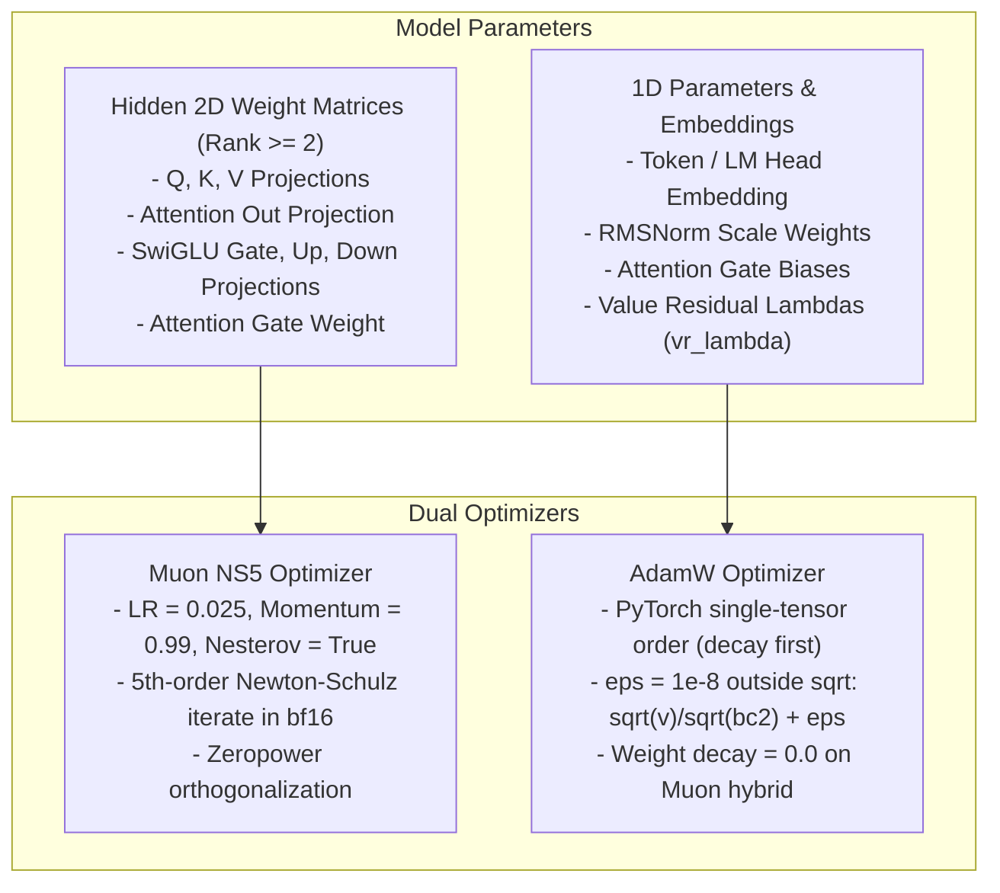

# Op Coverage — nanolab Default GPT

The v1 model is the nanolab default GPT architecture: 12 layers, hidden width $d_{\text{model}} = 768$, 12 attention heads, head dimension $d_{\text{head}} = 64$, vocabulary size 50,304, causal attention with per-head output gating and value residual connection, SwiGLU MLP, tied embedding weights, and a dual `muon_ns5_adamw` optimizer.

**Verified** at `nanolab/config.py` (`n_layer=12`, `d_model=768`, `n_head=12`, `head_dim=64`, `vocab_size=50304`, `optimizer="muon_ns5_adamw"`, `gated_attention=True`, `value_residual=True`).

---

## Transformer Block Flow

```mermaid
flowchart TD
    subgraph TransformerBlock["nanolab GPT Layer Execution"]
        X["Input Activations x [B, T, D]"] --> Norm1["Pre-RMSNorm (eps=1e-6)"]
        
        subgraph AttentionMixer["Attention Mixer"]
            Norm1 --> QProj["Linear Q: [B, T, D] -> [B, T, H, d]"]
            Norm1 --> KProj["Linear K: [B, T, D] -> [B, T, H, d]"]
            Norm1 --> VProj["Linear V: [B, T, D] -> [B, T, H, d]"]
            
            QProj --> RoPEQ["Half-Split RoPE (Q)"]
            KProj --> RoPEK["Half-Split RoPE (K)"]
            
            RoPEQ --> NormQ["RMS Q-Norm"]
            RoPEK --> NormK["RMS K-Norm"]
            
            NormQ --> SDPA["Causal Scaled Dot-Product Attn\nscale = 1/sqrt(d_head) = 1/8"]
            NormK --> SDPA
            VProj --> SDPA
            
            Norm1 --> Gate["Linear Gate: [B, T, D] -> [B, T, H] + Bias\nGate = sigmoid(x W_g + b_g)"]
            
            SDPA --> GatedAttn["Per-Head Gated Attention\nAttn = SDPA * Gate"]
            Gate --> GatedAttn
            
            GatedAttn --> VR["Value Residual Blend\nAttn_vr = lerp(Attn, V0, sigmoid(vr_lambda))"]
            VR --> OutProj["Linear Output Projection: [B, T, D]"]
        end
        
        OutProj --> Res1["Residual Add (+)"]
        X --> Res1
        
        subgraph MLPMixer["SwiGLU MLP Mixer"]
            Res1 --> Norm2["RMSNorm (eps=1e-6)"]
            Norm2 --> GateUp["Linear Gate & Up Projections"]
            GateUp --> Swish["SwiGLU: (x W_gate) * silu(x W_up)"]
            Swish --> Down["Linear Down Projection"]
        end
        
        Down --> Res2["Residual Add (+)"]
        Res1 --> Res2
        
        Res2 --> NextX["Next Layer Activations [B, T, D]"]
    end
```

---

## Dual Optimizer Partitioning

---

## Op Implementation Matrix

Dtypes follow [`docs/dtype-policy.md`](file:///Users/bharath/Code/research/ojas/docs/dtype-policy.md). Head dimensions above 64 on Metal produce `OjasError::UnsupportedHeadDim`, never a silent clamp.

| Operation | CPU Reference (`ojas-cpu`) | Metal Step (`ojas-metal`) | DType | Mathematical Specification | Status |
| :--- | :--- | :--- | :--- | :--- | :---: |
| **Embedding** | Table lookup | `tessl` gather / scatter | `f32` | $y_t = W_{\text{embed}}[x_t]$ | **Verified** |
| **Linear** | Single-threaded GEMM | `tessl` GEMM | `f32` | $y = x W^T$ (bias-free in linear blocks) | **Verified** |
| **RMSNorm** | Exact reduction | `tessl` weighted RMSNorm | `f32` | $y = \frac{x}{\sqrt{\frac{1}{D}\sum x_i^2 + 10^{-6}}} \odot w$ | **Verified** |
| **Half-split RoPE** | Split last axis | `tessl` RoPE | `f32` | Rotate halves: $(-x_2, x_1)$ with $\theta_i = 10000^{-2i/D}$ | **Verified** |
| **RMS QK-Norm** | Head-wise RMSNorm | `tessl` QK-norm | `f32` | Applied separately to Q and K prior to attention | **Verified** |
| **Causal SDPA** | Causal mask, exact softmax | `flash_attn_rows` ($d=64$) | `f32` | $\text{Softmax}\left(\frac{Q K^T}{\sqrt{d_{\text{head}}}} + M\right) V$ | **Verified** |
| **Per-Head Gate** | Sigmoid broadcast | Custom `per_head_gate.metal` | `f32` | $\text{Gate} = \sigma(x W_{\text{gate}} + b_{\text{gate}})$; $\text{Attn} \odot \text{Gate}$ | **Verified** |
| **Value Residual** | Linear blend | In-place lerp | `f32` | $\text{blend}(V, V_0) = (1 - \lambda) V + \lambda V_0, \; \lambda = \sigma(\text{vr\_lambda})$ | **Verified** |
| **SwiGLU** | SiLU & pointwise mul | `tessl` SwiGLU | `f32` | $(x W_{\text{gate}}) \odot \text{SiLU}(x W_{\text{up}}) W_{\text{down}}$ | **Verified** |
| **Residual Add** | Pointwise vector add | Pointwise add | `f32` | $x_{l+1} = x_l + f(x_l)$ | **Verified** |
| **Cross-Entropy** | Mean loss over valid tokens | Chunked CE with canary offset | `f32` | $\mathcal{L} = -\frac{1}{N_{\text{valid}}} \sum \log \frac{e^{z_{y}}}{\sum e^{z_j}}$ | **Verified** |
| **Grad Clip** | Global norm clipping | Global norm clipping | `f32` | Scale by $\min\left(1, \frac{\text{max\_norm}}{\|\mathbf{g}\|_2 + 10^{-6}}\right)$ | **Verified** |
| **AdamW** | Single-tensor torch order | `tessl` fused AdamW | `f32` | Decay first; bias correction; $\varepsilon=10^{-8}$ outside sqrt | **Verified** |
| **Muon NS5** | 5-step Newton-Schulz | Newton-Schulz iterate | `bf16` | Quintic polynomial iterate: $a X + b (X X^T) X + c (X X^T)^2 X$ | **Verified** |

---

## Memory Footprint at Default Micro-batch

* **Micro-batch Shape:** Batch size 16, sequence length 1024 = 16,384 tokens.
* **Unchunked Logits:** Three $16384 \times 50304$ `f32` tensors require $3 \times 16384 \times 50304 \times 4 \approx 9.89\text{ GB}$.
* **Mitigation:** Chunked cross-entropy tiles the logit projection, maintaining activations within hardware budget without OOM crashes.
