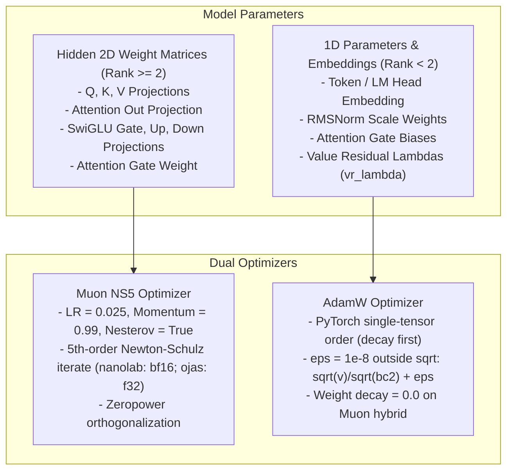
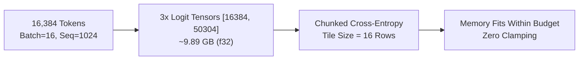

# Op Coverage — nanolab Default GPT

The v1 model is the nanolab default GPT architecture: 12 layers, hidden width $d_{\text{model}} = 768$, 12 attention heads, head dimension $d_{\text{head}} = 64$, vocabulary size 50,304, causal attention with per-head output gating and value residual connection, SwiGLU MLP, tied embedding weights, and a dual `muon_ns5_adamw` optimizer.

**Verified** at `nanolab/config.py` (`n_layer=12`, `d_model=768`, `n_head=12`, `head_dim=64`, `vocab_size=50304`, `optimizer="muon_ns5_adamw"`, `gated_attention=True`, `value_residual=True`).

---

## Transformer Block Execution Flow

```mermaid
flowchart TD
    subgraph TransformerBlock["nanolab GPT Layer Execution"]
        X["Input Activations x [B, T, D]"] --> Norm1["Pre-RMSNorm (eps = 1e-6)"]
        
        subgraph AttentionMixer["Attention Mixer"]
            Norm1 --> QProj["Linear Q: [B, T, D] -> [B, T, H, d]"]
            Norm1 --> KProj["Linear K: [B, T, D] -> [B, T, H, d]"]
            Norm1 --> VProj["Linear V: [B, T, D] -> [B, T, H, d]"]
            
            QProj --> NormQ["RMS Q-Norm"]
            KProj --> NormK["RMS K-Norm"]
            
            NormQ --> RoPEQ["Half-Split RoPE (Q)"]
            NormK --> RoPEK["Half-Split RoPE (K)"]
            
            VProj --> VR["Value Residual Blend\nv = (1 - s) v + s v0, s = sigmoid(vr_lambda)\n(layer 0 publishes v0)"]
            
            RoPEQ --> SDPA["Causal Scaled Dot-Product Attn\nscale = 1/sqrt(d_head) = 1/8"]
            RoPEK --> SDPA
            VR --> SDPA
            
            Norm1 --> Gate["Linear Gate: [B, T, D] -> [B, T, H] + Bias\nGate = sigmoid(x W_g + b_g)"]
            
            SDPA --> GatedAttn["Per-Head Gated Attention\nAttn = SDPA * Gate"]
            Gate --> GatedAttn
            
            GatedAttn --> OutProj["Linear Output Projection: [B, T, D]"]
        end
        
        OutProj --> Res1["Residual Add (+)"]
        X --> Res1
        
        subgraph MLPMixer["SwiGLU MLP Mixer"]
            Res1 --> Norm2["RMSNorm (eps = 1e-6)"]
            Norm2 --> GateUp["Linear Gate & Up Projections"]
            GateUp --> Swish["SwiGLU: silu(x W_gate) * (x W_up)"]
            Swish --> Down["Linear Down Projection"]
        end
        
        Down --> Res2["Residual Add (+)"]
        Res1 --> Res2
        
        Res2 --> NextX["Next Layer Activations [B, T, D]"]
    end
```

---

## Dual Optimizer Partitioning

> [!NOTE]
> * **Muon NS5:** nanolab runs the quintic Newton-Schulz iteration in `bf16` (`X = G.bfloat16()`). ojas runs it in `f32` on CPU, Metal and wgpu, so ojas and nanolab Muon updates differ by bf16 rounding. There is no bf16 Newton-Schulz kernel in ojas.
> * **Value residual:** nanolab blends `v` with layer 0's `v0` *before* attention: `v = (1 - s) * v + s * v0`, `s = sigmoid(vr_lambda)` (`nanolab/mixers.py`). It is not applied to the attention output.
> * **AdamW:** Follows PyTorch single-tensor order (weight decay applied before gradient update; bias correction computed; $\varepsilon = 10^{-8}$ added **outside** the square root).

---

## Op Implementation Matrix

Dtypes follow [`docs/dtype-policy.md`](file:///Users/bharath/Code/research/ojas/docs/dtype-policy.md). 

Each row is an op of the `Backend` trait (`ojas-core/src/backend.rs`). The Metal column names what `MetalBackend` (`ojas-metal/src/device.rs`) runs, and `ojas_*` kernels live in `ojas-metal/kernels/ojas_backend.metal`. wgpu kernels live in `ojas-kernels/src/wgsl/`. Read from source 2026-10-01; each backend's parity suite against the CPU passed in the run recorded in `docs/status.md`.

| Operation | CPU (`ojas-cpu`) | Metal (`ojas-metal`) | wgpu (`ojas-wgpu`) | DType | Specification |
| :--- | :--- | :--- | :--- | :--- | :--- |
| **Embedding** | Table lookup / scatter-add; ARM64 NEON `gather_embedding_rows_768` in `ojas-simd` | `ojas_embed_*` | WGSL | `f32`, ids `u32` | $y_t = W[x_t]$ |
| **Linear** | Packed GEMM (Exact) or SIMD/Accelerate (Fast) | tessl GEMM, `ExactF32` operands | WGSL GEMM | `f32` | $y = x W^T$, no bias |
| **RMSNorm** | Exact reduction | `ojas_rms_*` | WGSL | `f32` | $y = x / \sqrt{\overline{x^2} + 10^{-6}} \odot w$ |
| **Half-split RoPE** | Split last axis | `ojas_rope` | WGSL | `f32` | Rotate halves $(-x_2, x_1)$; layout `[B, T, H, D]` |
| **RMS QK-Norm** | Head-wise RMSNorm | `ojas_rms_*` per head | WGSL | `f32` | Applied to Q and K before RoPE (nanolab order) |
| **Permute** | Byte moves | `ojas_permute` | WGSL `layout` | `f32` | `torch.permute(x, dims).contiguous()`; rank ≤ 8 |
| **Causal SDPA** | Exact softmax; blocked above 256 positions in Fast; grouped-query | Tiled TensorOps forward and FlashAttention-2 backward, D ≤ 256, grouped-query | WGSL, D ≤ 256, grouped-query | `f32` | $\mathrm{softmax}(QK^T/\sqrt{d} + M)V$; layout `[B, Hq, T, D]` query and `[B, Hkv, T, D]` KV; $T_q = T_k$ |
| **Per-Head Gate** | Sigmoid broadcast | `ojas_per_head_gate_*` | WGSL | `f32` | $\sigma(x W_g^T + b_g) \odot \text{attn}$ |
| **Value Residual** | Linear blend | `ojas_vres_*` | WGSL | `f32` | $(1 - s) v + s v_0$, $s = \sigma(\lambda)$, on `v` before attention |
| **SiLU, Mul** (SwiGLU) | Pointwise parallel over scoped worker threads; ReLU, SiLU, GELU, Sigmoid, Tanh | `ojas_silu_*`, `ojas_mul_*` | WGSL | `f32` | $\mathrm{silu}(x W_{gate}) \odot (x W_{up})$ |
| **Residual Add** | Pointwise | tessl `residual_add` | WGSL | `f32` | $x + f(x)$ |
| **Cross-Entropy** | Mean over valid targets | `ojas_ce_rows`, `ojas_ce_mean` | WGSL | `f32` | Mean NLL; `ignore_index`; all-ignored is `NonFinite`. Full `rows × vocab` logits and gradient are materialized |
| **Linear Cross-Entropy** | Tiled online softmax, stream loss/grad | Tiled stream | WGSL `loss.wgsl` | `f32` | Fused linear projection + CE loss; tiles rows/vocab without materializing full logits (`LinearCeChunk`) |
| **Grad Clip** | Global norm, f64 sum of squares | `ojas_reduce_*`, `ojas_scale` | WGSL | `f32` | Scale by $\min(1, m / (\lVert g \rVert + 10^{-6}))$ |
| **Accumulate Grad** | In-place add (finite check) | In-place / buffer | WGSL `accumulate` | `f32` | Accumulate step gradients into parameter gradient buffers |
| **KV Cache Write** | Slice copy at timestep | Slice copy | WGSL `kv_cache` | `f32` | Write key/value token slices into time-major decode KV cache |
| **AdamW** | Single-tensor torch order | tessl `qwen35_adamw` | WGSL | `f32` | Decay first; f64 bias correction; $\varepsilon$ outside sqrt |
| **Muon NS5** | 5-step Newton-Schulz | Newton-Schulz on tessl GEMM | WGSL GEMM | `f32` (nanolab: bf16) | $aX + b(XX^T)X + c(XX^T)^2X$ |

> [!WARNING]
> `MetalBackend` and `WgpuBackend` attention refuse $d_{\text{head}} > 256$ with `OjasError::UnsupportedHeadDim` (`METAL_MAX_HEAD_DIM`, and `ATTENTION_MAX_HEAD_DIM` in `ojas-kernels/src/geometry.rs` for wgpu). The tiny Metal training step in `ojas-metal/src/gpu.rs` runs tessl `flash_attn_rows` and refuses above 64. Nothing is truncated. Causal SDPA accepts grouped-query head counts.

---

## Memory Footprint at Default Micro-batch

* **Micro-batch Shape:** Batch size 16, sequence length 1024 = 16,384 tokens.
* **Unchunked Logits:** Three $16384 \times 50304$ `f32` tensors require $3 \times 16384 \times 50304 \times 4 \approx 9.89\text{ GB}$.
* **Status (Updated 2026-10-04):** Chunked / fused linear cross-entropy is implemented via `Backend::linear_cross_entropy_mean` (closing finding F9 in [`pytorch-parity-plan.md`](pytorch-parity-plan.md)). By chunking over rows and vocabulary tiles (default `LinearCeChunk { rows: 16, cols: 4096 }`) and calculating an online streaming softmax, peak memory drops from ~9.89 GB to under 50 MB for the logit chunk while accumulating parameter gradients directly. The unchunked fallback `cross_entropy_mean_forward/backward` remains available for small vocabulary / testing scenarios. The `Budget` refuses an allocation that does not fit (`CapacityExceeded`); it does not clamp.
