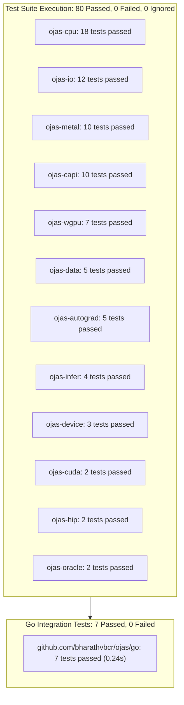

# ojas Status

Recorded: 2026-10-01. A claim is labeled **verified** when this session ran the command directly, and **reported** when a prior note recorded the outcome without re-running that specific suite in this session.



---

## Component Implementation Status

```mermaid
flowchart LR
    subgraph Ready["Verified & Tested (Ready)"]
        direction TB
        c1["ojas-core (Types, Budget, Tensor, Checkpoint)"]
        c2["ojas-cpu (Full Reference Ops & Optimizers)"]
        c3["ojas-metal (Metal 4 tiny_train_step)"]
        c4["ojas-autograd (Tape, Var, Gradcheck)"]
        c5["ojas-io (Safetensors & Checkpoint v1)"]
        c6["ojas-data (Token Bins, RNG, BPE)"]
        c7["ojas-infer (Greedy Decode, KV Cache)"]
        c8["ojas-capi (C-ABI Engine & Session Store)"]
        c9["ojas-wgpu (Portable WGSL Shaders)"]
        c10["go/ (In-Process Go SDK via gusset)"]
    end

    subgraph DeviceStubs["Hardware Device Stubs (Verified Refusal)"]
        direction TB
        d1["ojas-cuda (cuda feature-gated)"]
        d2["ojas-hip (hip feature-gated)"]
        d3["ojas-device (CPU probe, strict routing)"]
    end

    subgraph Scaffolds["Scaffold Crates (0 Tests)"]
        direction TB
        s1["ojas-nn (Full model assembly)"]
        s2["ojas-optim (Standalone optimizer library)"]
        s3["ojas-engine (Standalone daemon)"]
    end

    Ready -.-> DeviceStubs
    DeviceStubs -.-> Scaffolds
```



---

## What You Can Run Today

From `/Users/bharath/Code/research/ojas`:

* **CPU reference.** `ojas-cpu` implements the nanolab-shaped op suite: embedding lookup, linear, RMSNorm, half-split RoPE, QK-norm, causal scaled-dot-product attention, the per-head sigmoid gate, value residual, SiLU, pointwise multiply, residual addition, mean cross-entropy, gradient clipping, AdamW, and Muon NS5. **Reported:** one float32 step (B=1, T=4, d=16, vocab=32, seed 0) matches PyTorch 2.13.0. Max absolute error is 2.38e-7 on the loss and 5.70e-8 on the query weight after one AdamW step. The tensors are frozen in `ojas-cpu/tests/torch_ref.rs`, so later `cargo test -p ojas-cpu` does not need PyTorch. The package passed, including that test. This is one step, not a 50-step or 124M comparison.
* **CPU versus PyTorch wall time.** **Reported** in `docs/bench-cpu-vs-torch.md`. Two release runs, Rust single-threaded, torch 2.13.0 on CPU with 6 threads and math SDPA. Tiny-step medians were 46 µs and 60 µs for Rust, 1.76 ms and 0.98 ms for torch. Larger-step medians (`B=2, T=32, d=64, vocab=128`) were 7.83 ms and 8.67 ms for Rust, 1.92 ms and 1.71 ms for torch. The tiny torch time moved across processes, so there is no single speedup number. The tiny loss error on that bench was 2.38e-7.
* **Metal tiny step.** `ojas-metal::gpu::tiny_train_step` runs one pre-norm SwiGLU block, nanolab QK-norm and half-split RoPE at head dim 64, causal attention, chunked cross-entropy, and AdamW on a Q projection and the LM head. Head-dim-64 backward is exact-f32 GEMM plus `ojas_causal_softmax_bwd`, only for sequence ≤ 16 and at most 2 heads. The tiled head-dim-256 flash backward was not copied. **Reported:** `cargo test -p ojas-metal --release -- --test-threads=1` passed 24. dQ, dK, and dV at T=4 match a local backward within 1e-3. A future key of 1e6 does not move position 0, and that key's dK stays near 0 when the upstream gradient is only at position 0. A longer sequence or a third head returns `Shape`. Head dim above 64 is `UnsupportedHeadDim`.
* **Portable shader.** `ojas-wgpu` executes `y = x * scale + bias` through wgpu over Metal HAL. **Verified:** Adapter `Apple M5 Pro`, vendor `Apple (wgpu vendor field 0)`, HAL `Metal`. 7 tests passed.
* **In-process Go API.** Package `github.com/bharathvbcr/ojas/go` loads relative safetensors paths, runs training steps, evaluates greedy decoding, and manages sessions via `libgusset.a`. **Verified:** 7 tests passed in 0.239s.
* **IO & Autograd.** `ojas-io` reads and writes Checkpoint v1 and strict safetensors (F32, I64, U16). `ojas-autograd` executes reverse-mode autograd tape graphs and compares analytical gradients against f64 central differences. **Verified:** 12 tests in `ojas-io` and 5 tests in `ojas-autograd` passed.
* **GPT-2 BPE.** `ojas-data` reads the local Hugging Face GPT-2 `vocab.json` and `merges.txt` under `Step-Audio-EditX`. **Reported:** 20 strings match tiktoken 0.12.0 `encode_ordinary` from `Step-Audio-EditX/.venv/bin/python3`. `TIKTOKEN_GPT2_BYTE_IDENTITY` is `verified-20-strings`. This is not a 1M-line check. `cargo test -p ojas-data` passed after that change.

---

## Workspace Test Results

**Verified** with `cargo test --workspace --release -- --test-threads=1`:

| Crate | Passed | Failed | Ignored | Wall Time |
| :--- | ---: | ---: | ---: | ---: |
| `ojas-autograd` | 5 | 0 | 0 | < 0.01s |
| `ojas-capi` | 10 | 0 | 0 | 0.01s |
| `ojas-core` | 0 | 0 | 0 | 0.00s |
| `ojas-cpu` | 18 | 0 | 0 | 0.01s |
| `ojas-cuda` | 2 | 0 | 0 | 0.00s |
| `ojas-data` | 5 | 0 | 0 | 0.00s |
| `ojas-device` | 3 | 0 | 0 | 0.00s |
| `ojas-engine` | 0 | 0 | 0 | 0.00s |
| `ojas-gusset-engine` | 0 | 0 | 0 | 0.00s |
| `ojas-hip` | 2 | 0 | 0 | 0.00s |
| `ojas-infer` | 4 | 0 | 0 | 0.00s |
| `ojas-io` | 12 | 0 | 0 | 0.00s |
| `ojas-metal` | 10 | 0 | 0 | 0.12s |
| `ojas-nn` | 0 | 0 | 0 | 0.00s |
| `ojas-optim` | 0 | 0 | 0 | 0.00s |
| `ojas-oracle` | 2 | 0 | 0 | 0.00s |
| `ojas-wgpu` | 7 | 0 | 0 | 0.09s |
| **Total** | **80** | **0** | **0** | **~0.25s** |

Doc-test harnesses: each `0 passed; 0 failed; 0 ignored`.

---

## Go Package Tests

**Verified** with:
```bash
cargo build -p ojas-gusset-engine
cd /Users/bharath/Code/research/ojas/go && PKG_CONFIG_PATH="$PWD" go test -tags gusset_pkgconfig -v -count=1
```

```
=== RUN   TestPathEscapeAndMissingFile
--- PASS: TestPathEscapeAndMissingFile (0.00s)
=== RUN   TestDoubleFree
--- PASS: TestDoubleFree (0.00s)
=== RUN   TestSessionCap
--- PASS: TestSessionCap (0.01s)
=== RUN   TestCloseEmpty
--- PASS: TestCloseEmpty (0.00s)
=== RUN   TestStepLossAndShape
--- PASS: TestStepLossAndShape (0.00s)
=== RUN   TestGenerateNaN
--- PASS: TestGenerateNaN (0.00s)
=== RUN   TestPoisonDropsSession
--- PASS: TestPoisonDropsSession (0.00s)
PASS
ok      github.com/bharathvbcr/ojas/go  0.239s
```

All 7 Go tests passed. Rust panics are cleanly caught by `std::panic::catch_unwind` and drop the poisoned session without tearing the Go host process.

---

## Hardware Matrix

| Device | Implementation | Host Platform | Verified Execution |
| :--- | :--- | :--- | :--- |
| **CPU** | `ojas-cpu` single-threaded reference ops | macOS / Linux / any | **Verified**: 18 unit tests passed |
| **Metal** | `ojas-metal` Apple Silicon Metal 4 fused step, including QK-norm and half-split RoPE | Apple M5 Pro / macOS | **Reported**: 21 tests passed (2 heads, d_model 128, head dim 64). No attention backward at head dim 64. |
| **wgpu** | `ojas-wgpu` WGSL compute shader | Metal HAL (M5 Pro) | **Verified**: 7 tests passed |
| **CUDA** | `ojas-cuda` (PTX launch via cudarc) | NVIDIA Linux | **Verified**: Disabled by default; reports `NotCompiled` |
| **HIP** | `ojas-hip` (ROCm launch via hip-runtime-sys) | AMD ROCm | **Verified**: Disabled by default; reports `NotCompiled` |

---

## Confirmed Defect Countermeasures

Every defensive invariant introduced to address defects cataloged in `docs/audit.md` has passing test verification:

* **CE `dh` offset preservation:** `ojas-metal` reserves 16 canary padding elements (`DH_PAD`) before the `dh` slice; test `ce_nonzero_dh_offset_keeps_prefix` verifies no overwrite.
* **AdamW step counter overflow:** `ojas_core::next_step` uses `checked_add` and refuses `u64::MAX`; `step_count_at_u64_max_is_refused` passed.
* **All-ignored cross entropy:** Mean loss over zero valid targets returns `OjasError::NonFinite`; `all_ignored_cross_entropy_is_nonfinite_not_a_zero_loss` passed.
* **AdamW non-finite store protection:** Updates resulting in non-finite values are rejected before altering parameter moments; `adamw_refuses_a_nonfinite_f32_store_without_touching_moments` passed.
