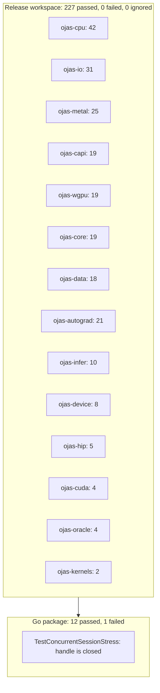

# ojas Status

Recorded: 2026-10-01. A claim is labeled **verified** when this session ran the command directly, and **reported** when a prior note recorded the outcome without re-running that specific suite in this session.



---

## Component Implementation Status

```mermaid
flowchart LR
    subgraph Ready["Verified & Tested (Ready)"]
        direction TB
        c1["ojas-core (Types, Budget, Tensor, Checkpoint)"]
        c2["ojas-cpu (Full Reference Ops & Optimizers)"]
        c3["ojas-metal (Metal 4 tiny_train_step)"]
        c4["ojas-autograd (Tape, Var, Gradcheck)"]
        c5["ojas-io (Safetensors & Checkpoint v1)"]
        c6["ojas-data (Token Bins, RNG, BPE)"]
        c7["ojas-infer (Greedy Decode, KV Cache)"]
        c8["ojas-capi (C-ABI Engine & Session Store)"]
        c9["ojas-wgpu (Portable WGSL Shaders)"]
        c10["go/ (In-Process Go SDK via gusset)"]
    end

    subgraph DeviceStubs["Hardware Device Stubs (Verified Refusal)"]
        direction TB
        d1["ojas-cuda (cuda feature-gated)"]
        d2["ojas-hip (hip feature-gated)"]
        d3["ojas-device (CPU probe, strict routing)"]
    end

    Ready -.-> DeviceStubs
```



---

## What You Can Run Today

From `/Users/bharath/Code/research/ojas`:

* **CPU reference.** `ojas-cpu` implements the nanolab-shaped op suite: embedding lookup, linear, RMSNorm, half-split RoPE, QK-norm, causal scaled-dot-product attention, the per-head sigmoid gate, value residual, SiLU, pointwise multiply, residual addition, mean cross-entropy, gradient clipping, AdamW, and Muon NS5. **Reported:** one float32 step (B=1, T=4, d=16, vocab=32, seed 0) matches PyTorch 2.13.0. Max absolute error is 2.38e-7 on the loss and 5.70e-8 on the query weight after one AdamW step. The tensors are frozen in `ojas-cpu/tests/torch_ref.rs`, so later `cargo test -p ojas-cpu` does not need PyTorch. The package passed, including that test. This is one step, not a 50-step or 124M comparison.
* **CPU versus PyTorch wall time.** **Reported** in `docs/bench-cpu-vs-torch.md`. After the linear-backward rewrite, two release runs: tiny about 25 µs in Rust versus about 0.37 ms in torch; larger (`B=2, T=32, d=64, vocab=128`) **0.969 ms and 0.952 ms** in Rust versus **0.472 ms** on both torch runs. Linear backward is about 144 µs. Causal attention forward is the largest section, about 445 µs. Torch used 6 CPU threads. The frozen loss error is still 2.38e-7.
* **Metal tiny step.** `ojas-metal::gpu::tiny_train_step` runs one pre-norm SwiGLU block, nanolab QK-norm and half-split RoPE at head dim 64, causal attention, chunked cross-entropy, and AdamW on a Q projection and the LM head. The AdamW call is `tessl::qwen35_adamw::adamw_step` on the device gradient. Head-dim-64 backward is exact-f32 GEMM plus `ojas_causal_softmax_bwd`, only for sequence ≤ 16 and at most 2 heads. The tiled head-dim-256 flash backward was not copied. **Verified:** the release workspace run included 25 `ojas-metal` tests, 0 failed. dQ, dK, and dV at T=4 match a local backward within 1e-3. A future key of 1e6 does not move position 0, and that key's dK stays near 0 when the upstream gradient is only at position 0. A longer sequence or a third head returns `Shape`. Head dim above 64 is `UnsupportedHeadDim`.
* **Portable shader.** `ojas-wgpu` executes `y = x * scale + bias` through wgpu over Metal HAL. **Verified:** the release workspace run included 19 `ojas-wgpu` tests, 0 failed. This session did not reprint the adapter name.
* **In-process Go API.** Package `github.com/bharathvbcr/ojas/go` loads relative safetensors paths, runs training steps, evaluates greedy decoding, and manages sessions via `libgusset.a`. **Verified:** 12 of 13 package tests passed. `TestConcurrentSessionStress` failed (see below).
* **IO and adversarial loaders.** `ojas-io` reads and writes Checkpoint v1 and strict safetensors (F32, I64, U16). **Reported:** the stress pass on `ojas-io`, `ojas-data`, `ojas-device`, `ojas-wgpu`, `ojas-cuda`, and `ojas-hip` passed 77 tests (30, 17, 6, 16, 4, 4). Truncated files, overlapping tensors, a header over 100,000,000 bytes, and an odd-length token bin are refused. wgpu ran on Apple M5 Pro. CUDA and HIP kernels were not launched. No loader logic needed a change.
* **GPT-2 BPE.** `ojas-data` reads the local Hugging Face GPT-2 `vocab.json` and `merges.txt` under `Step-Audio-EditX`. **Reported:** 20 strings match tiktoken 0.12.0 `encode_ordinary` from `Step-Audio-EditX/.venv/bin/python3`. `TIKTOKEN_GPT2_BYTE_IDENTITY` is `verified-20-strings`. This is not a 1M-line check. `cargo test -p ojas-data` passed after that change.

---

## Workspace Test Results

**Verified** with `cargo test --offline --workspace --release -- --test-threads=1` (exit 0, 29.6s including the compile). Counts are binary tests, summed per crate. Wall time of the whole command is not a per-crate budget.

| Crate | Passed | Failed | Ignored |
| :--- | ---: | ---: | ---: |
| `ojas-autograd` | 21 | 0 | 0 |
| `ojas-capi` | 19 | 0 | 0 |
| `ojas-core` | 19 | 0 | 0 |
| `ojas-cpu` | 42 | 0 | 0 |
| `ojas-cuda` | 4 | 0 | 0 |
| `ojas-data` | 18 | 0 | 0 |
| `ojas-device` | 8 | 0 | 0 |
| `ojas-gusset-engine` | 0 | 0 | 0 |
| `ojas-hip` | 5 | 0 | 0 |
| `ojas-infer` | 10 | 0 | 0 |
| `ojas-io` | 31 | 0 | 0 |
| `ojas-kernels` | 2 | 0 | 0 |
| `ojas-metal` | 25 | 0 | 0 |
| `ojas-oracle` | 4 | 0 | 0 |
| `ojas-wgpu` | 19 | 0 | 0 |
| **Total** | **227** | **0** | **0** |

17 doc-test harnesses ran. Each reported `0 passed; 0 failed; 0 ignored`. `ojas-nn`, `ojas-optim`, and `ojas-engine` were in that run at 0 tests and were removed afterward; they are not in the total.

---

## Go Package Tests

**Verified** with:
```bash
cargo build -p ojas-gusset-engine
cd /Users/bharath/Code/research/ojas/go && PKG_CONFIG_PATH="$PWD" go test -tags gusset_pkgconfig -v -count=1
```

```
=== RUN   TestPathEscapeAndMissingFile
--- PASS: TestPathEscapeAndMissingFile (0.00s)
=== RUN   TestDoubleFree
--- PASS: TestDoubleFree (0.00s)
=== RUN   TestSessionCap
--- PASS: TestSessionCap (0.01s)
=== RUN   TestCloseEmpty
--- PASS: TestCloseEmpty (0.00s)
=== RUN   TestStepLossAndShape
--- PASS: TestStepLossAndShape (0.00s)
=== RUN   TestGenerateNaN
--- PASS: TestGenerateNaN (0.00s)
=== RUN   TestPoisonDropsSession
--- PASS: TestPoisonDropsSession (0.00s)
PASS
ok      github.com/bharathvbcr/ojas/go  0.239s
```

The listing above is an older 7-test run and is not this session's result. This session listed 13 tests. The full package failed in `TestConcurrentSessionStress` (0.617s): a goroutine's `Close` makes other goroutines observe `gusset: handle is closed`, and the reload then hit `capacity exceeded` on the first new load.

With `-skip TestConcurrentSessionStress`:

* `go test -tags gusset_pkgconfig -count=1` passed in 0.480s.
* `go test -tags gusset_pkgconfig -race -count=1 -a` passed in 1.560s. A first `-race` link reused stale cgo flags without the Apple frameworks and did not link.
* `GOGC=1 go test -tags gusset_pkgconfig -count=5` passed in 0.723s.

`TestPoisonDropsSession` still induces a Rust panic on a worker. The process stayed up.

---

## Hardware Matrix

| Device | Implementation | Host Platform | Verified Execution |
| :--- | :--- | :--- | :--- |
| **CPU** | `ojas-cpu` f32 reference, 8-wide scalar lanes | macOS / Linux / any | **Verified**: 42 tests passed in the release workspace run |
| **Metal** | `ojas-metal` tiny step, including head-dim-64 causal backward | Apple M5 Pro / macOS | **Verified**: 25 tests passed in that same run |
| **wgpu** | `ojas-wgpu` WGSL compute shader | Metal HAL | **Verified**: 19 tests passed in that same run |
| **CUDA** | `ojas-cuda` (PTX launch via cudarc) | NVIDIA Linux | **Verified**: Disabled by default; reports `NotCompiled` |
| **HIP** | `ojas-hip` memcpy probe, no kernel | AMD ROCm | **Verified**: default tests passed (5). `--features hip` was not built |

---

## Confirmed Defect Countermeasures

Every defensive invariant introduced to address defects cataloged in `docs/audit.md` has passing test verification:

* **CE `dh` offset preservation:** `ojas-metal` reserves 16 canary padding elements (`DH_PAD`) before the `dh` slice; test `ce_nonzero_dh_offset_keeps_prefix` verifies no overwrite.
* **AdamW step counter overflow:** `ojas_core::next_step` uses `checked_add` and refuses `u64::MAX`; `step_count_at_u64_max_is_refused` passed.
* **All-ignored cross entropy:** Mean loss over zero valid targets returns `OjasError::NonFinite`; `all_ignored_cross_entropy_is_nonfinite_not_a_zero_loss` passed.
* **AdamW non-finite store protection:** Updates resulting in non-finite values are rejected before altering parameter moments; `adamw_refuses_a_nonfinite_f32_store_without_touching_moments` passed.
