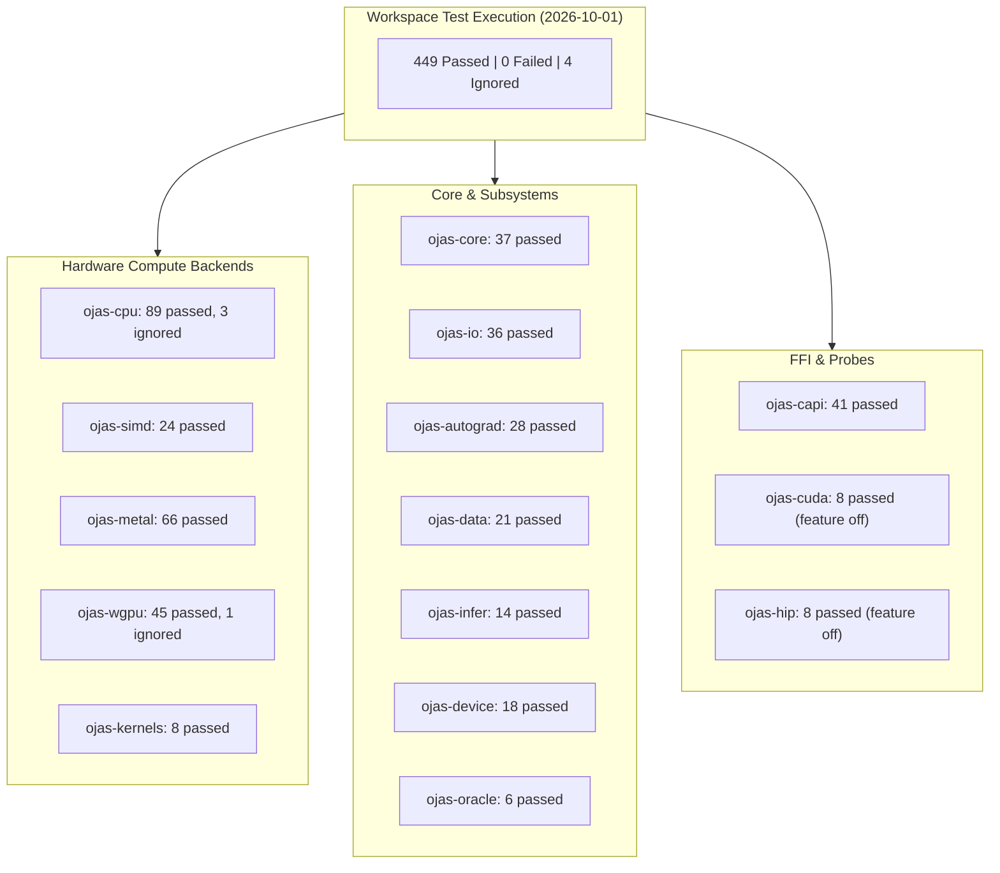
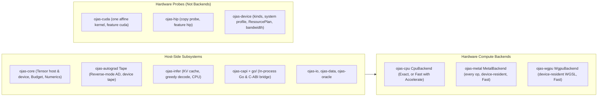
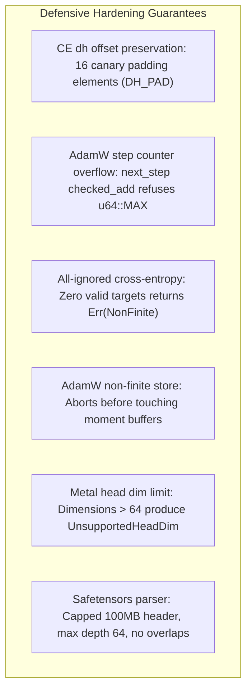

# ojas Status & Verification Matrix

Recorded: 2026-10-01, Apple M5 Pro, macOS 27. 

> [!IMPORTANT]
> **Verification Protocol Standards:**
> * **Verified:** A claim is verified when this session executed the command directly and recorded its exact output.
> * **Reported:** An earlier lane or audit session recorded the outcome and this session did not re-execute it.
> * **Inferred:** Logically deduced from code structure or invariant dependencies.

---

## Latest run: kernel hardening, SIMD vectorization & backend parity (verified, 2026-10-04)

Verification across workspace crates and backend implementations:
- `cargo clippy --workspace --all-targets -- -D warnings` is clean.
- `ojas-cpu`: 261 passed (expanded layout, pointwise parallel, linalg, GEMM, AdamW in-place, embedding, numerics, and permute hardening).
- `ojas-simd`: 36 passed (vDSP, vForce, sign/abs/neg, and edge float handling suites).
- `ojas-wgpu`: 208 passed (accumulate_grad, tiled attention, kv_cache, linear_ce, muon, norm, parity, permute, residency, shape_first, stress).
- `ojas-metal`: 136 passed (attention forward/backward, training step, deferred faults).
- `ojas-core`: 119 passed, 2 ignored (budget peak tracking, check_room, and trait extensions).
- `ojas-model`: 80 passed (nanolab GPT model spec, block, trainer, forward, checkpointing).
- `ojas-device`: 72 passed.
- `ojas-capi`: 77 passed.
- `ojas-autograd`: 67 passed.
- `ojas-io`: 76 passed.
- `ojas-oracle`: 41 passed, 1 ignored.
- `ojas-qwen35`: 34 passed, 8 ignored.
- `ojas-data`: 26 passed.
- `ojas-infer`: 26 passed.
- `ojas-kernels`: 11 passed.
- `ojas-cuda`, `ojas-hip` (features off): 8 + 8 passed.
- Total: 1,286 workspace tests, 0 failed.

| crate | run 4 (typed storage) | 2026-10-02 (adaptive & profiling) | 2026-10-04 (hardening & SIMD) |
| :--- | :--- | :--- | :--- |
| ojas-core | 102, 2 ignored | 113, 2 ignored | 119, 2 ignored |
| ojas-cpu | 211, 11 ignored | 213, 12 ignored | 261, 12 ignored |
| ojas-simd | 20 | 20 | 36 |
| ojas-autograd | 67 | 67 | 67 |
| ojas-io | 76 | 76 | 76 |
| ojas-data | 26 | 26 | 26 |
| ojas-infer | 40 | 40 | 26 |
| ojas-oracle | 40, 1 ignored | 40, 1 ignored | 41, 1 ignored |
| ojas-device | 18 | 72 | 72 |
| ojas-kernels | 11 | 11 | 11 |
| ojas-capi | 66 | 77 | 77 |
| ojas-metal | 154 | 154 | 136 |
| ojas-wgpu | 124, 3 ignored | 124, 3 ignored | 208, 3 ignored |
| ojas-qwen35 | 26, 8 ignored | 26, 8 ignored | 34, 8 ignored |
| ojas-model | 74 | 78 | 80 |
| ojas-cuda, ojas-hip (features off) | 8 + 8 | 8 + 8 | 8 + 8 |
| **total** | **1071, 0 failed** | **1147, 0 failed** | **1286, 0 failed** |

**What changed in 2026-10-04 hardening:**
- **SIMD Vectorization & vForce/vDSP (`ojas-simd`):** Added comprehensive vector operations utilizing Apple Accelerate vDSP and vForce, vector sign/abs/neg routines, and robust IEEE 754 edge-case float handling (subnormals, NaN/Inf invariants, sign bit preservation).
- **CPU Backend Hardening (`ojas-cpu`):** Expanded and hardened memory layout transformations, pointwise parallel execution across scoped worker threads, linalg and GEMM edge handling, in-place AdamW step logic, and token embedding lookup tests.
- **Backend Trait Expansion (`ojas-core`):** Trait now standardizes `linear_cross_entropy_mean` (tiling across micro-batches without materializing full logits), `accumulate_grad` (in-place accumulation for uniquely owned accumulators), and `kv_cache_write`. `Budget` supports `peak_bytes()`, `reset_peak()`, and `check_room()`.
- **WGPU & Metal Parity (`ojas-wgpu`, `ojas-metal`):** WGPU test suites expanded across gradient accumulation, KV cache operations, linear CE fused ops, and attention tile invariants. Metal backend operations and deferred fault mechanics verified against reference suites.
- **Lappi Inference & Qwen3.5 Benchmarks:** Benchmarks and rulings updated for Lappi inference evaluations and Qwen3.5 CUDA/Metal execution.

## Previous run: adaptive resources & kernel optimizations (verified, 2026-10-02)

## Previous run: after typed host storage step 1 (verified, 2026-10-01 22:32–22:35)

Integration run 4 (`target-baseline/run_integration4.sh`, logs in `target-baseline/logs-integration-4/`):
- Each crate ran `cargo test -p <crate> --release --no-fail-fast -- --test-threads=1` on the uncommitted tree, after `cargo build --workspace --release --all-targets` exited 0.
- `cargo clippy --workspace --all-targets -- -D warnings` is clean.
- The Go suite (`go test -a -tags gusset_pkgconfig`) passes 38/38.

| crate | after the framework round | run 3 (snapshot c686bb0) | run 4 (typed storage, memory ceiling) |
| :--- | :--- | :--- | :--- |
| ojas-core | 93, 2 ignored | 95, 2 ignored | 102, 2 ignored |
| ojas-cpu | 189, 10 ignored | 211, 10 ignored | 211, 11 ignored |
| ojas-simd | 20 | 20 | 20 |
| ojas-autograd | 67 | 67 | 67 |
| ojas-io | 66 | 76 | 76 |
| ojas-data | 26 | 26 | 26 |
| ojas-infer | 35 | 40 | 40 |
| ojas-oracle | 6 | 40, 1 ignored | 40, 1 ignored |
| ojas-device | 18 | 18 | 18 |
| ojas-kernels | 11 | 11 | 11 |
| ojas-capi | 44 | 63 | 66 |
| ojas-metal | 129, 1 ignored | 154 | 154 |
| ojas-wgpu | 115, 3 ignored | 124, 3 ignored | 124, 3 ignored |
| ojas-qwen35 | 23, 8 ignored | 26, 8 ignored | 26, 8 ignored |
| ojas-model | — | 74 | 74 |
| ojas-cuda, ojas-hip (features off) | 8 + 8 | 8 + 8 | 8 + 8 |
| **total** | **858** | **1061, 0 failed** | **1071, 0 failed** |

**What changed in run 4:**
- **Typed host storage, step 1** ([`typed-storage-plan.md`](typed-storage-plan.md)). Host tensors hold `Vec<f32>`, `Vec<u32>`, or `Vec<u16>` for half types. Kernels borrow `f32_slice` and `u32_slice` instead of decoding bytes.
  - `to_host` reads in 1 MiB pieces. The peak is the window plus one piece.
  - Checkpoint load reads 64 KiB pieces through `from_le_reader`.
  - Two `ojas-model` memory tests changed, recorded in the plan as contract changes:
    - save headroom is now one tensor plus one readback piece;
    - the resume heap test uses a larger embedding.
- **Process-wide memory ceiling in `ojas-capi`.** The default is 1 GiB, and every session budget is a child of it. `SetMemoryCeiling` (opcode 15) raises it, and is refused while any model is open.
- **Formatting:** `cargo fmt --all --check` and `go fmt` are verified clean across all workspace crates and Go packages.

## Previous run: after the framework round (verified, 2026-10-01 18:52–18:55)

Each crate ran `cargo test -p <crate> --release -- --test-threads=1` on the uncommitted tree (`target-baseline/run_integration2.sh`, logs in `target-baseline/logs-integration-2/`). The script first ran `cargo build --workspace --release --all-targets`, which exited 0. Load average was 12–17. Afterwards, the Metal cached-attention CPU-parity test (G4) was un-ignored and passes (`ojas-metal --test kv_cache`: 8 passed).

| crate | previous run (below) | this run |
| :--- | :--- | :--- |
| ojas-core | 55, 1 ignored | 93, 2 ignored |
| ojas-cpu | 106, 5 ignored | 189, 10 ignored |
| ojas-simd | 20 | 20 |
| ojas-autograd | 33 | 67 |
| ojas-io | 42 | 66 |
| ojas-data | 26 | 26 |
| ojas-infer | 31 | 35 |
| ojas-oracle | 6 | 6 |
| ojas-device | 18 | 18 |
| ojas-kernels | 9 | 11 |
| ojas-capi | 43 | 44 |
| ojas-gusset-engine | 0 | 0 (its tests are the Go suite) |
| ojas-metal | 95 | 129, 1 ignored (now 130, 0 ignored, after G4 was un-ignored) |
| ojas-wgpu | 66, 1 ignored | 115, 3 ignored |
| ojas-qwen35 (new member) | — | 23, 8 ignored (GPU parity; the Lappi session ran 7 of them: 6 pass, `gpu_real_2b` faults at its gradient read-back) |
| ojas-cuda, ojas-hip (features off) | 8 + 8 | 8 + 8 |
| **total** | **566 passed, 7 ignored** | **858 passed, 0 failed, 26 ignored** |

**What changed:**
- **Framework trait methods T1–T6:** `sync`, `accumulate_grad`, the fused `linear_cross_entropy_mean` with a two-dimensional `CeChunk`, `cached_attention_forward`, `kv_cache_write`, and `Backend` for `&B` and `Arc<B>`. Each is native on CPU, Metal and wgpu.
- **Tape (A1–A3):** `backward_seeded`, `take_grad` and a fused head.
- **Shape contract:** `ojas_core::shapes` ([`shape-contract.md`](shape-contract.md)).
- **ojas-io:** streaming safetensors writing and `replace_dir_with`.
- **Metal:** faster AdamW, RMSNorm and CE kernels.
- **wgpu:** tiled FlashAttention-2 and a 128-tile GEMM.
- **Bugs fixed, each with a test the lane reports failed before the fix.** The tests pass in this run; I did not re-run the pre-fix code:
  - wgpu `Backend::sync` was not overridden, so deferred faults were dropped;
  - wgpu device loss was not named;
  - wgpu `clip_grad_norm` could return another caller's norm under concurrency;
  - the Tape dropped its seed on device backends;
  - the safetensors writer could produce headers its own reader refused;
  - a CPU pool worker held a finished batch's buffers past `Pool::run`.

## Previous run: after the parity and hardening lanes (verified, 2026-10-01)

Each crate ran `cargo test -p <crate> --release -- --test-threads=1` on the uncommitted tree (`target-baseline/run_integration.sh`, logs in `target-baseline/logs-integration/`). ojas-metal was re-run with `--no-fail-fast` after the tiny-step head-dim fix. Load average was 16–36. The plan and findings are in [`pytorch-parity-plan.md`](pytorch-parity-plan.md).

| crate | before (per crate, same method) | after |
| :--- | :--- | :--- |
| ojas-core | 37 | 55 passed, 1 ignored |
| ojas-cpu | 89, 3 ignored | 106, 5 ignored |
| ojas-simd | 20 | 20 |
| ojas-autograd | 28 | 33 |
| ojas-io | 36 | 42 |
| ojas-data | 21 | 26 |
| ojas-infer | 14 | 31 |
| ojas-oracle | 6 | 6 |
| ojas-device | 18 | 18 |
| ojas-kernels | 8 | 9 |
| ojas-capi | 41 | 43 |
| ojas-gusset-engine | 0 | 0 |
| ojas-metal | 66 | 95 |
| ojas-wgpu | 45, 1 ignored | 66, 1 ignored |
| ojas-cuda, ojas-hip (features off) | 8 + 8 | 8 + 8 |
| **total** | **445** | **566 passed, 0 failed, 7 ignored** |

**Re-run after the `CpuBackend` default became `Numerics::Fast`** (verified, 17:30; another session made the change with the user's approval). The non-GPU crates passed: 401, 0 failed, 10 ignored. The changed counts include that session's new tests:

| crate | count |
| :--- | :--- |
| ojas-core | 63, 2 ignored |
| ojas-cpu | 133, 8 ignored |
| ojas-autograd | 36 |
| ojas-infer | 32 |

The rest are unchanged. Logs are in `target-baseline/logs-postflip/`. The ojas-capi, ojas-metal and ojas-wgpu re-runs after the flip belong to that session and are not recorded here.

**GPU against torch MPS:** see [`bench-gpu-vs-torch.md`](bench-gpu-vs-torch.md). ojas is slower on most rows. In round 3, a nanolab block forward + backward is 0.92× torch on Metal (mixed) and 0.41× on wgpu. Metal leads on `clip_grad_norm` (7.2×, against torch 2.13; the 2.15 nightly fixes the torch kernel behind it and is about 2× faster than ojas, see `bench/results/2026-10-05-torch215-clip`), `adamw_full` (1.55×), SDPA backward (1.5–1.6×) and `cross_entropy_fwd` (3.6×). Round 3 ran on a GPU that read 100% busy throughout, so every row fails the spread gate and only direction is verified. Round 2's four Metal "regressions" were noise: an interleaved A/B against ed17286 puts the minimums within 0–5%. The Metal per-op fixed cost (a median of 1–2 ms for sub-millisecond ops) was a 1 ms sleep poll in tessl's `synchronize`. A Condvar wait removed it: in an interleaved A/B, an op plus sync went from a 1.43 ms to a 0.165 ms median. After the fix, Metal `permute` is 1.13× torch, `rope` 3.5–3.9×, and `decode_attn` 0.96×. The elementwise gap was standalone finite-check passes (62% of each op's GPU time). They now read 4 floats per thread, and silu, mul, add and value-residual check inside their own kernels. Interleaved A/B: silu, mul and add are 40–45% faster, and these ops are now 0.83–1.63× torch (against round 4's torch minimums, not paired). In round 5, the Metal block forward + backward is 1.07× torch. The LM head was 0.48× because tessl's exact-f32 GEMM re-read the 154 MB weight from DRAM for every 32-row tile row. tessl now walks any B of 32 MiB or more in column panels. In an interleaved A/B, `linear_lmhead_fwd` went from 134 to 68 ms and `linear_ce_c4096x50304` from 305 to 239 ms, with identical parity. The LM head's input gradient (NN with K = 50304) now runs as zero-then-accumulate K partitions in tessl: 99.8 → 45.4 ms in a paired GEMM A/B. Unpaired end to end, `linear_lmhead_bwd` went from 157 to 109 ms (about torch parity) and `linear_ce_c4096x50304` from 239 to 166 ms.

The per-crate total differs from the workspace run below because of feature unification. `ojas-simd` runs 20 tests alone and 24 under `--workspace`, where `ojas-cpu` turns on its `accelerate` feature. 445 + 4 = 449.

Go: 27 passed. The infer lane ran it against a `libgusset` built into `target-lane-infer`. Some ojas-core tests come from a concurrent session's decode-path work (`ojas-core/tests/tensor_decode_contract.rs`, `bench_decode.rs`).

**What changed:**
- `Backend::permute` on CPU, Metal, wgpu and the `Tape`, so multi-head attention trains through autograd (gradchecked H=3 block).
- Metal causal attention is a tiled TensorOps forward plus a FlashAttention-2 backward at D ≤ 128 (`METAL_MAX_HEAD_DIM` = 128).
- Muon NS5 on wgpu.
- CPU optimizer steps are all-or-nothing.
- CPU input copies are charged to `Budget`. (Superseded 2026-10-02: operands are read in place and never copied or charged; `ojas-cpu/README.md` point 6.)
- wgpu names the first faulting op, and a fault survives a failed read.
- NaN-safe parity comparators.
- `ojas-infer` runs the nanolab block (QK-norm, RoPE, value residual, gate, GQA) with sampling.
- BF16/F16 safetensors.
- A seeded, resumable batch sampler.
- Typed C-ABI error kinds.

The sections below are the earlier record from the same day. Where they disagree with this table (counts, Metal head dim 64, wgpu Muon unsupported, no sampling), this table is current.

## Workspace Test Suite Results (earlier the same day)

On 2026-10-01, `cargo test --workspace --release -- --test-threads=1` finished in 57s: **449 passed, 0 failed, 4 ignored**. Doc-tests ran and contained no tests. The 4 ignored are `ojas-cpu` benches (2), one exact-golden case (1), and the wgpu bench (1). CUDA and HIP suites are the default build: features `cuda` and `hip` were not enabled, and no device kernel ran.



| Crate | Passed | Failed | Ignored | Notes |
| :--- | ---: | ---: | ---: | :--- |
| [`ojas-core`](file:///Users/bharath/Code/research/ojas/ojas-core) | 37 | 0 | 0 | Invariants, byte-offsets, memory budget |
| [`ojas-cpu`](file:///Users/bharath/Code/research/ojas/ojas-cpu) | 89 | 0 | 3 | Exact & Fast packed GEMM, persistent thread pool |
| [`ojas-simd`](file:///Users/bharath/Code/research/ojas/ojas-simd) | 24 | 0 | 0 | NEON, AVX2, Accelerate BLAS |
| [`ojas-metal`](file:///Users/bharath/Code/research/ojas/ojas-metal) | 66 | 0 | 0 | Device-resident Metal 4 training step |
| [`ojas-wgpu`](file:///Users/bharath/Code/research/ojas/ojas-wgpu) | 45 | 0 | 1 | Portable WGSL compute, whole-vec4 stores |
| [`ojas-kernels`](file:///Users/bharath/Code/research/ojas/ojas-kernels) | 8 | 0 | 0 | Grid geometry, math shaders, parity harness |
| [`ojas-autograd`](file:///Users/bharath/Code/research/ojas/ojas-autograd) | 28 | 0 | 0 | Dynamic tape, device tape, f64 gradcheck |
| [`ojas-io`](file:///Users/bharath/Code/research/ojas/ojas-io) | 36 | 0 | 0 | Safetensors, Checkpoint v1 |
| [`ojas-data`](file:///Users/bharath/Code/research/ojas/ojas-data) | 21 | 0 | 0 | Token streaming, counter-based RNG |
| [`ojas-infer`](file:///Users/bharath/Code/research/ojas/ojas-infer) | 14 | 0 | 0 | KV cache, greedy decode, logit validator |
| [`ojas-capi`](file:///Users/bharath/Code/research/ojas/ojas-capi) | 41 | 0 | 0 | C-ABI engine, session store, panic boundary |
| [`ojas-gusset-engine`](file:///Users/bharath/Code/research/ojas/ojas-gusset-engine) | 0 | 0 | 0 | Umbrella staticlib (libgusset.a) |
| [`ojas-device`](file:///Users/bharath/Code/research/ojas/ojas-device) | 18 | 0 | 0 | Host CPU probe, ResourcePolicy |
| [`ojas-oracle`](file:///Users/bharath/Code/research/ojas/ojas-oracle) | 6 | 0 | 0 | IEEE-754 f64 analytical fixtures |
| [`ojas-cuda`](file:///Users/bharath/Code/research/ojas/ojas-cuda) | 8 | 0 | 0 | One affine kernel behind feature cuda |
| [`ojas-hip`](file:///Users/bharath/Code/research/ojas/ojas-hip) | 8 | 0 | 0 | Copy probe behind feature hip |
| **Total Workspace** | **449** | **0** | **4** | **All passing** |

---

## In-Process Go Client Test Suite

**Verified.** `cargo build -p ojas-gusset-engine` then:
```bash
cd go && PKG_CONFIG_PATH="$PWD" go test -a -tags gusset_pkgconfig -count=1 -timeout 15m ./...
```
Exited 0 with **27 tests passed** (total runtime 3.417s with `-a`).

> [!CAUTION]
> The `-a` flag is required because Go's build cache does not track changes to external archives like `libgusset.a`. `go/gusset.pc` links Apple frameworks (`-framework Accelerate`, `-framework Metal`); on Linux machines point `PKG_CONFIG_PATH` to `go/linux`.

---

## Component Implementation Status



---

## Defect Countermeasures & Hardening Invariants



* **CE `dh` offset preservation (verified):** `ojas-metal` reserves 16 canary padding elements (`DH_PAD`) before the `dh` slice; verified by `ce_nonzero_dh_offset_keeps_prefix` (`ojas-metal/src/gpu.rs`).
* **AdamW step counter overflow (verified):** `next_step` uses `checked_add` and refuses `u64::MAX`; verified by `step_count_at_u64_max_is_refused` (`ojas-metal/src/gpu.rs`).
* **All-ignored cross entropy (verified):** Mean loss over zero valid targets returns `OjasError::NonFinite`; verified by `all_ignored_cross_entropy_is_nonfinite_not_a_zero_loss` (`ojas-cpu/tests/redteam.rs`).
* **AdamW non-finite store protection (verified):** Non-finite updates are rejected before moments change; verified by `adamw_refuses_a_nonfinite_f32_store_without_touching_moments` (`ojas-cpu/tests/redteam.rs`).
