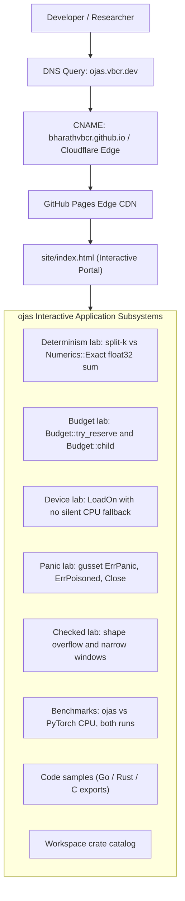

# ojas Web Documentation, Visual Identity & Domain Architecture

Survey & Deployment Date: 2026-10-01.

---

## 1. Web Portal & Interactive Application

The interactive web documentation for **ojas** is hosted at:
* **Primary Custom Domain:** [`https://ojas.vbcr.dev/`](https://ojas.vbcr.dev/)
* **Portfolio Integrated Route:** [`https://bharath.vbcr.dev/ojas`](https://bharath.vbcr.dev/ojas)
* **GitHub Repository:** [`https://github.com/bharathvbcr/ojas`](https://github.com/bharathvbcr/ojas)

The application source lives at [`site/index.html`](file:///Users/bharath/Code/research/ojas/site/index.html) and is mirrored at [`docs/index.html`](file:///Users/bharath/Code/research/ojas/docs/index.html) for direct local previewing.



---

## 2. Visual Identity (One Logo)

### Concept
In Sanskrit systems philosophy, **ojas** is the essence that vitalizes strength — the reserve spent during intense endeavor. Here it is the energy a training step spends.

There is one logo: a regular icosahedron of smoked dark liquid glass, with oxblood ink swirling round a glowing core, lit by a thin crimson rim. It shares its material with the LiquiTask logo (a glass cube of the same dark red liquid), so the two read as one family.

The wordmark is always live text ("ojas", Plus Jakarta Sans 800 on the card, Fira Code in the site header), never part of the logo.

Palette, sampled from the render: core `#f85b56`, crimson `#c21719`, oxblood `#560d12`, smoke `#1b0002`.

### Source

[`docs/brand/ojas-logo-source.png`](brand/ojas-logo-source.png) is the only source: a 1024×1024 render from the local Qwen-Image-2.1 studio (MLSystemsLab), `POST /api/generate` with `width`/`height` 1024, 40 steps, seed 101, and this prompt:

> Premium app icon logo on a pure black background. A single small regular icosahedron made of smoked dark liquid glass floats in the exact centre, occupying only the central sixty percent of the square frame with wide empty black margin on every side. Inside the glass, deep oxblood and crimson liquid swirls like red ink in water, and at its heart a small glowing ember-red core of light shines out through the facets. Crisp glossy facet edges with thin bright crimson rim light. Minimal, iconic, symmetrical, studio 3D product render, sharp focus.

The same seed at another size gives a different image, so a larger master means a new render, not a re-run.

### Assets

The model's "transparent" option only adds words to the prompt; its output is opaque. [`docs/brand/render.sh`](brand/render.sh) therefore cuts the logo out of its black background (alpha from brightness, colour un-premultiplied), then rasterizes [`docs/brand/render.html`](brand/render.html) in headless Chrome for the tile, plate and card. Glass on a light background turns clear and loses its colour, so anywhere the background may be light the logo sits in its dark tile.

| Asset | Path | Use |
| :--- | :--- | :--- |
| Logo, transparent | `site/assets/ojas-logo.png`, `ojas-logo.webp` (704×704) | Site header and footer; dark backgrounds only |
| Tile 512 | `site/assets/ojas-tile-512.png` | README, JSON-LD `image`, any light background |
| Favicon 32 | `site/assets/favicon-32.png` | Browser tab (tile) |
| Apple touch icon 180 | `site/assets/apple-touch-icon.png` | iOS home screen (opaque plate) |
| Manifest icons 192 / 512 | `site/assets/icon-192.png`, `site/assets/icon-512.png` | `site.webmanifest`, maskable (logo inside the safe zone) |
| Social card 1200×630 | `site/assets/ojas-og.png` | `og:image`, `twitter:image` |

### Regenerating the Assets

From the repository root, online (the social card loads Google Fonts), with Google Chrome and ImageMagick installed:

```bash
sh docs/brand/render.sh
```

> [!NOTE]
> `docs/index.html`, `docs/site.webmanifest` and `docs/assets/` are a full copy of `site/`; the script's last step keeps them in step. Re-run it after any edit to `site/index.html`.
---

## 3. Domain Wiring (`vbcr.dev`)

### CNAME & DNS Setup
1. **Repository CNAME Files:**
   * [`site/CNAME`](file:///Users/bharath/Code/research/ojas/site/CNAME) contains `ojas.vbcr.dev`.
   * [`docs/CNAME`](file:///Users/bharath/Code/research/ojas/docs/CNAME) contains `ojas.vbcr.dev`.
2. **DNS Zone Configuration:**
   ```zone
   ojas.vbcr.dev.    300    IN    CNAME    bharathvbcr.github.io.
   ```
3. **Automated CI/CD Deployment:**
   The workflow at [`.github/workflows/deploy-pages.yml`](file:///Users/bharath/Code/research/ojas/.github/workflows/deploy-pages.yml) builds and publishes the `site/` directory directly to GitHub Pages on every push to `main`.
4. **Integrated Portfolio Router (`Portfolio` / `vbcr.dev`):**
   * Configured `ojas` in `/Users/bharath/Code/web/Portfolio/src/lib/routes.js` (`APP_ROUTES.ojas`, subdomain `ojas.vbcr.dev`, path `/ojas`).
   * Configured `ojas` landing page specification in `/Users/bharath/Code/web/Portfolio/src/data/projectSites.js` (`PROJECT_SITES.ojas`).
   * Added project catalog entry `p41` to `/Users/bharath/Code/web/Portfolio/src/data/projectData.js`.
   * Verified with 45/45 test suites (331 tests) passing in `Portfolio`.
5. **Metadata & OpenGraph:**
   All canonical references, twitter cards, and search engine definitions in `site/index.html` resolve to `https://ojas.vbcr.dev/` with alternate link rel pointing to `https://bharath.vbcr.dev/ojas`.

---

## 4. Interactive Features

The site is a set of pages: `index.html` holds the labs, `why.html` the motivation, `benchmarks.html` the timings, `roadmap.html` what comes next, and `guide/` the reference. Each interactive piece demonstrates one ojas guarantee. Results it prints use the error text from the source, and benchmark numbers come from `docs/bench-cpu-vs-torch.md`.

### 4.1 Determinism Lab (hero)
Sums 4,096 fixed float32 values in the browser with `Math.fround` after every add. The split-k column partitions the sum across the chosen thread count and combines partials in a random finish order; the `Numerics::Exact` column sums in ascending order. It counts distinct bit patterns per column. The page states that this shows the mechanism and does not measure any framework; the ojas property itself is `ojas-cpu/tests/exact_golden.rs` (thread counts 1, 2, 3, 7, 16, 18).

### 4.2 Guarantee Labs (tabbed)
* **Memory budget:** sequential `Budget::try_reserve` calls against a cap, with an optional `Budget::child` for the KV cache (parent charged first, released if the child refuses). Errors use the `CapacityExceeded` display text from `ojas-core/src/error.rs`.
* **No silent fallback:** `LoadOn` with `DeviceMetal` or `DeviceWgpu` on a host with or without the device, following `go/api.go` and `ojas-capi/src/load.rs`.
* **Panic firewall:** Load, Step, an engine panic, and Close, following `TestPoisonDropsSession` in `go/api_test.go` (`gusset.ErrPanic`, then `gusset.ErrPoisoned`, then "unknown model" for pre-panic ids).
* **Checked shapes & views:** BigInt shape arithmetic in `Tensor::zeros` order (`contiguous_strides`, `shape_product`, `contiguous_nbytes`) beside the wrapped 64-bit value, and `Tensor::narrow` windows over 64 bytes of storage with the `Tensor::window` error text.

### 4.3 Why ojas and developer docs
* **Why ojas:** six reasons, the author's account of the defects in `docs/audit.md` and the PyTorch measurements in `docs/pytorch-parity-plan.md` section 3, and what ojas is and is not ready for.
* **Developer docs (`#docs`):** quickstart, core concepts, feature reference, Go API reference, architecture and crates, status and limits, and contributing. The Rust and Go snippets were compiled against this tree on 2026-10-01, and the Rust output shown is from that run. The Go reference states what `Load`, `Step` and `GenerateGreedy` do today, from the doc comments in `go/api.go`.

### 4.4 Benchmarks
Both recorded runs from the final optimized table, selectable, with no single speedup stated:
* **Tiny step:** ojas CPU 22.5 µs in both runs; PyTorch 2.13 CPU 354 µs and 487 µs.
* **Larger step:** ojas CPU 0.462 ms and 0.455 ms; PyTorch 2.13 CPU 0.456 ms and 0.463 ms.
* **Breakdown:** the larger step's section clocks (linear backward 129.2 µs, linear forward 79.1 µs, and so on), plus the single-linear result where torch is faster.
