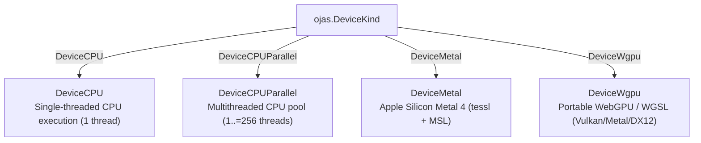

# ojas Go Client

The Go package `github.com/bharathvbcr/ojas/go` provides high-performance, in-process deep learning training and inference for Go applications, powered by the Rust core via `gusset` and `ojas-capi`.

---

## Integration Architecture & FFI Bridge

```mermaid
sequenceDiagram
    autonumber
    participant App as Go Application
    participant SDK as ojas Go Package (go/api.go)
    participant FFI as CGO Bridge (go/ffi.go)
    participant Gusset as Worker Pool (libgusset.a)
    participant Rust as ojas-capi Engine

    App->>SDK: ojas.SetModelRoot(ctx, "./models")
    App->>SDK: id, err := ojas.LoadOn(ctx, ojas.DeviceMetal, 0, "gpt_model.safetensors")
    SDK->>FFI: callEngine(ctx, opLoad, payload)
    FFI->>Gusset: Submit to Worker Queue
    Gusset->>Rust: ojas_capi::dispatch(OP_LOAD)
    Rust-->>App: sessionID (uint64)

    App->>SDK: stats, err := ojas.Step(ctx, sessionID, req)
    SDK->>FFI: callEngine(ctx, opStep, payload)
    FFI->>Gusset: Worker Dispatch
    Gusset->>Rust: ojas_capi::dispatch(OP_STEP)
    Note over Rust: Computes on Metal GPU; reads back 4-byte loss
    Rust-->>App: ojas.StepStats{Loss, GradNorm, Lr}

    App->>SDK: token, err := ojas.GenerateGreedy(ctx, sessionID, prompt)
    SDK->>FFI: callEngine(ctx, opGenerate, payload)
    FFI->>Gusset: Worker Dispatch
    Gusset->>Rust: ojas_capi::dispatch(OP_GENERATE)
    Rust-->>App: token (uint32)

    App->>SDK: ojas.Free(ctx, sessionID)
    App->>SDK: ojas.Close(ctx)
```

---

## Usage Example

```go
package main

import (
	"context"
	"fmt"
	"log"

	ojas "github.com/bharathvbcr/ojas/go"
)

func main() {
	ctx := context.Background()

	// 1. Set model repository root directory
	if err := ojas.SetModelRoot(ctx, "./models"); err != nil {
		log.Fatalf("SetModelRoot failed: %v", err)
	}

	// 2. Load model on Apple Silicon GPU (Metal)
	// Zero silent fallbacks: fails if Metal is unavailable!
	sessionID, err := ojas.LoadOn(ctx, ojas.DeviceMetal, 0, "nanolab_gpt.safetensors")
	if err != nil {
		log.Fatalf("LoadOn failed: %v", err)
	}
	defer ojas.Free(ctx, sessionID)

	// 3. Dispatch training step
	req := ojas.StepRequest{
		Batch:   1,
		Seq:     2,
		Step:    1,
		Lr:      0.001,
		Logits:  []float32{1.0, 2.0, 0.5, 1.2, 0.1, 0.8, 1.5, 0.3},
		Targets: []uint32{1, 0},
	}
	stats, err := ojas.Step(ctx, sessionID, req)
	if err != nil {
		log.Fatalf("Step failed: %v", err)
	}
	fmt.Printf("Loss: %.4f, GradNorm: %.4f, LR: %.4f\n", stats.Loss, stats.GradNorm, stats.Lr)

	// 4. Generate greedy token
	prompt := []uint32{0, 1, 1}
	nextTok, err := ojas.GenerateGreedy(ctx, sessionID, prompt)
	if err != nil {
		log.Fatalf("GenerateGreedy failed: %v", err)
	}
	fmt.Printf("Generated Token: %d\n", nextTok)

	// 5. Clean up engine resources
	_ = ojas.Close(ctx)
}
```

---

## Hardware Device Selection



> [!IMPORTANT]
> * **Zero Silent Fallback:** Selecting `DeviceMetal` or `DeviceWgpu` on a system where that hardware or driver is absent **returns an error immediately**. The client never silently degrades to CPU execution.
> * **Thread Constraints:** When selecting `DeviceCPUParallel`, the thread count must satisfy $1 \le \text{threads} \le 256$ (`MaxCPUThreads`). Passing 0 or $>256$ returns an error.

---

## Compiling & Testing

To execute the Go test suite against the compiled Rust library:

```bash
# 1. Build the umbrella Rust static library archive
cargo build -p ojas-gusset-engine

# 2. Run the Go tests with pkg-config linking against target/debug/libgusset.a.
#    -a is required: Go's build cache does not track libgusset.a!
cd go && PKG_CONFIG_PATH="$PWD" go test -a -tags gusset_pkgconfig -v -count=1 ./...
```

> [!CAUTION]
> The `-a` flag is **strictly required** for `go test`. Go's build cache does not monitor changes to external static archives (`libgusset.a`), so omitting `-a` may cause tests to link against stale object code.
> 
> On Linux, run with `PKG_CONFIG_PATH="$PWD/linux"` to link standard glibc libraries (`-lgcc_s -lutil -lrt -lpthread -lm -ldl -lc`) instead of Apple macOS frameworks.
