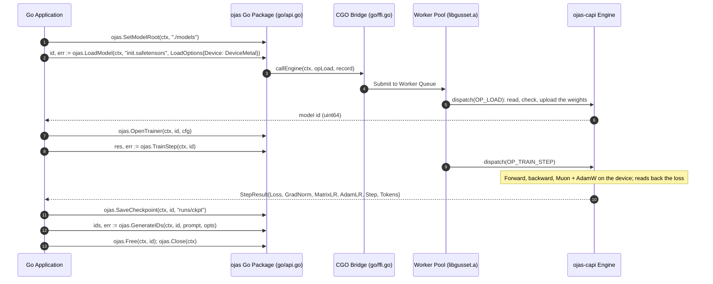
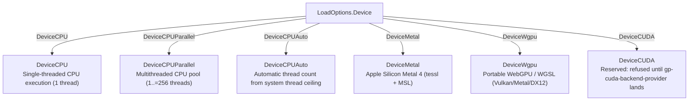

# ojas Go Client

The Go package `github.com/bharathvbcr/ojas/go` trains and serves the nanolab GPT in process: the Rust engine (`ojas-capi`, through `gusset`) holds each model on its device, and Go sends paths, token ids and options.

---

## Integration Architecture & FFI Bridge



---

## Usage Example

```go
package main

import (
	"context"
	"fmt"
	"log"

	ojas "github.com/bharathvbcr/ojas/go"
)

func main() {
	ctx := context.Background()
	if err := ojas.SetModelRoot(ctx, "./models"); err != nil {
		log.Fatal(err)
	}

	// Every model's BudgetBytes draws from the process-wide memory ceiling
	// (1 GiB by default). Raise it before any model is open; it is refused
	// while one is. Here it comes from the machine: SystemProfile cuts the
	// 16 GiB asked for by RAM, available memory and any cgroup limit. The
	// ceiling counts logical tensor bytes and a Metal buffer can take up to
	// twice that, so this caller keeps half as headroom. The fraction is the
	// caller's choice; nothing picks it for you.
	prof, err := ojas.SystemProfile(ctx, 16<<30, false)
	if err != nil {
		log.Fatal(err)
	}
	ceiling := prof.BudgetBytes / 2
	if ceiling == 0 { // SetMemoryCeiling refuses 0
		log.Fatal("no memory to spare on this machine")
	}
	if err := ojas.SetMemoryCeiling(ctx, ceiling); err != nil {
		log.Fatal(err)
	}

	// A nanolab safetensors file (nanolab state_dict names, spec in metadata).
	// Metal or wgpu fail closed: no device means an error, never a CPU model.
	id, err := ojas.LoadModel(ctx, "init.safetensors", ojas.LoadOptions{
		Device:      ojas.DeviceMetal,
		BudgetBytes: ceiling, // above the ceiling is ErrCapacity
	})
	if err != nil {
		log.Fatal(err)
	}
	defer ojas.Free(ctx, id)

	cfg := ojas.NanolabTrainConfig("fineweb_train_000.bin", 4, 1024, 16, 1337,
		ojas.Schedule{Kind: ojas.ScheduleCosine, Warmup: 30, Total: 300})
	cfg.BinFormat = ojas.BinFineWeb
	if err := ojas.OpenTrainer(ctx, id, cfg); err != nil {
		log.Fatal(err)
	}
	for i := 0; i < 300; i++ {
		res, err := ojas.TrainStep(ctx, id)
		if err != nil {
			log.Fatal(err) // errors.Is(err, ojas.ErrNonFinite), ErrCapacity, ...
		}
		fmt.Printf("step %d loss %.4f\n", res.Step, res.Loss)
	}
	if err := ojas.SaveCheckpoint(ctx, id, "runs/ckpt"); err != nil {
		log.Fatal(err)
	}

	if err := ojas.LoadTokenizer(ctx, id, "gpt2/vocab.json", "gpt2/merges.txt"); err != nil {
		log.Fatal(err)
	}
	prompt, _ := ojas.Tokenize(ctx, id, "Once upon a time")
	out, err := ojas.GenerateIDs(ctx, id, prompt, ojas.SampleOptions{
		Temperature: 0.8, TopK: 50, Seed: 1, MaxNewTokens: 64,
	})
	if err != nil {
		log.Fatal(err)
	}
	text, _ := ojas.Detokenize(ctx, id, out)
	fmt.Println(text)

	_ = ojas.Close(ctx)
}
```

`Resume(ctx, "runs/ckpt", opts, cfg)` continues the run in a new id; `cfg` must equal the saved config. `NewModel(ctx, spec, seed, opts)` starts from a fresh nanolab init. `Inspect(ctx, path)` counts a file's tensors without loading it.

---

## Errors

| Sentinel | In-band kind | Meaning |
| :--- | :--- | :--- |
| `ErrCapacity` | `ojas:E_CAPACITY:` | a byte budget, the process memory ceiling (`SetMemoryCeiling`), the 64-model table, or the model's context length |
| `ErrNonFinite` | `ojas:E_NONFINITE:` | a NaN or infinity; the step committed nothing |
| `ErrDeviceLost` | `ojas:E_DEVICE_LOST:` | the device was lost |
| `ErrBusy` | `ojas:E_BUSY:` | another call holds this id (pool size > 1) |
| `ErrPoisoned` | `ojas:E_POISONED:` | the trainer was left partly updated; Resume |
| `ErrPressure` | `ojas:E_PRESSURE:` | critical memory pressure refused a call that would allocate, before it started; nothing changed, Save and Free still run; back off and retry |
| `context.Canceled` | (gusset) | the call's context ended; a cancelled step commits nothing |

A kind counts only at the start of the engine's message, so a path that spells one never selects it.

---

## Hardware Device Selection



> [!IMPORTANT]
> * **Zero Silent Fallback:** Selecting `DeviceMetal` or `DeviceWgpu` on a system where that hardware or driver is absent **returns an error immediately**. The client never silently degrades to CPU execution.
> * **CUDA is refused:** `DeviceCUDA` (5) returns an error naming CUDA and creates no model. The engine's CUDA backend cannot yet hold a session (its runtime cannot move between threads, and no compute op is implemented); that waits on task gp-cuda-backend-provider.
> * **Thread Constraints:** `DeviceCPUParallel` needs $1 \le \text{Threads} \le 256$ (`MaxCPUThreads`). 0 or more than 256 is an error.
> * **Auto Thread Sizing:** `DeviceCPUAuto` sizes the CPU pool from this machine's thread ceiling (`SystemProfile`'s `ThreadCeiling`, clamped to `MaxCPUThreads`), factoring in usable CPUs and cgroup CPU quotas. An unreadable CPU count is refused, not guessed.
> * **Numerics:** `NumericsExact` makes a CPU model bitwise reproducible; Metal and wgpu refuse a Numerics setting.
> * **Memory Ceiling Validation:** `SetMemoryCeiling` replaces the process ceiling (default 1 GiB, or machine hard limit if tighter). It refuses 0, while any model is open, or if the requested bytes exceed the machine's physical RAM or cgroup limit (`ErrCapacity`).

---

## Compiling & Testing

```bash
# 1. Build the umbrella Rust static library archive
cargo build -p ojas-gusset-engine

# 2. Run the Go tests with pkg-config linking against target/debug/libgusset.a.
#    -a is required: Go's build cache does not track libgusset.a!
cd go && PKG_CONFIG_PATH="$PWD" go test -a -tags gusset_pkgconfig -v -count=1 ./...
```

The tests load `../ojas-capi/tests/fixtures/nano.safetensors`, a checked-in 40 KB nanolab model (2 layers, d 16, vocab 64).

> [!CAUTION]
> The `-a` flag is **strictly required** for `go test`. Go's build cache does not monitor changes to external static archives (`libgusset.a`), so omitting `-a` may cause tests to link against stale object code.
>
> On Linux, run with `PKG_CONFIG_PATH="$PWD/linux"` to link standard glibc libraries (`-lgcc_s -lutil -lrt -lpthread -lm -ldl -lc`) instead of Apple macOS frameworks.
