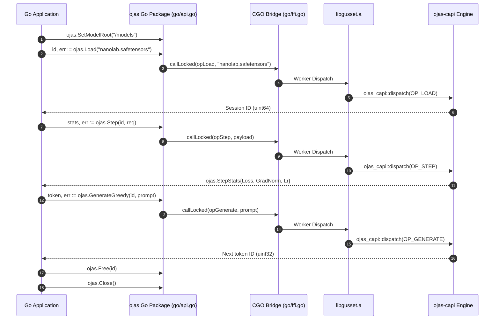

# ojas Go Client

The Go package `github.com/bharathvbcr/ojas/go` provides in-process training and inference capabilities for Go applications, powered by Rust via `gusset` and `ojas-capi`.

---

## Integration Architecture



---

## Usage Example

```go
package main

import (
	"fmt"
	"log"

	ojas "github.com/bharathvbcr/ojas/go"
)

func main() {
	// Set model directory
	if err := ojas.SetModelRoot("./models"); err != nil {
		log.Fatalf("SetModelRoot failed: %v", err)
	}

	// Load model weights
	sessionID, err := ojas.Load("gpt_weights.safetensors")
	if err != nil {
		log.Fatalf("Load failed: %v", err)
	}
	defer ojas.Free(sessionID)

	// Execute one training step
	req := ojas.StepRequest{
		Batch:   1,
		Seq:     4,
		Step:    1,
		Lr:      0.001,
		Logits:  []float32{1.0, 2.0, 0.5, 1.2, 0.1, 0.8, 1.5, 0.3},
		Targets: []uint32{1, 0},
	}

	stats, err := ojas.Step(sessionID, req)
	if err != nil {
		log.Fatalf("Step failed: %v", err)
	}
	fmt.Printf("Loss: %.4f, GradNorm: %.4f, LR: %.4f\n", stats.Loss, stats.GradNorm, stats.Lr)

	// Greedily decode next token
	prompt := []uint32{12, 45, 89}
	nextTok, err := ojas.GenerateGreedy(sessionID, prompt)
	if err != nil {
		log.Fatalf("GenerateGreedy failed: %v", err)
	}
	fmt.Printf("Generated Token: %d\n", nextTok)

	// Close engine
	_ = ojas.Close()
}
```

---

## Compiling & Testing

To run the Go package test suite:

```bash
# 1. Build the umbrella Rust static library archive
cargo build -p ojas-gusset-engine

# 2. Run the Go tests with pkg-config linking against target/debug/libgusset.a
cd go && PKG_CONFIG_PATH="$PWD" go test -tags gusset_pkgconfig -v -count=1
```
