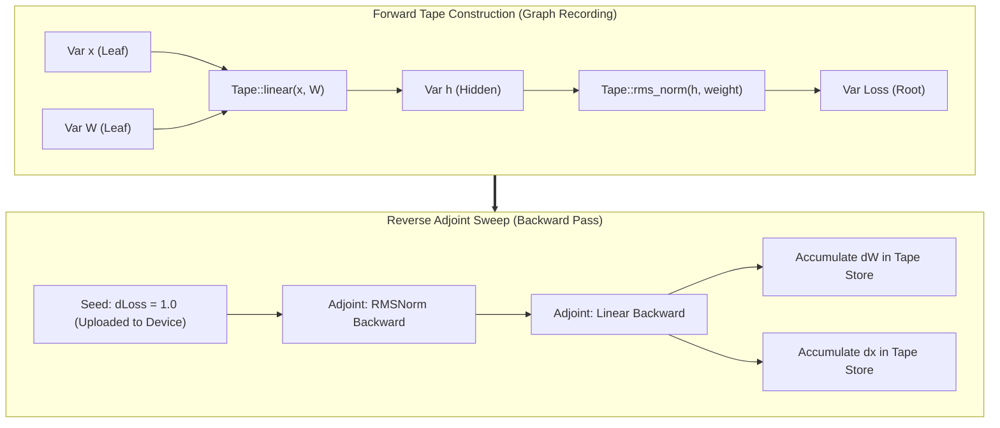
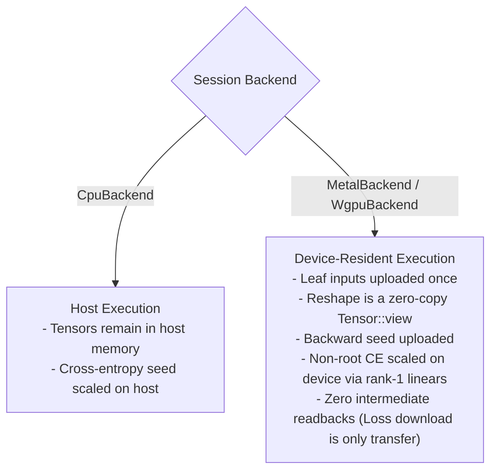
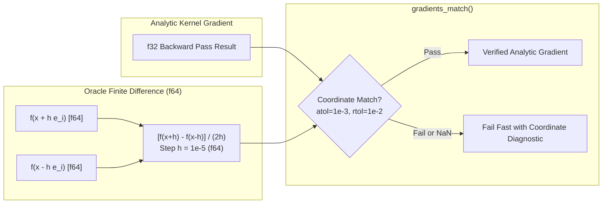

# ojas-autograd

`ojas-autograd` provides a dynamic reverse-mode automatic differentiation tape and an IEEE-754 `f64` numerical gradient verification oracle for the **ojas** deep learning framework.

It supports reverse-mode differentiation across CPU and GPU backends (`MetalBackend`, `WgpuBackend`) with device-resident gradient evaluation.

---

## Tape Graph & Reverse-Mode Adjoint Execution

---

## Multi-Backend Tape Execution & Device Residency

The autograd tape automatically adjusts its execution strategy depending on the underlying backend:

> [!NOTE]
> In `wgpu_tape` and `device_tape` test suites, intermediate backward activations stay entirely in GPU memory. The loss download is the single audited readback from the device.

---

## Numerical Gradcheck Oracle (`central_diff`)

Every analytical gradient kernel is mathematically validated against an offline double-precision (`f64`) numerical oracle using central finite differences:

$$\frac{\partial f}{\partial x_i} \approx \frac{f(\mathbf{x} + h \mathbf{e}_i) - f(\mathbf{x} - h \mathbf{e}_i)}{2h}$$

---

## Safety Invariants & Defect Defenses

> [!IMPORTANT]
> 1. **Strict Double Precision (`f64`):** The numerical oracle computes in `f64` to prevent single-precision subtraction cancellation artifacts from masquerading as gradient discrepancies.
> 2. **Finite Step Size:** The finite difference step $h$ must be finite and strictly $> 0.0$.
> 3. **Coordinate-Wise NaN Detection:** Parity checks compare absolute and relative error across every single tensor element. Any coordinate producing `NaN` or non-finite differences fails immediately—**preventing false-positive passes from NaN fold operations**.
