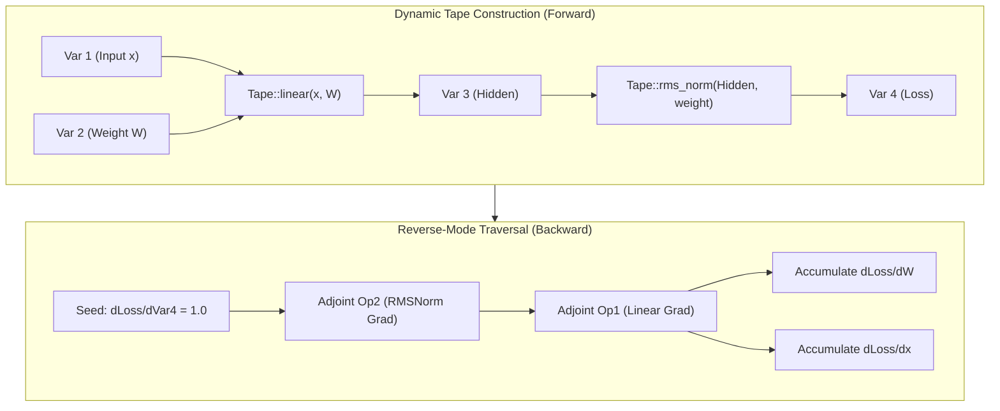
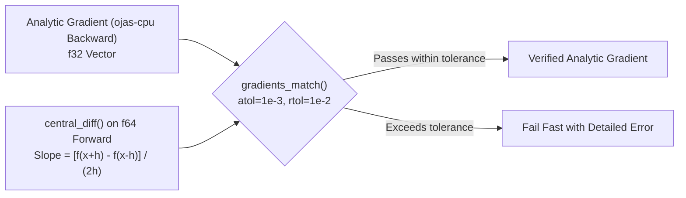

# ojas-autograd

`ojas-autograd` provides a reverse-mode automatic differentiation tape alongside an IEEE-754 `f64` central-difference numerical gradient checker.

---

## Tape Graph Architecture

---

## Numerical Gradcheck

`ojas-autograd` verifies analytic backward passes against numerical finite differences calculated in double precision (`f64`):

### Gradcheck Invariants
1. **Finite Differences in f64:** The numerical oracle evaluates strictly in double precision (`f64`), preventing single-precision subtraction cancelation artifacts.
2. **Strict Step Size:** `h` must be finite and $> 0.0$.
3. **No NaN Masking:** Parity checks compare absolute and relative error on every single scalar coordinate. Any coordinate producing `NaN` or exceeding threshold returns a descriptive failure string.
