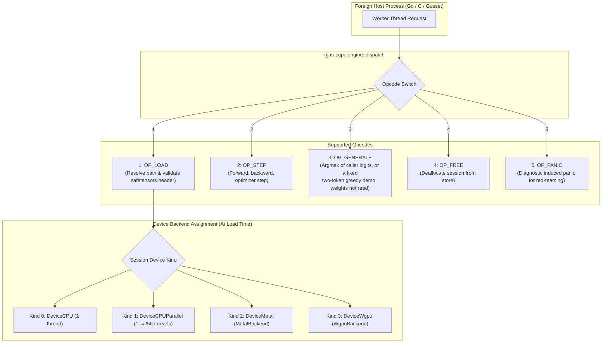
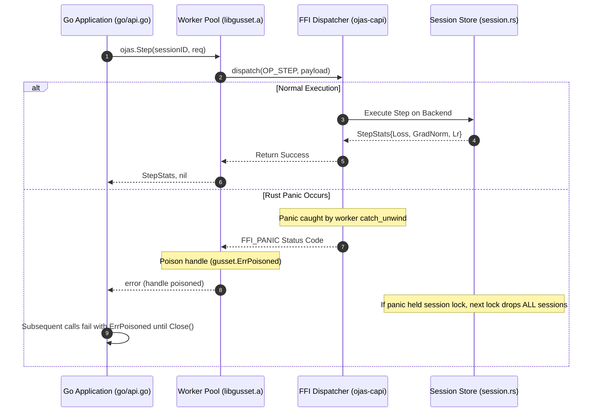

# ojas-capi

`ojas-capi` provides the C-ABI engine dispatch layer, session store management, device routing, and panic isolation boundaries for foreign language runtimes (such as Go via `gusset` and C/C++ host applications).

---

## C-ABI Dispatch Architecture & Device Routing

---

## Panic Isolation & Poisoning Lifecycle

---

## Defensive Countermeasures & Security Invariants

> [!IMPORTANT]
> 1. **Zero Silent Fallback on Device Failure:** If a requested GPU backend (e.g. Metal or wgpu) fails to open, `OP_LOAD` returns an explicit error (the backend's open error, as a `metal: ...` or `wgpu: ...` string) immediately. **It will never silently substitute a CPU session.**
> 2. **Panic Boundary Isolation:** Rust panics are caught by `catch_unwind` on the worker thread, preventing an FFI crash of the host Go runtime. A panic poisons the handle, returning `gusset.ErrPoisoned` to all subsequent calls until `Close()`.
> 3. **Path Traversal Defense:** Model file paths must reside strictly within the designated `model_root`. Paths attempting directory traversal (e.g. `../../etc/passwd`) are rejected by `resolve_under_root` with a path error string (`path must not contain ..`, `path escapes model root`, `path must be relative`).
> 4. **Session Cap Enforcement:** The active session table is strictly bounded to 64 sessions (`SESSION_CAP = 64`) to prevent memory exhaustion from unclosed sessions.
> 5. **Safetensors Header-Only Load:** `OP_LOAD` parses and validates only the JSON header of safetensors files to confirm schema and tensor counts; it does not read parameter weights into host memory during load.
> 6. **Thread Count Clamping:** `DeviceCPUParallel` accepts thread counts strictly within $1 \le \text{threads} \le 256$. Zero or counts greater than 256 are refused.
> 7. **Typed Error Kinds:** The `ojas:E_CAPACITY:`, `ojas:E_NONFINITE:` and `ojas:E_DEVICE_LOST:` prefixes are chosen from the typed error where it is produced (`kind_of` in `src/lib.rs`: `CapacityExceeded`, `NonFinite`, a backend's own device-lost detail, `DeviceError::Capacity` on a device open), never from message text, which carries user paths. A missing `busy_model.safetensors` is a plain load error. Rust never emits `ojas:E_BUSY:`.

> [!WARNING]
> While `catch_unwind` catches standard Rust panics, it **cannot catch process aborts**, out-of-memory aborts from infallible system allocators (`vec!`, `format!`), or stack overflows.
