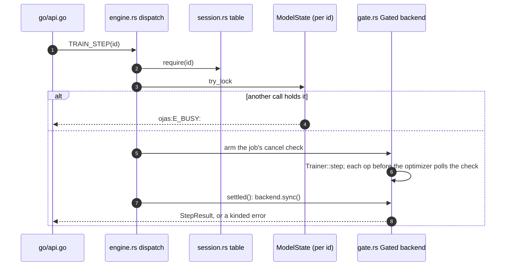

# ojas-capi

`ojas-capi` is the opcode layer the Go API (`go/`) reaches through gusset. A model id names a nanolab GPT held on one device: its weights, its trainer once one is open, and its tokenizer (`docs/framework-design.md` §7).

---

## Opcodes

`{...}` is an option record (`src/wire.rs`): `count: u32`, then `tag: u32, len: u32, value` per field. An unknown tag, a repeated tag or a malformed value is refused, and every length is checked against the payload before anything is allocated.

| Op | Payload | Result |
| :--- | :--- | :--- |
| 1 LOAD | `{path, device?, threads?, budget?, numerics?}` | `id: u64, tensors: u32` |
| 2 | retired (the payload-only Step); not registered | |
| 3 GENERATE | `id: u64, mode: u32 = 1, n: u32, logits: [f32; n]` | `token: u32` |
| 4 FREE | `id: u64` | empty |
| 5 PANIC | anything | (panics; test hook) |
| 6 NEW | spec fields, `seed`, placement fields | `id: u64, tensors: u32` |
| 7 TRAIN_OPEN | `id: u64`, train fields | empty |
| 8 TRAIN_STEP | `id: u64, mode: u32`; mode 1 adds `k, seq`, then per micro-batch `rows, x, y` | loss f32, grad norm f32, Muon LR f64, AdamW LR f64, step u64, tokens u64 |
| 9 SAVE | `id: u64`, directory | empty |
| 10 RESUME | `{path}`, placement fields, train fields | `id: u64, tensors: u32` |
| 11 TOKENIZER | `id: u64, {vocab_json, merges_txt}` | empty |
| 12 TOKENIZE | `id: u64, mode: u32` (1 encode text, 2 decode ids), body | ids or UTF-8 |
| 13 SAMPLE | `id: u64, {temperature, top_k?, top_p?, seed, max_new_tokens, stop?, prompt}` | ids |
| 14 INSPECT | relative path | `tensors: u32` |
| 15 SET_MEMORY_CEILING | `bytes: u64` | empty |
| 16 SYSTEM_PROFILE | empty, `budget: u64`, or `budget: u64, flags: u32` | versioned host profile and resource plan record |

Placement: device 0 CPU, 1 CPU parallel (`threads` 1..=256), 2 Metal, 3 wgpu, 4 CPU auto (`auto_threads` from the plan's thread ceiling); `budget` bytes (default 1 GiB, per session); `numerics` 1 Exact or 2 Fast (CPU only).

Memory ceiling: every session's budget is a child of one process-wide root `Budget` (`src/session.rs`), initialized to 1 GiB (`DEFAULT_MEMORY_CEILING_BYTES`) or the machine's `hard_memory_limit` (physical RAM or tighter cgroup limit) if smaller. All sessions together never account more than the ceiling; a charge past it is `ojas:E_CAPACITY:`. A session `budget` above the ceiling can never be met and is refused at load with `ojas:E_CAPACITY:`. SET_MEMORY_CEILING (`set_memory_ceiling`) is the only way to change it. It refuses 0, refuses `bytes` exceeding `hard_memory_limit` (`ojas:E_CAPACITY:`), and refuses while any model holds the ceiling (in the table, being built, or freed while a call is still inside it): a `Budget`'s cap is fixed, so a new root under live sessions would split the accounting.

Preflight validation: `preflight` verifies that the model spec's `head_dim` is supported by Metal (if Metal is requested) and that total parameter bytes fit the session budget before any device opens or weights are read from disk.

---

## Calls and the model lock

- **Cancellation.** `Trainer::step` has no cancel hook, so the backend is wrapped (`gate.rs`): every op polls the job's cancel check except `muon_ns5_step`, `adamw_step`, `sync` and `download`, the trainer's optimizer and finish. A cancel therefore always lands before the optimizer and a cancelled step commits nothing. The call returns gusset's own `cancelled: Explicit`, which Go maps to `context.Canceled`.
- **Deferred faults.** Every model call ends with `settled()`, so a NaN or lost device that Metal or wgpu reports at its next sync is this call's error, never the next call's.
- **Poison.** An error in the optimizer or finish leaves the trainer partly updated: that call and every later Step, Save and Sample on the id return `ojas:E_POISONED:` until a Resume.

---

## Error kinds

`ojas:E_CAPACITY:`, `ojas:E_NONFINITE:`, `ojas:E_DEVICE_LOST:` and `ojas:E_POISONED:` are chosen from the typed error where it is produced (`kind_of` in `src/lib.rs`), and `ojas:E_BUSY:` / `ojas:E_POISONED:` from the session lock (`Session::lock_state`). `ojas:E_PRESSURE:` comes from admission (`engine::admit`): a call that would allocate is refused before it starts while the kernel reports critical memory pressure. It is transient and changes nothing, Save and Free still run, and it is distinct from `E_CAPACITY` (the work will not fit). Never from message text, which carries user paths: a missing `ojas:E_BUSY: x.safetensors` is a plain load error. The kind is always the first thing in the message, and Go matches it only there.

---

## Security invariants

> [!IMPORTANT]
> 1. **Every path is under the model root.** LOAD, INSPECT, RESUME, SAVE, TRAIN_OPEN's token bin and TOKENIZER's two files are relative to `set_model_root`'s directory: no `..`, no absolute path, and every existing component's canonical form must stay under the root (`resolve_under_root`, `resolve_dir_under_root`). A symlink inside the root that points inside it is followed; one that points out is refused.
> 2. **Files are opened once, without following a final symlink.** Model files, token bins and tokenizer files are opened with `O_NOFOLLOW` (`ojas_io::open_nofollow`) and checked to still be the entry the path names (`confirm_open_identity`). Loaders that take a path (`TokenBin`, `load_hf_gpt2`) are handed `/dev/fd/N` of that open file, so their own open cannot follow a symlink swapped in afterwards.
> 3. **Checkpoint directories.** SAVE writes a sibling staging directory and swaps it in whole (`ojas_io::replace_dir_with`, which refuses a symlinked target or parent); RESUME reads `state.ojck` and both safetensors files with `O_NOFOLLOW`, checks every name, shape, step and run id, and builds the trainer only after every check passes.
> 4. **Bounded.** 64 sessions; a per-session byte budget charged by every tensor, drawn from a process-wide ceiling (1 GiB unless SET_MEMORY_CEILING raises it with no model open); 4 KiB paths; 64 option fields; tokenizer files and text at 32 MiB (`ojas_data::HF_TEXT_CAP`); thread counts 1..=256.
> 5. **No silent fallback.** A Metal or wgpu device that cannot open is the load's error (`metal: ...`, `wgpu: ...`); no CPU session stands in.
> 6. **Panic isolation.** Panics are caught on the worker thread and poison the gusset handle (`gusset.ErrPoisoned`) until `Close()`.

> [!WARNING]
> `catch_unwind` cannot catch process aborts, out-of-memory aborts from infallible allocations (`vec!`, `format!`), or stack overflows.
