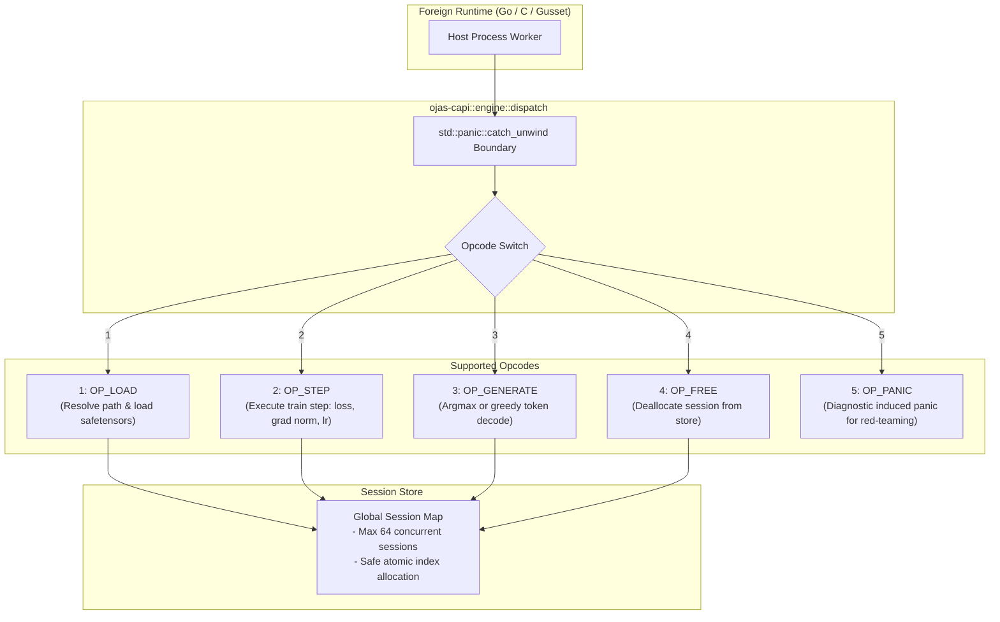

# ojas-capi

`ojas-capi` provides the C-ABI engine dispatch layer, session management, and panic isolation boundaries for foreign language runtimes (such as Go via `gusset`).

---

## C-ABI Dispatch Architecture

---

## Invariants & Defect Defenses

1. **Panic Boundary (`catch_unwind`):** Every foreign dispatch is protected against Rust panics. If a panic occurs, `ojas-capi` catches it, drops the associated session to prevent reusing torn internal state, and writes a descriptive error payload to the host caller.
2. **Session Capacity Cap:** Sessions are capped at 64 (`SESSION_CAP = 64`). Exceeding this limit returns an error instead of permitting memory exhaustion.
3. **Safe Path Resolution:** Model file paths are verified to reside strictly within `model_root`. Directory traversal attacks (e.g. `../../etc/passwd`) are rejected.
4. **Double Free Detection:** Attempting to free an already-freed or non-existent session returns an error rather than inducing undefined behavior.
