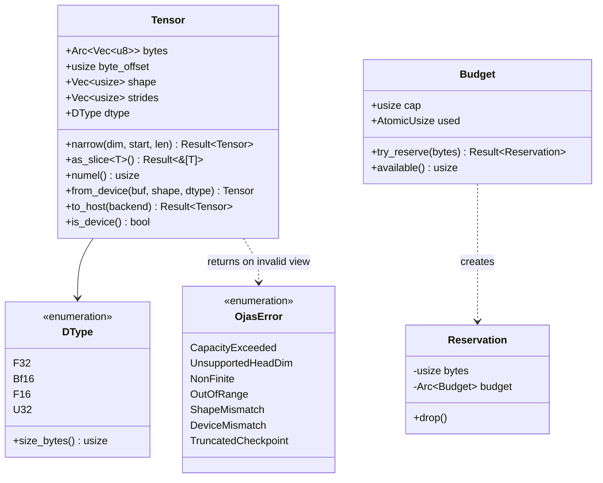
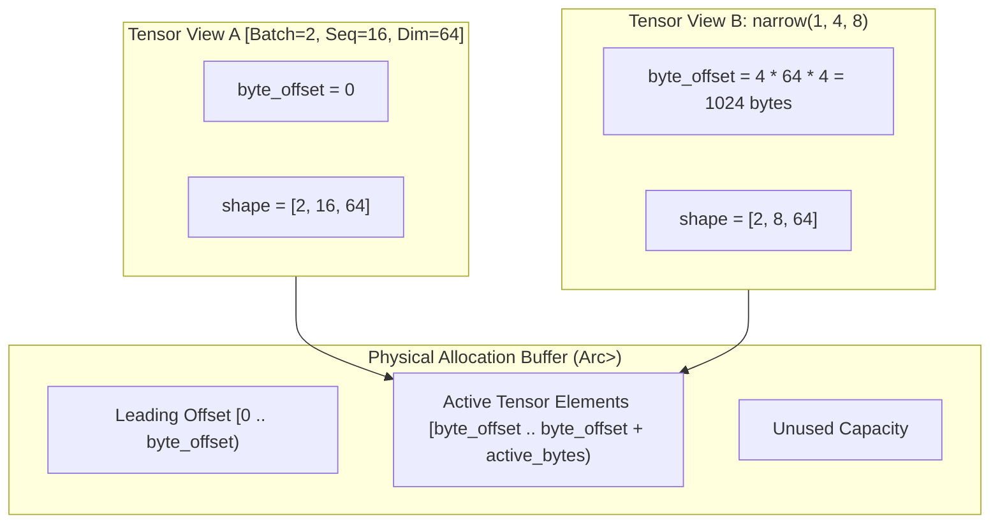

# ojas-core

`ojas-core` is the foundational crate of the **ojas** stack. It defines core tensor abstractions, error invariants, memory budgeting, data types, and checkpoint schema structures.

It depends exclusively on the Rust standard library (`#![forbid(unsafe_code)]`).

---

## Core Abstractions



---

## Zero-Copy Tensor View Model

Tensors track memory via an explicit `byte_offset` into an underlying `Arc<Vec<u8>>` or a backend's device buffer handle. Slicing with `narrow()` creates a new view without copying bytes:



> [!NOTE]
> Every offset calculation accounts strictly for `dtype.size_bytes()`. View bounds are checked before pointer arithmetic to guarantee safe memory access.

---

## Memory Budgeting & Capacity Control

All tensor allocations in `ojas` must secure permits from an explicit `Budget`. Memory is never silently overcommitted or clamped:

```mermaid
stateDiagram-v2
    [*] --> Initialized: Budget::new(max_bytes)
    
    Initialized --> Active: try_reserve(req) [req <= remaining]
    Active --> Active: try_reserve(req) [req <= remaining]
    Active --> Initialized: drop(Reservation) [releases bytes]
    
    Initialized --> Rejected: try_reserve(req) [req > remaining]
    Active --> Rejected: try_reserve(req) [req > remaining]
    
    Rejected --> [*]: Returns Err(OjasError::CapacityExceeded)
```

> [!IMPORTANT]
> When an allocation request exceeds remaining budget capacity, `try_reserve()` returns `Err(OjasError::CapacityExceeded)` immediately. The engine **refuses to silently swap, clamp shapes, or resize limits**.
> 
> *Note on infallible allocations:* Standard Rust allocations like `vec!`, `format!`, and OS thread spawning (`thread::spawn`) operate outside the software budget and can still abort if the host operating system exhausts physical memory.

---

## Device Tensors & Readback Tracking

`Tensor::from_device` encapsulates device-resident memory handles managed by GPU backends (`MetalBackend`, `WgpuBackend`).

```mermaid
flowchart LR
    HostMem["Host Tensor (Arc<Vec<u8>>)"] -->|Backend::upload()| DeviceMem["Device Tensor (DeviceBuffer)"]
    DeviceMem -->|Tensor::to_host()| HostCopy["Host Tensor Copy"]
    DeviceMem -.->|device_readbacks() counter increments| Counter["Readback Audit Counter"]
    HostCopy --> Counter
```

> [!CAUTION]
> Host accessors such as `.to_f32_vec()` or `.as_slice::<f32>()` **refuse device tensors** rather than triggering an implicit, unmetered readback across PCIe / unified memory buses. Callers must explicitly call `.to_host(backend)`, which increments the counted readback metric.

---

## Immutable Numerical Invariants

1. **Epsilon Regularization Constants:**
   * `RMS_NORM_EPS = 1e-6`: Denominator variance offset in normalization.
   * `ADAMW_EPS = 1e-8`: Second moment offset added **outside** the square root.
   * `CLIP_GRAD_NORM_EPS = 1e-6`: Denominator safety offset for global gradient norm clipping.
   *(These constants represent distinct physical dimensions and are never interchanged).*

2. **Step Counter Arithmetic:**
   `next_step(current)` increments training step counters using `checked_add`, returning `OjasError::OutOfRange` at `u64::MAX` rather than silently wrapping to zero.

3. **No Silent Clamping:**
   Dimensions exceeding kernel capabilities (e.g. $d_{\text{head}} >$ `METAL_MAX_HEAD_DIM` = 128 on Metal) yield `OjasError::UnsupportedHeadDim` loud and early.

4. **Cached Finiteness:**
   `Tensor::all_finite_cached(scan)` runs a backend's NaN/infinity scan at most once per storage. A finite result for the whole allocation answers for every view of it until the storage is next written, and every mutable host access resets it. A smaller window is scanned and records nothing. The scan is trusted, so it must check every element with `f32_all_finite`; debug builds re-check a `true` for the whole allocation and panic if it was wrong.
