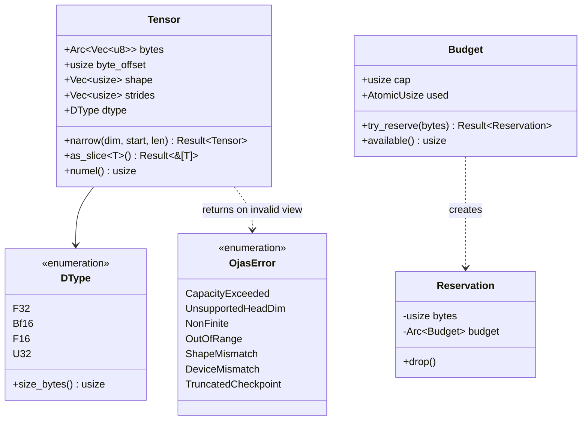

# ojas-core

`ojas-core` is the foundational crate of the **ojas** stack. It defines core tensor abstractions, error invariants, memory budgeting, data types, and checkpoint schema structures.

It depends exclusively on the Rust standard library (`#![forbid(unsafe_code)]`).

---

## Core Abstractions

---

## Key Invariants

1. **Zero-Copy Byte Offsets:** `Tensor.byte_offset` points to the start of element 0 within the backing buffer. Slicing with `narrow(dim, start, len)` adjusts this offset without copying underlying buffer bytes.
2. **Strict Budgeting:** `Budget::try_reserve(bytes)` checks the allocation against a hard ceiling. If the request exceeds available capacity, it returns `OjasError::CapacityExceeded` loud and early—never silently clamping or resizing.
3. **Canonical Epsilon Constants:**
   * `RMS_NORM_EPS = 1e-6`
   * `ADAMW_EPS = 1e-8`
   * `CLIP_GRAD_NORM_EPS = 1e-6`
4. **Step Counter Safety:** `next_step(current)` increments training step counters with `checked_add`, returning `OjasError::OutOfRange` at `u64::MAX`.
