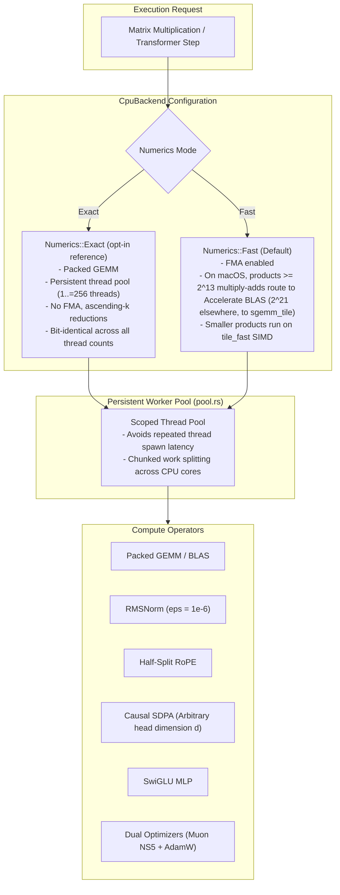

# ojas-cpu

`ojas-cpu` provides the high-performance CPU backend and reference implementation for **ojas**, executing the full **nanolab default GPT** training step, autoregressive inference, and autograd gradient evaluation.

It supports both the bit-identical **Exact tier** and the hardware-accelerated **Fast tier** (via `ojas-simd` and Apple Accelerate).

---

## Architectural Topology & Execution Modes



---

## Transformer Layer & Optimizer Flow

```mermaid
flowchart TD
    subgraph LayerFlow["Transformer Forward Pass"]
        X["Input Tensors [B, T, D]"] --> Norm1["RMSNorm (eps = 1e-6)"]
        Norm1 --> Proj["Q, K, V Projections (Packed GEMM)"]
        Proj --> RoPE["Half-Split RoPE (rotates -x2, x1)"]
        RoPE --> QKN["RMS QK-Norm"]
        QKN --> SDPA["Causal SDPA (Causal mask, scale = 1/sqrt(d))"]
        Norm1 --> Gate["Linear Gate: sigmoid(x W_g + b_g)"]
        SDPA --> GatedAttn["Per-Head Gated Attention = SDPA * Gate"]
        Gate --> GatedAttn
        GatedAttn --> VR["Value Residual Blend: lerp(Attn, V0, sigmoid(vr_lambda))"]
        VR --> OutProj["Output Projection"]
        OutProj --> Res1["Residual Add (+)"]
        X --> Res1
        Res1 --> Norm2["Post-RMSNorm"]
        Norm2 --> SwiGLU["SwiGLU MLP: (x W_g) * silu(x W_up) W_down"]
        SwiGLU --> Res2["Residual Add (+)"]
        Res1 --> Res2
    end

    subgraph BackwardOptim["Loss, Backward & Dual Optimizers"]
        Res2 --> CE["Chunked Cross-Entropy (Mean over valid tokens)"]
        CE --> Clip["Gradient Clipping (CLIP_GRAD_NORM_EPS = 1e-6)"]
        Clip --> OptSplit{"Parameter Rank"}
        OptSplit -->|Rank >= 2 (2D Weights)| Muon["Muon NS5 Optimizer (bf16 Newton-Schulz)"]
        OptSplit -->|Rank < 2 (1D / Embeds)| AdamW["AdamW (decay first, eps = 1e-8 outside sqrt)"]
    end

    LayerFlow --> BackwardOptim
```

---

## Exact vs. Fast Numerics Contract

> [!NOTE]
> * **Exact Tier (`Numerics::Exact`, opt-in via `.with_numerics(Numerics::Exact)`):** The reference contract. Uses an ascending-$k$ packed GEMM without hardware FMA. Successive executions with identical inputs produce **bit-identical floating point digests** across 1, 2, 3, 7, 16, and 18 thread configurations.
> * **Fast Tier (`Numerics::Fast`, the default since 2026-10-01):** Leverages SIMD FMA instructions via `ojas-simd`. On macOS, products with at least $2^{21}$ multiply-adds dispatch to Apple Accelerate `cblas_sgemm` for multi-TFLOP throughput.

---

## Defensive Countermeasures & Safety Guarantees

> [!IMPORTANT]
> 1. **Zero-Loss Defect Defense:** Cross-entropy evaluated over sequences containing zero valid tokens (e.g. all targets match `ignore_index`) immediately returns `Err(OjasError::NonFinite)` rather than falsely returning $0.0$ loss.
> 2. **AdamW Moment Protection:** If parameter updates evaluate to non-finite values (NaN / Inf), the optimizer aborts before touching internal moment buffers, preventing persistent corruption.
> 3. **Arbitrary Head Dimension:** Unlike Metal kernels that enforce $d_{\text{head}} \le 64$, `ojas-cpu` supports arbitrary head dimensions (e.g., $d=65$ verified in test suites).
> 4. **No Allocation Leaks:** The persistent worker pool reuses memory across training steps, preventing thread spawn overhead and memory fragmentation.
