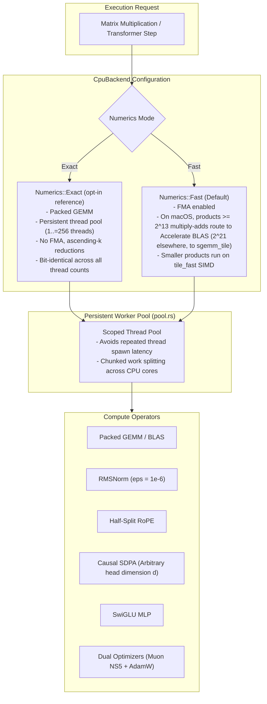

# ojas-cpu

`ojas-cpu` provides the high-performance CPU backend and reference implementation for **ojas**, executing the full **nanolab default GPT** training step, autoregressive inference, and autograd gradient evaluation.

It supports both the bit-identical **Exact tier** and the hardware-accelerated **Fast tier** (via `ojas-simd` and Apple Accelerate).

---

## Architectural Topology & Execution Modes



---

## Transformer Layer & Optimizer Flow

```mermaid
flowchart TD
    subgraph LayerFlow["Transformer Forward Pass"]
        X["Input Tensors [B, T, D]"] --> Norm1["RMSNorm (eps = 1e-6)"]
        Norm1 --> Proj["Q, K, V Projections (Packed GEMM)"]
        Proj --> RoPE["Half-Split RoPE (rotates -x2, x1)"]
        RoPE --> QKN["RMS QK-Norm"]
        QKN --> SDPA["Causal SDPA (Causal mask, scale = 1/sqrt(d))"]
        Norm1 --> Gate["Linear Gate: sigmoid(x W_g + b_g)"]
        SDPA --> GatedAttn["Per-Head Gated Attention = SDPA * Gate"]
        Gate --> GatedAttn
        GatedAttn --> VR["Value Residual Blend: lerp(Attn, V0, sigmoid(vr_lambda))"]
        VR --> OutProj["Output Projection"]
        OutProj --> Res1["Residual Add (+)"]
        X --> Res1
        Res1 --> Norm2["Post-RMSNorm"]
        Norm2 --> SwiGLU["SwiGLU MLP: (x W_g) * silu(x W_up) W_down"]
        SwiGLU --> Res2["Residual Add (+)"]
        Res1 --> Res2
    end

    subgraph BackwardOptim["Loss, Backward & Dual Optimizers"]
        Res2 --> CE["Chunked Cross-Entropy (Mean over valid tokens)"]
        CE --> Clip["Gradient Clipping (CLIP_GRAD_NORM_EPS = 1e-6)"]
        Clip --> OptSplit{"Parameter Rank"}
        OptSplit -->|Rank >= 2 (2D Weights)| Muon["Muon NS5 Optimizer (bf16 Newton-Schulz)"]
        OptSplit -->|Rank < 2 (1D / Embeds)| AdamW["AdamW (decay first, eps = 1e-8 outside sqrt)"]
    end

    LayerFlow --> BackwardOptim
```

---

## Exact vs. Fast Numerics Contract

> [!NOTE]
> * **Exact Tier (`Numerics::Exact`, opt-in via `.with_numerics(Numerics::Exact)`):** The reference contract. Uses an ascending-$k$ packed GEMM without hardware FMA. Successive executions with identical inputs produce **bit-identical floating point digests** across 1, 2, 3, 7, 16, and 18 thread configurations.
> * **Fast Tier (`Numerics::Fast`, the default since 2026-10-01):** Leverages SIMD FMA instructions via `ojas-simd`. On macOS, products with at least $2^{13}$ multiply-adds (`FAST_WHOLE_CALL_MACS`) dispatch to Apple Accelerate `cblas_sgemm` as one call; elsewhere the cutoff is $2^{21}$ and the call goes to `ojas-simd`.

---

## Defensive Countermeasures & Safety Guarantees

> [!IMPORTANT]
> 1. **Zero-Loss Defect Defense:** Cross-entropy evaluated over sequences containing zero valid tokens (e.g. all targets match `ignore_index`) immediately returns `Err(OjasError::NonFinite)` rather than falsely returning $0.0$ loss.
> 2. **AdamW Moment Protection:** If parameter updates evaluate to non-finite values (NaN / Inf), the optimizer aborts before touching internal moment buffers, preventing persistent corruption.
> 3. **Arbitrary Head Dimension:** Unlike Metal kernels that enforce $d_{\text{head}} \le 64$, `ojas-cpu` supports arbitrary head dimensions (e.g., $d=65$ verified in test suites).
> 4. **No Allocation Leaks:** The persistent worker pool reuses memory across training steps, preventing thread spawn overhead and memory fragmentation.
> 5. **AdamW and Gradient Clip Charge Nothing (since 2026-10-01):** `adamw_step` updates the parameter and both moments in place in two passes (check every element finite, then store), and `clip_grad_norm` scales each gradient where it is after the norm pass. Neither uses a buffer or charges the `Budget`, so both succeed on an exhausted budget; before, each charged one buffer (the parameter's length, or the largest gradient's) and refused with `CapacityExceeded` when it did not fit. Both are still all or nothing: a non-finite value, a shared or device target, or a bad layout is refused before anything is written, and the results are bit-identical to the buffered versions. Gated by `adamw_charges_nothing` and `clip_charges_nothing` (`tests/heavy_ops.rs`) and the heap gate in `tests/redteam_ops_heap.rs`. Since 2026-10-02 `accumulate_grad` into a uniquely owned accumulator works the same way: one pass checks every sum finite, a second adds in place, and nothing is charged (`tests/budget_inputs.rs` `accumulate_into_a_unique_acc_charges_nothing`, `tests/framework_accum.rs`); before, the sum was built in a charged buffer and copied in. A shared accumulator still needs one new tensor, written straight into it.
> 6. **Operands Are Read in Place, Never Copied (since 2026-10-01):** every op reads its tensor inputs where they are: a borrowed slice on the calling thread (the GEMM core's `Mat`, and `scoped` threads where a pass splits), or a clone of the tensor that the pool's tasks share (`validate.rs` `Shared`, one more owner of the storage, freed before the op returns). Inputs are therefore never charged: an op's budget peak is its output plus the scratch its kernel documents, so ops succeed in less room than before, when each operand was copied and the copy charged (`tests/budget_inputs.rs` pins each op's exact peak; `tests/redteam_linear_budget.rs` bounds linear at outputs plus GEMM scratch). Mul, add, the value-residual blend and (since 2026-10-02) causal SDPA forward and backward, linear forward and backward, SiLU forward and backward, RMSNorm forward and backward, RoPE forward and backward and the attention gate forward write straight into their output tensors: tasks fill disjoint slices of the outputs on scoped threads (`pool/scoped.rs` `fill_parts`, `chunks_into`, `rows_into`, with the pool's partitions and inline thresholds) instead of returning per-task results that were joined and then copied, so outputs are no longer held twice and the uncharged per-task parts are gone. GEMM writes into a caller's slice (`gemm_out`), so linear's outputs are the GEMM's output, and the Muon step borrows its parameter, gradient and momentum and frees each Newton–Schulz intermediate after its last reader. `tests/budget_inputs.rs` pins the new peaks: SDPA forward at its output plus one task's 24 floats, SiLU forward at its output alone, RMSNorm forward at its output plus one `rstd` per row. Bits match the earlier build: `bench_ops` dump mode at 6 threads for the SiLU, RMSNorm, QK-norm, RoPE and gate cases, and for the block case, whose forward output and every weight gradient cover linear forward and backward at the nanolab shapes; a dump of the Muon step output; the SDPA per-row path at 1 and 6 threads. Timing of these conversions on their own is not measured. The rest followed the same day: gate and value-residual backward fill all their outputs from one partition (`scoped::chunks_into_n`), the fused cross-entropy gradients are accumulated by `gemm_acc` straight into their tensors (at nanolab's 50304×768 vocabulary the weight gradient, 155 MB, was held twice during its copy), KV-cache attention copies each head's rows once into the output (its heads stay on the persistent pool, since decode calls it per layer and token), and a shared accumulator's replacement is written in place. No op copies a joined result into its tensor any more; `alloc_out` and `F32Out` are deleted, with `Exec::chunks` and the helpers only they used. `tests/budget_inputs.rs` pins gate backward at 346 floats, value-residual backward at 131, the fused cross-entropy at 828 at its test shape and a shared accumulator at 64, and each pin is refused by the earlier tree. Bits match the earlier tree: the `bench_ops` gate and value-residual dumps at 6 threads, and a dump of all five ops at 1 and 6 threads under both numerics (52 files). Interleaved A/B against the earlier tree (6 threads, 7 rounds, load about 4, after/before by min / median): gate backward 0.73 / 0.75, value-residual backward 0.56 / 0.58, block step 0.99 / 0.99, block forward 1.00 / 1.00, value-residual forward 1.00 / 1.00, gate forward 1.07 / 1.04 (a 0.2 ms case whose code changed only in holding its gates in a `Vec` instead of an `Arc<Vec>`). Later the same day, mul forward and backward, add forward and the value-residual forward, which had run on the calling thread, were split across scoped threads, written in place (`pointwise.rs` `elementwise_into`). New outputs are now scanned for NaN with the operand scan, in 4 MiB blocks on scoped threads (`validate.rs` `window_finite`). Bits match. Interleaved A/B at load 5–6, after/before by min / median: mul forward 0.72 / 0.76, mul backward 0.72 / 0.74, add forward 0.91 / 0.93, value-residual forward 0.94 / 0.97. Measured on its own, the parallel output scan landed between 0.92 (value-residual backward) and 1.03 (cross-entropy backward) by min across cases, mostly within run-to-run noise. The one gain consistent by both min and median is the LM-head linear forward, 0.97 / 0.97, about −1.4 ms (`docs/bench-cpu-vs-torch.md`). It is kept because operands and outputs now share one scan, not for speed. The elementwise passes then moved their scan onto the writing threads (`validate.rs` `fill_outs_chunked`, which splits the pass and scans each piece where it was written, with no second pass): against the s9 tree, mul forward 0.80 / 0.79, mul backward 0.81 / 0.80, add forward 0.80 / 0.79, value-residual forward 0.75 / 0.74, with bits matching (`target-matmul/s10_gate.sh`, load about 5). The row-split ops followed through one row-shaped owner (`validate.rs` `fill_rows`): SiLU forward 0.75 / 0.88, SiLU backward 0.84 / 0.90, RMSNorm forward 0.82 / 0.81 (QK-norm forward with it), RoPE forward 0.80 / 0.78 and backward 0.82 / 0.83, gate forward 0.77 / 0.82; the block step does not move (1.02 / 1.00). Bits match (`target-matmul/s11_gate.sh`). The NaN refusal is unchanged: every operand is checked at entry, before anything is charged.
> 7. **Each Storage Is Scanned for NaN Once Until It Is Written (since 2026-10-02):** the entry scan goes through `Tensor::all_finite_cached` (ojas-core), which records on the storage that a scan of the whole allocation found every value finite. Later ops on that tensor, its clones and its views skip the scan; a smaller view over a storage not known finite still scans its own window. Every host write (`f32_slice_mut`, `write_f32`) needs sole ownership and resets the record, so a NaN written in place after a successful op is refused by the next one (`tests/redteam.rs` `a_nan_written_in_place_after_a_successful_op_is_refused_by_the_next`; the core test `a_nan_written_after_a_finite_result_is_caught_on_the_next_call` fails if the reset is removed). Computed outputs are built by `fill_out` / `fill_outs` (see point 6) and recorded finite as they are made; outputs finite by construction (embedding, permute, the CE gradient, the add backward copies) start unknown and are scanned once by their first consumer, as every operand was before. The finiteness test itself has one owner, `ojas_core::f32_all_finite`. Interleaved A/B on `bench_ops` (6 threads, 9 rounds, min / median, under a load of about 30): embedding forward 0.08 / 0.09 of before (its 50304×768 table was rescanned every call), embedding backward 0.39 / 0.47, mul forward 0.69 / 0.64, mul backward 0.79 / 0.72; linear was within the noise of that load. `bench_ops` reuses its inputs, so these numbers are for operands already recorded finite. An op's first touch of an unknown operand now scans each operand in turn (each split into 1M-value pieces on the pool) where it used to scan all of them in one parallel pass, so an op with several fresh operands under 1M values each scans them serially. The `block` case, whose intermediate activations are fresh every step, measures the net: block step 0.95 of before by min and 0.98 by median, block forward 0.98 / 0.88 (7 interleaved rounds against the pre-flag tree, load 20–28): no regression, within noise of a small gain.
