# ojas-cpu

`ojas-cpu` provides the single-threaded, bit-identical reference implementation for all ops in the **nanolab default GPT** architecture.

It serves as the gold-standard parity target for GPU kernels and autograd gradient checking.

---

## Architecture & Execution Model

```mermaid
flowchart TD
    subgraph CPUExecution["Deterministic Single-Threaded CPU Engine"]
        In["Input Tensors"] --> Emb["Embedding Lookup"]
        Emb --> Layer["Transformer Layer Loop"]
        
        subgraph Ops["Reference Operators"]
            RMS["RMSNorm (eps=1e-6)"]
            RoPE["Half-Split RoPE (rotates -x2, x1)"]
            QKN["RMS QK-Norm"]
            SDPA["Causal SDPA (Arbitrary head dimension d)"]
            Gate["Per-Head Output Gate: sigmoid(x W_g + b_g)"]
            VR["Value Residual: lerp(Attn, V0, lambda)"]
            SwiGLU["SwiGLU MLP: (x W_g) * silu(x W_up) W_down"]
        end

        Layer --> RMS
        RMS --> RoPE
        RoPE --> QKN
        QKN --> SDPA
        SDPA --> Gate
        Gate --> VR
        VR --> SwiGLU
        
        SwiGLU --> CE["Mean Cross-Entropy (Rejects zero valid rows)"]
        CE --> Clip["Gradient Clipping (scale = min(1, max_norm/(norm+1e-6)))"]
        Clip --> Optimizers["Dual Optimizers"]
        
        subgraph Optim["Optimizer Kernels"]
            Muon["Muon NS5 (bf16 Newton-Schulz 5th order)"]
            AdamW["AdamW (decay first, eps=1e-8 outside sqrt)"]
        end

        Optimizers --> Muon
        Optimizers --> AdamW
    end
```

---

## Determinism & Verification Guarantees

* **Single-Threaded Bit Identicality:** All loops iterate in increasing index order without multithreaded reduction trees. Successive executions with identical inputs produce identical bit representations.
* **No Artificial Dimension Clamping:** While Metal kernels enforce $d_{\text{head}} \le 64$, `ojas-cpu` calculates causal attention across arbitrary head dimensions (e.g., $d=65$ in `causal_sdpa_t1_t2_and_head_dim_65_match_hand_softmax`).
* **Zero-Loss Defect Defense:** Cross-entropy over empty or all-ignored target sequences immediately returns `OjasError::NonFinite` rather than masking failure with $0.0$ loss.
* **Moment Safety:** AdamW update steps computing non-finite float stores abort immediately, preserving prior moments from corruption.
