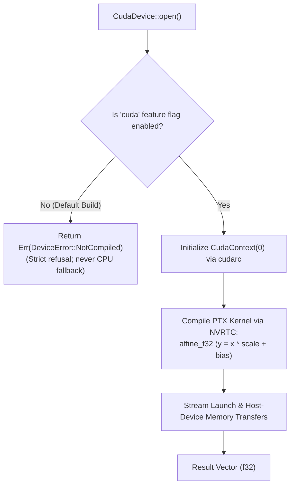

# ojas-cuda

`ojas-cuda` provides an optional NVIDIA CUDA GPU driver and kernel execution probe for **ojas** via `cudarc`.

It is feature-gated under `--features cuda` and is disabled in the default workspace build.

---

## Execution Model & Compilation Gate

---

## Architectural Role & Boundaries

> [!NOTE]
> `ojas-cuda` does **not** implement the `ojas_core::Backend` trait and is not reachable from the Go C-ABI runtime (`ojas-capi`). It serves as an isolated affine kernel execution probe for systems testing on NVIDIA hardware.

---

## Defensive Countermeasures & Safety Guarantees

> [!IMPORTANT]
> 1. **Zero Silent Fallback:** Attempting to invoke CUDA operations in a build without `--features cuda` immediately returns `Err(DeviceError::NotCompiled)`. The engine **never silently redirects GPU workloads to host CPU execution**.
> 2. **Device Mismatch Defense:** Passing a mismatched device handle (such as `Device::Cpu`) to `CudaDevice::affine_f32` raises `Err(DeviceError::DeviceMismatch)` loud and early.
