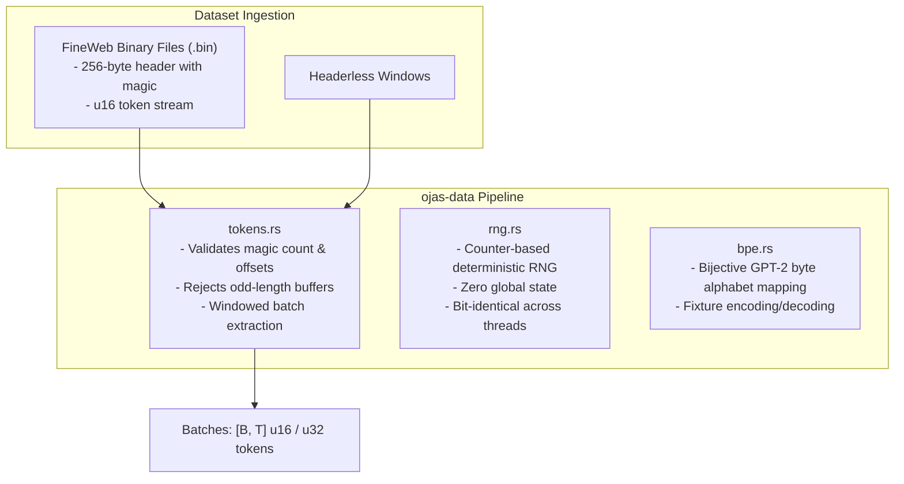

# ojas-data

`ojas-data` provides token streaming from pre-tokenized binary files, counter-based deterministic RNG, and BPE tokenizer fixtures.

---

## Data Pipeline

---

## Tokenizer Invariant: Byte Identity

`TIKTOKEN_GPT2_BYTE_IDENTITY` is `"verified-20-strings"`. Those twenty strings match tiktoken 0.12.0 `gpt2` `encode_ordinary`. That is not a full-corpus check.
