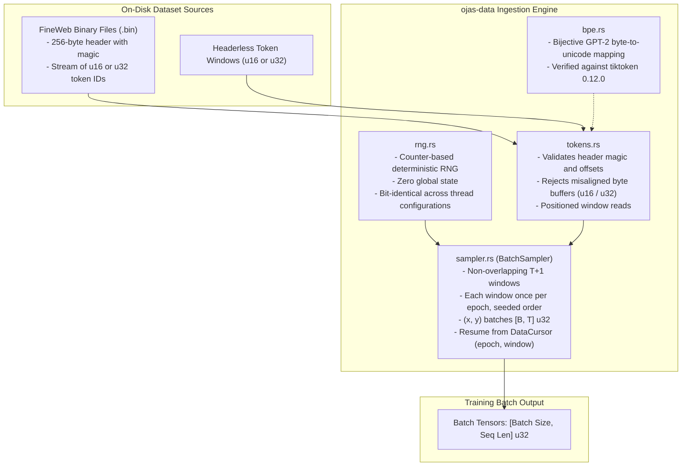
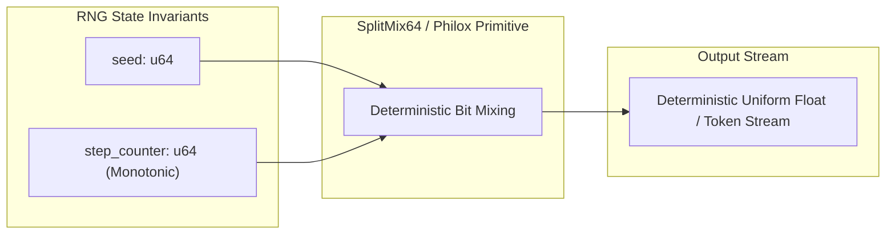

# ojas-data

`ojas-data` provides token streaming from pre-tokenized binary datasets, counter-based deterministic pseudo-random number generators, and GPT-2 byte-pair encoding (BPE) tokenization routines.

---

## Data Pipeline Architecture

`BatchSampler` covers `W = (len - 1) / T` windows; window `k` is tokens
`[kT, kT + T]`, `x` its first `T` and `y` its last `T`. Each epoch visits
every window once in an order keyed by `(seed, epoch)` (a Feistel
permutation over `CounterRng`, so no per-epoch table). A batch that runs
past the end of an epoch continues into the next one. The checkpoint's
`DataCursor` stores the epoch in `shard` and the next window's ordinal in
`token_index`. nanolab's batcher instead draws starts uniformly with
replacement; this sampler does not reproduce that stream.

---

## Deterministic Counter-Based RNG

> [!NOTE]
> Unlike standard global RNG state (which causes nondeterministic outputs when threads interleave), counter-based RNG state evaluates purely as a function of `(seed, step, index)`. Successive executions produce bit-identical training batches regardless of thread scheduling.

---

## Defensive Countermeasures & Hardening

> [!IMPORTANT]
> 1. **Buffer Length Validation:** Token buffer decoders reject misaligned byte sequences (odd lengths for `u16`, non-multiples of 4 for `u32`), preventing misaligned memory reads.
> 2. **Header Magic Verification:** Binary dataset files must present valid magic headers; corrupted or truncated headers fail immediately.
> 3. **BPE Byte Identity:** `TIKTOKEN_GPT2_BYTE_IDENTITY` is verified against `tiktoken 0.12.0` `encode_ordinary` on 20 reference strings.
