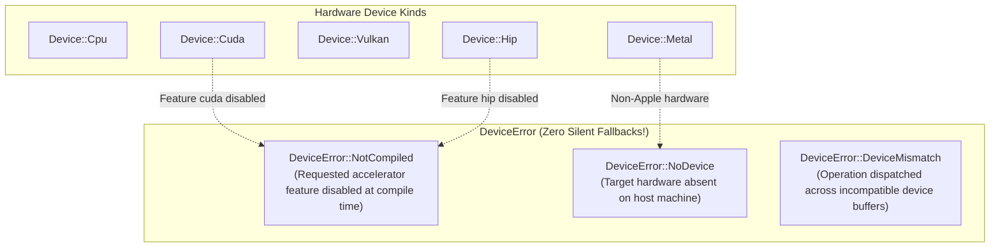
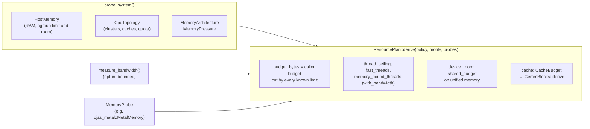

# ojas-device

`ojas-device` provides hardware device enumeration, host resource probing, memory planning (`ResourcePolicy`), and strict error propagation for hardware accelerators across **ojas**.

---

## Device Enumeration & Fallback Policy

---

## Host Probing & Resource Planning

`probe_system()` reads the machine once: memory, CPU topology, caches, memory architecture and pressure. Every field is a `MemoryReport`: `Known(n)` when a probe read it, `Unknown` when it could not. Nothing is filled in from a table.

| Field | macOS | Linux |
| :--- | :--- | :--- |
| RAM total / available | `hw.memsize`; free + inactive pages | `/proc/meminfo` `MemTotal`, `MemAvailable` |
| cgroup memory limit and room | none | tightest `memory.max` (v2) or `memory.limit_in_bytes` (v1) over the cgroup **and its ancestors**; room is the limit less the working set (usage less `inactive_file` page cache) |
| CPUs: logical, physical, usable | `hw.logicalcpu`, `hw.physicalcpu`, `available_parallelism` | `/sys/devices/system/cpu/online`, `topology/core_id`, `available_parallelism` |
| Core clusters (fastest first) | `hw.perflevelN.*` (name, cores, L1d, L2, CPUs per L2) | Intel `cpu_core`/`cpu_atom`, else arm64 `cpu_capacity`, else one cluster |
| L3, cache line, page | `hw.l3cachesize` (Apple silicon reports none), `hw.cachelinesize`, `hw.pagesize` | `cache/index*`, `sysconf(_SC_PAGESIZE)` |
| cgroup CPU quota | none | tightest `cpu.max` / `cpu.cfs_quota_us` over the cgroup and its ancestors |
| Memory architecture | `Unified` on Apple silicon (`hw.optional.arm64`) | `Unknown` (a GPU probe can say more) |
| Memory pressure | `kern.memorystatus_vm_pressure_level` | `Unknown` |

Windows and other targets build and report `Unknown` for everything except the usable CPU count.

Copy bandwidth is **not** measured at startup. `measure_bandwidth(&BandwidthConfig)` copies one buffer into another on 1 and on N threads and keeps the fastest of several repetitions. Allocation is fallible and capped at 64 MiB per buffer for every caller (two buffers, shared by the threads; `for_profile` may use less, down to 1/16 of available memory), wall time is capped, and the 1-minute load average is recorded so a figure taken on a busy machine reads as a lower bound. `cached_bandwidth` keeps the first successful measurement for the process; a refusal is not kept.

The plan never widens the caller's request:

- `budget_bytes` is the caller's budget cut by total RAM, available RAM, the cgroup limit, and the cgroup room. Under `MemoryPressure::Critical`, `budget_bytes` is cut to `0` (critical pressure admits no new allocations).
- On unified memory a GPU's allocations come out of the same RAM as the CPU's. Such a device's `device_room` is at most `budget_bytes`, and `shared_budget` is set: charge the CPU backend and that GPU backend to **one** `Budget`, not one each.
- Thread counts are advice. `thread_ceiling` is the usable CPU count capped at `CPU_THREAD_CEILING` and cut to the cgroup CPU quota (rounded down to whole CPUs, at least 1). `fast_threads` is the fastest cluster's count, and `memory_bound_threads` is unknown until a bandwidth measurement is supplied.
- `GemmBlocks::derive(&plan.cache, mr, nr, elem_bytes)` sizes `kc` from the smallest L1, `mc` from the smallest L2 share, and `nc` from the L3 (simplified from Low et al., 2016). `nc` is `None` when no L3 is reported, as on Apple silicon: the L2 already holds the A blocks, so it is not used for the B panel. `nc` assumes one B panel shared by the cores on the L3; a kernel whose threads each pack their own must divide it by those threads. It is a recommendation; no kernel switches to it without an explicit constructor and a benchmark.

---

## The "Never Fall Back" Guarantee

> [!IMPORTANT]
> **No Silent CPU Fallbacks:** Most legacy machine learning frameworks silently route missing accelerator workloads onto the host CPU when a GPU is misconfigured or missing. This masks operational deployment errors and produces catastrophic latency spikes.
> 
> In `ojas`, selecting `Device::Cuda` or `Device::Hip` when that runtime is disabled returns `Err(DeviceError::NotCompiled)` immediately. Calling an unsupported operation on a device returns `Err(DeviceError::DeviceMismatch)`.

> [!NOTE]
> `ojas-device` defines device kinds and memory policies; it does **not** open GPU contexts or implement compute backends. Driver initialization and backend kernels reside in `ojas-metal`, `ojas-wgpu`, `ojas-cuda`, and `ojas-hip`.
