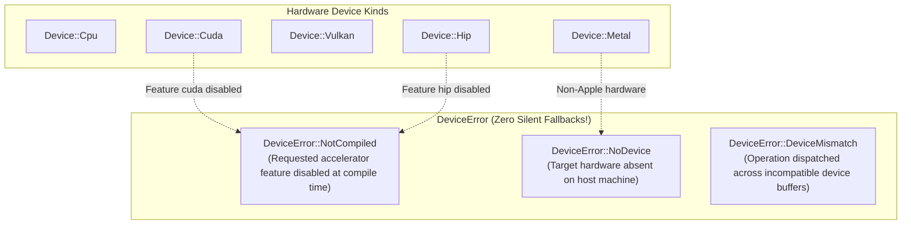
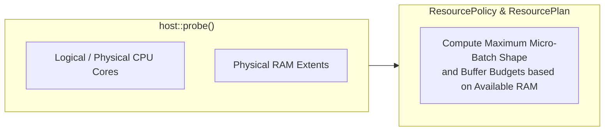

# ojas-device

`ojas-device` provides hardware device enumeration, host resource probing, memory planning (`ResourcePolicy`), and strict error propagation for hardware accelerators across **ojas**.

---

## Device Enumeration & Fallback Policy

---

## Host Probing & Resource Planning

`ojas-device` probes host CPU core topology and physical memory capacity to plan training and inference resource allocations:

---

## The "Never Fall Back" Guarantee

> [!IMPORTANT]
> **No Silent CPU Fallbacks:** Most legacy machine learning frameworks silently route missing accelerator workloads onto the host CPU when a GPU is misconfigured or missing. This masks operational deployment errors and produces catastrophic latency spikes.
> 
> In `ojas`, selecting `Device::Cuda` or `Device::Hip` when that runtime is disabled returns `Err(DeviceError::NotCompiled)` immediately. Calling an unsupported operation on a device returns `Err(DeviceError::DeviceMismatch)`.

> [!NOTE]
> `ojas-device` defines device kinds and memory policies; it does **not** open GPU contexts or implement compute backends. Driver initialization and backend kernels reside in `ojas-metal`, `ojas-wgpu`, `ojas-cuda`, and `ojas-hip`.
