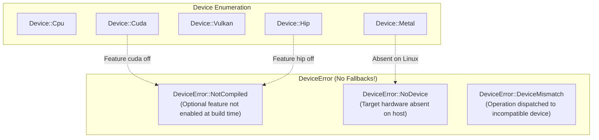

# ojas-device

`ojas-device` provides hardware device identification, hardware probing facilities, and strict error propagation for non-available backends.

---

## Hardware Hierarchy

---

## Core Philosophy: Never Fall Back

Most deep learning frameworks silently route missing accelerator workloads onto the host CPU. This masks deployment errors and produces unpredictable performance cliffs.

In `ojas`, selecting `Device::Cuda` when the `cuda` feature is disabled returns `Err(DeviceError::NotCompiled)` immediately. Calling an unsupported operation on a device returns `Err(DeviceError::DeviceMismatch)`.
