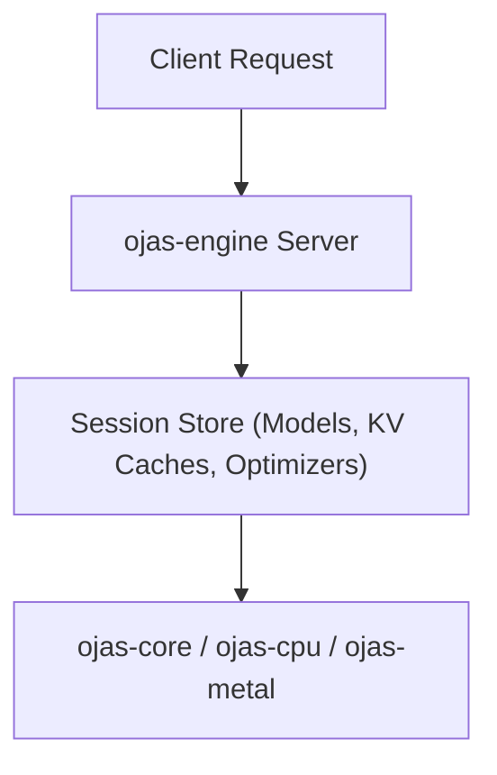

# ojas-engine

`ojas-engine` scaffolds standalone daemon session management.

---

## Session Architecture

*Note: In-process foreign language hosting (such as the Go client) is currently driven through [`ojas-capi`](file:///Users/bharath/Code/research/ojas/ojas-capi) and [`ojas-gusset-engine`](file:///Users/bharath/Code/research/ojas/ojas-gusset-engine).*
