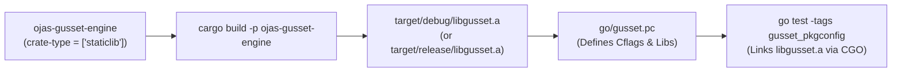

# ojas-gusset-engine

`ojas-gusset-engine` compiles the umbrella `staticlib` archive (`libgusset.a`) consumed by the Go client via CGO and `pkg-config`.

---

## Build & Linking Pipeline



---

## Configuration

The pkg-config specification file [`go/gusset.pc`](file:///Users/bharath/Code/research/ojas/go/gusset.pc) points directly to the compiled archive:

```ini
prefix=${pcfiledir}/..
libdir=${prefix}/target/debug
includedir=${prefix}

Name: gusset
Description: gusset with ojas engine built in
Version: 0.1.0
Libs: -L${libdir} -lgusset -framework Security -framework CoreFoundation -lpthread -ldl -lm
```
