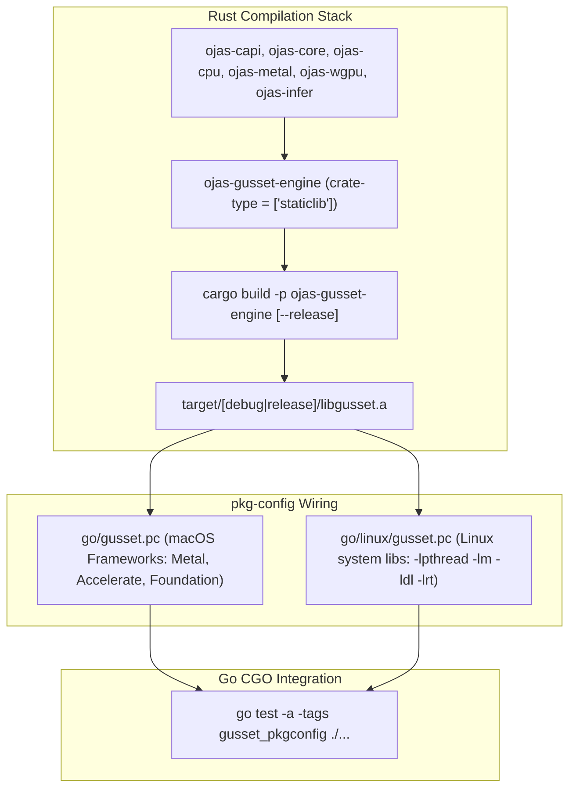

# ojas-gusset-engine

`ojas-gusset-engine` compiles the umbrella `staticlib` archive (`libgusset.a`) consumed by the Go client package (`github.com/bharathvbcr/ojas/go`) via CGO and `pkg-config`.

---

## Build & Linking Pipeline



---

## Pkg-Config Specification (`go/gusset.pc`)

```ini
prefix=${pcfiledir}/..
libdir=${prefix}/target/debug
includedir=${pcfiledir}/../../../devtools/gusset/internal/ffi

Name: gusset
Description: ojas umbrella staticlib (libgusset.a)
Version: 0.0.2
Libs: -L${libdir} -lgusset -lpthread -lm -ldl -lobjc -framework Metal -framework Foundation -framework QuartzCore -framework CoreFoundation -framework CoreGraphics -framework Accelerate
Cflags: -I${includedir}
```

---

## Compilation Invariants & Reminders

> [!CAUTION]
> **Go Build Cache Invalidation:** Go's build caching mechanism does not monitor changes to externally built C/Rust archives like `libgusset.a`. When rebuilding `ojas-gusset-engine`, **always run `go test` with the `-a` flag** (force recompile) to avoid linking against stale object files:
> ```bash
> cargo build -p ojas-gusset-engine
> cd go && PKG_CONFIG_PATH="$PWD" go test -a -tags gusset_pkgconfig -v -count=1 ./...
> ```

> [!NOTE]
> On Linux machines, point `PKG_CONFIG_PATH` to `go/linux` so that macOS-specific frameworks (`-framework Accelerate`, `-framework Metal`) are omitted in favor of standard Linux runtime libraries.
