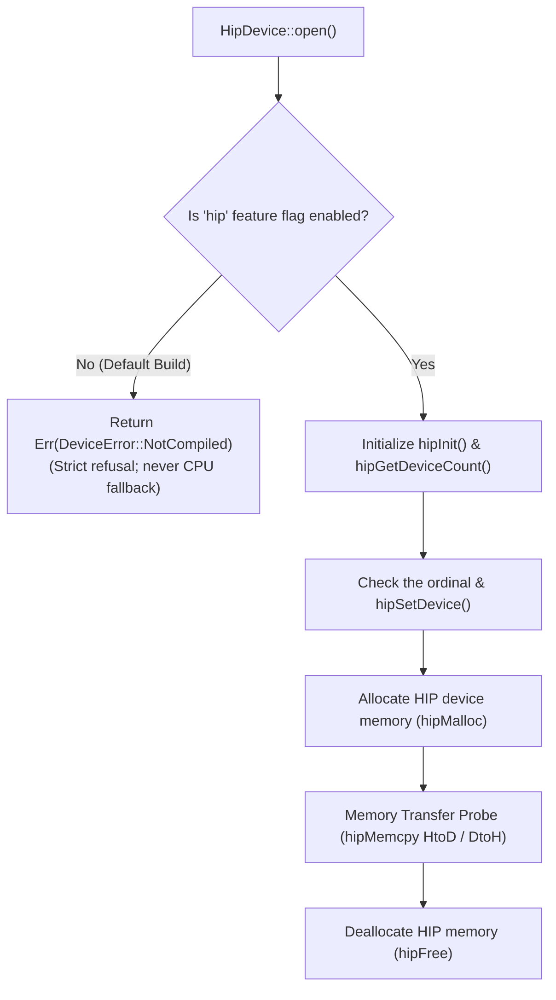

# ojas-hip

`ojas-hip` provides an optional AMD ROCm/HIP GPU memory and execution probe for **ojas** via `hip-runtime-sys`.

It is feature-gated under `--features hip` and is disabled in the default workspace build.

---

## Execution Model & Compilation Gate

---

## Architectural Role & Boundaries

> [!NOTE]
> `ojas-hip` does **not** implement the `ojas_core::Backend` trait and carries no compute kernels. It operates strictly as an isolated device and memory transfer probe for AMD ROCm hardware. A full HIP backend is planned: see [`tasks/gp-hip-backend.md`](../tasks/gp-hip-backend.md) and the HIP decision in [`docs/backends.md`](../docs/backends.md).

`HipDevice::open()` opens device 0; `HipDevice::open_ordinal(n)` opens device `n` and refuses an ordinal outside `hipGetDeviceCount` with `NoDevice`. Every copy sets the device first, because HIP keeps the current device per thread.

---

## Defensive Countermeasures & Safety Guarantees

> [!IMPORTANT]
> 1. **Zero Silent Fallback:** Invocations in builds without `--features hip` return `Err(DeviceError::NotCompiled)` immediately. **Missing ROCm drivers never silently trigger CPU execution.**
> 2. **Device Mismatch Defense:** Passing a device kind other than `Device::Hip` to `HipDevice::copy_roundtrip` immediately raises `Err(DeviceError::DeviceMismatch)`.
> 3. **Failures are named by class:** a missing runtime or device (HIP status 3, 4, 35, 100, 101) is `NoDevice`; out of memory (2) is `Capacity`; any other status from a device that answered, including copy, stream and event failures, is `Launch`.
> 4. **Every `unsafe` site carries a `// SAFETY:` comment.** HIP calls go through a local `extern "C"` block that returns the raw `c_int` status, so a status the binding's `hipError_t` enum does not list cannot be an invalid enum value. The crate is `forbid(unsafe_code)` when the `hip` feature is off.
