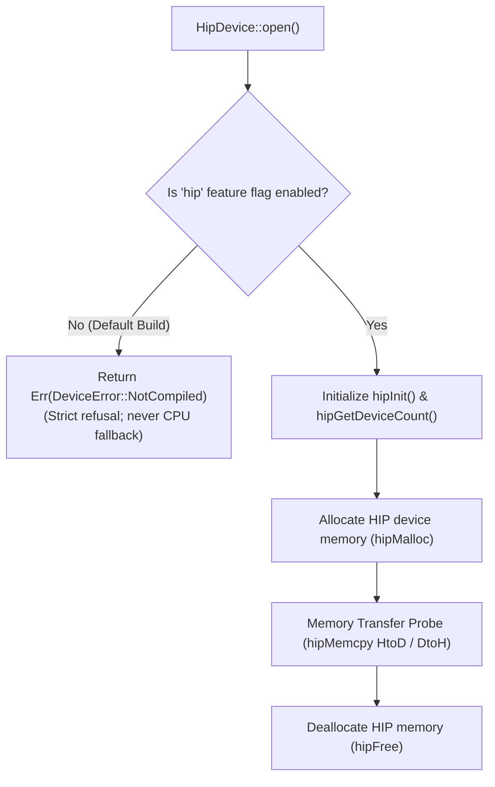

# ojas-hip

`ojas-hip` provides an optional AMD ROCm/HIP GPU memory and execution probe for **ojas** via `hip-runtime-sys`.

It is feature-gated under `--features hip` and is disabled in the default workspace build.

---

## Execution Model & Compilation Gate

---

## Architectural Role & Boundaries

> [!NOTE]
> `ojas-hip` does **not** implement the `ojas_core::Backend` trait and carries no compute kernels. It operates strictly as an isolated device and memory transfer probe for AMD ROCm hardware.

---

## Defensive Countermeasures & Safety Guarantees

> [!IMPORTANT]
> 1. **Zero Silent Fallback:** Invocations in builds without `--features hip` return `Err(DeviceError::NotCompiled)` immediately. **Missing ROCm drivers never silently trigger CPU execution.**
> 2. **Device Mismatch Defense:** Passing an incompatible device handle to `HipDevice::affine_f32` immediately raises `Err(DeviceError::DeviceMismatch)`.
