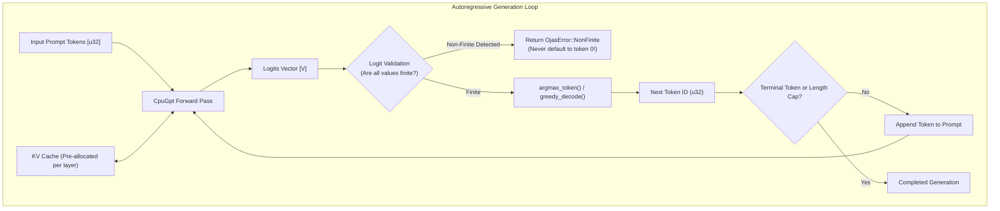

# ojas-infer

`ojas-infer` implements an autoregressive inference engine with KV caching, greedy token decoding, and strict logit validation.

---

## Inference Architecture

---

## Key Invariants

1. **Finite Logit Requirement:** Upstream engines have suffered from defects where an all-NaN logit vector silently falls back to token 0. In `ojas-infer`, any non-finite logit produces `OjasError::NonFinite`, failing immediately rather than poisoning inference.
2. **KV Cache Bounds:** Cache slots advance monotonically and refuse writes beyond allocated sequence limits.
3. **Tied Embedding Decoding:** Matrix multiplication utilizes tied embedding weights directly without duplicate allocations.
