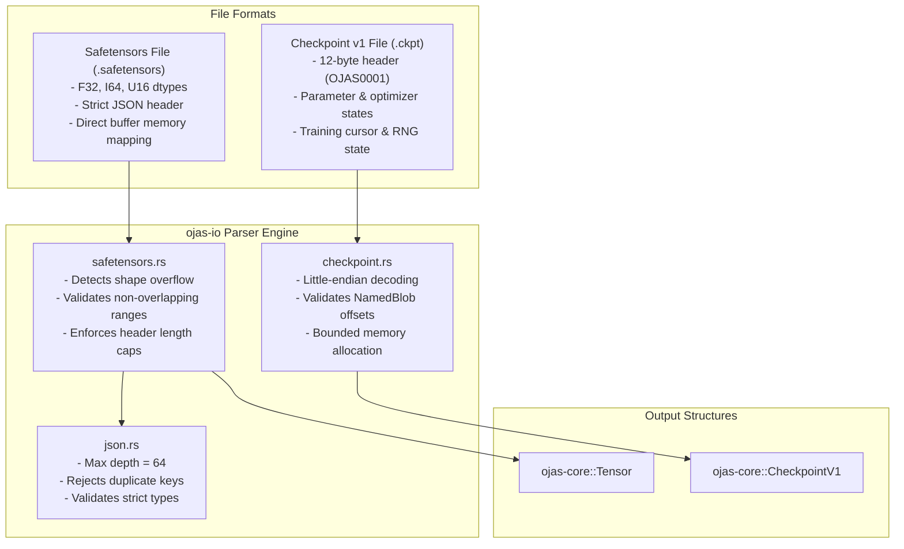

# ojas-io

`ojas-io` provides serialization and deserialization routines for **safetensors** model files and binary **Checkpoint v1** containers.

---

## Formats Handled

---

## Safety & Hardening Invariants

1. **Header Length Limits:** Safetensors header sizes are capped to prevent denial-of-service via corrupted header allocations.
2. **Duplicate Key Rejection:** JSON and safetensors readers reject files containing duplicate parameter keys.
3. **No Overlapping Ranges:** Tensor byte spans inside safetensors files must not overlap. Overlapping data ranges return an error.
4. **Shape Overflow Protection:** If the product of dimension sizes exceeds integer limits, decoding is aborted before allocating buffers.
5. **JSON Parser Recursion Cap:** JSON parsing is bounded to a depth of 64 to prevent stack overflow from untrusted nested payloads.
