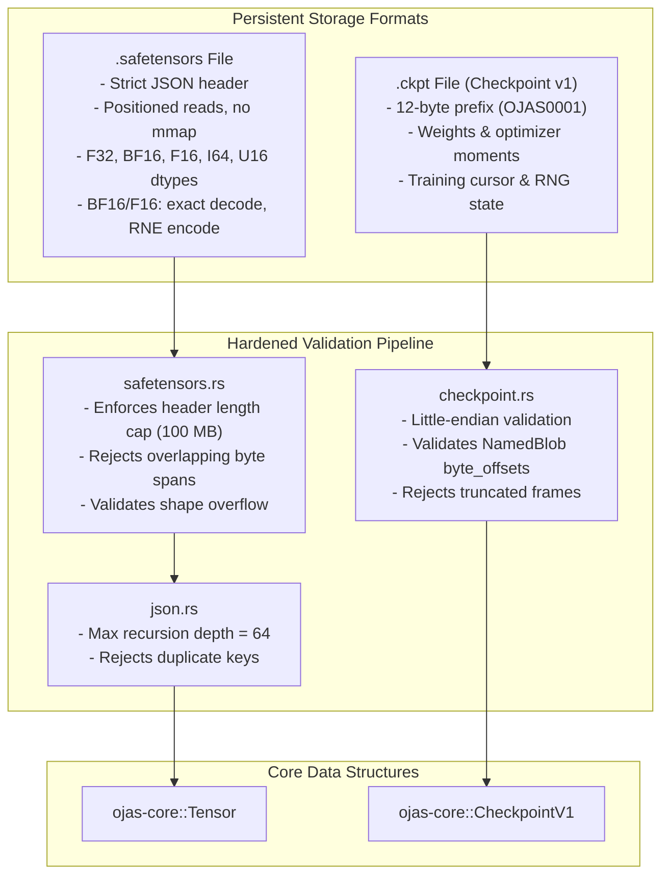
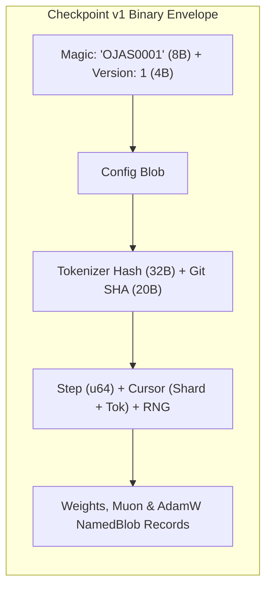

# ojas-io

`ojas-io` provides serialization and deserialization routines for **safetensors** model files and binary **Checkpoint v1** containers, hardened against malicious payloads, corrupted headers, and integer overflow attacks.

---

## Formats & Parsing Engine

---

## Binary Checkpoint v1 Record Structure

---

## Safety Invariants & Hardening Guarantees

> [!IMPORTANT]
> 1. **Header Length Enforcement:** Safetensors header sizes are capped at 100 MB (`MAX_HEADER_SIZE`) to prevent memory exhaustion from crafted denial-of-service headers.
> 2. **Duplicate Key Rejection:** Any JSON or safetensors header containing duplicate parameter identifiers returns `OjasError::InvalidSafetensors` immediately.
> 3. **Non-Overlapping Range Validation:** Tensor byte spans inside safetensors files must not overlap. Overlapping spans are rejected to eliminate memory alias vulnerabilities.
> 4. **Shape Overflow Detection:** If the product of dimension sizes overflows `usize` or `u64`, decoding halts before memory allocation.
> 5. **JSON Recursion Boundary:** JSON parsing is hard-limited to a maximum recursion depth of 64, preventing stack overflow from deeply nested payloads.
> 6. **Truncation Defense:** Checkpoint files truncated before an expected field boundary return `OjasError::TruncatedCheckpoint`—**never zero-padding missing data**.
