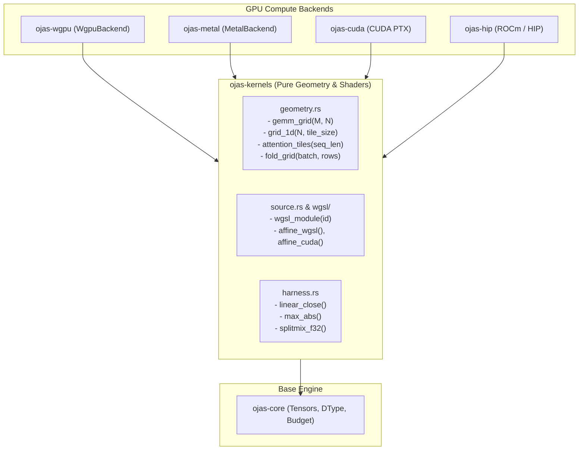
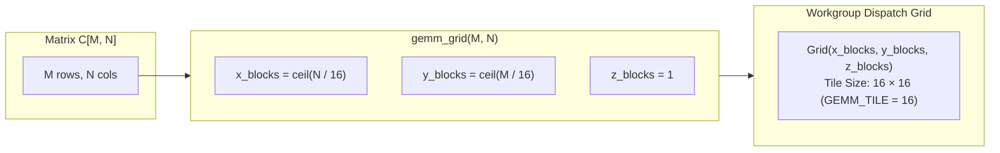
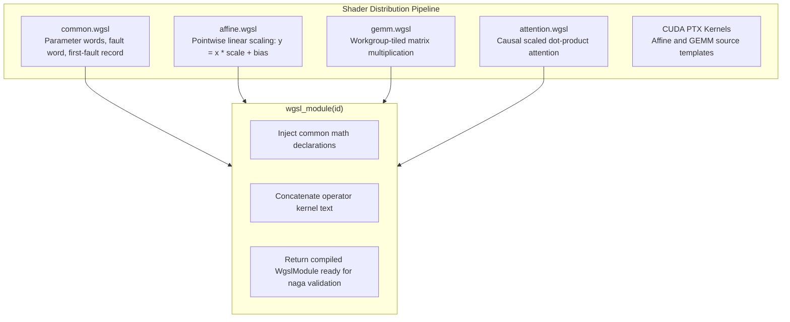

# ojas-kernels

`ojas-kernels` provides hardware-agnostic kernel source strings, workgroup execution grid geometry, shader assembly utilities, and mathematical parity harnesses for GPU backends across the **ojas** stack.

It depends exclusively on `ojas-core` (`#![forbid(unsafe_code)]`) and does not link directly to Metal, WebGPU, CUDA, or HIP driver runtimes.

> [!NOTE]
> By decoupling kernel text and grid geometry calculations from backend driver types, `ojas-kernels` enables out-of-process runners, cross-compilers, and lightweight unit testing of GPU dispatch logic without requiring a physical GPU adapter.

---

## Architectural Role

---

## Geometry & Workgroup Tiling

Execution grid dimensions are computed dynamically based on hardware limits and operator topologies:

### Key Geometric Invariants
* **`ATTENTION_MAX_HEAD_DIM = 64`:** Head dimensions for attention shaders are strictly capped at 64 to fit shared local memory tiles. Larger head dimensions are refused early with `OjasError::UnsupportedHeadDim`.
* **`GEMM_TILE = 16`:** Standard 2D workgroup tile size across both WGSL and CUDA affine and matrix kernels.
* **Checked Arithmetic:** `cover_1d` and `grid_1d` compute ceiling block counts using safe checked division: `(len + block - 1) / block`, asserting that block sizes are non-zero.

---

## Shader Catalog & Dispatch Modules

---

## Parity Verification Harness (`harness.rs`)

`linear_close` runs `linear_forward` on two backends from the same deterministic inputs (`splitmix_f32`), moving data with each backend's own `upload` and `download`, so a device backend runs its kernel. `ojas-wgpu/tests/parity.rs` calls it against `ojas-cpu`.

> [!IMPORTANT]
> `max_abs` returns `f64::INFINITY` when either side holds a non-finite value, so no tolerance accepts a NaN or infinite output.
