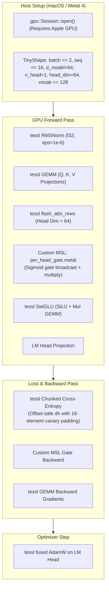

# ojas-metal

`ojas-metal` provides an Apple Silicon GPU training step running natively on macOS with **Metal 4**.

It bridges high-throughput GEMM and normalization kernels from `tessl` with a custom MSL shader for nanolab's per-head output gate.

---

## Metal Execution Pipeline

---

## Shaders & Kernels

### 1. Per-Head Sigmoid Gate (`kernels/per_head_gate.metal`)
Nanolab default GPT applies a linear gate with bias followed by sigmoid to modulate attention head outputs. `ojas-metal` compiles native MSL shaders:
* `per_head_gate_forward`: Computes $g = \sigma(x W_g + b_g)$ and outputs $y = \text{attn} \odot g$.
* `per_head_gate_backward`: Computes analytic gradients with respect to attention outputs and gate projections.

### 2. Cross-Entropy `dh` Canary Offset Defense
Upstream implementations often assume gradient slices start at buffer offset 0. `ojas-metal` prepends a canary prefix (`DH_PAD = 16`) to buffer allocations and verifies the prefix remains unaltered after cross-entropy writes (`ce_nonzero_dh_offset_keeps_prefix`).

### 3. Strict Head Dimension Policy
Metal flash-attention kernels are structured for $d_{\text{head}} = 64$. Any shape with $d_{\text{head}} > 64$ triggers `OjasError::UnsupportedHeadDim`, preventing silent memory corruption or silent truncation.
