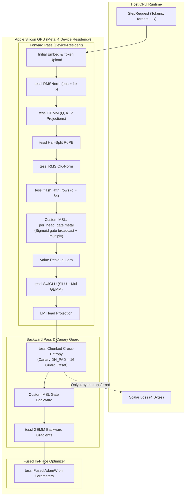
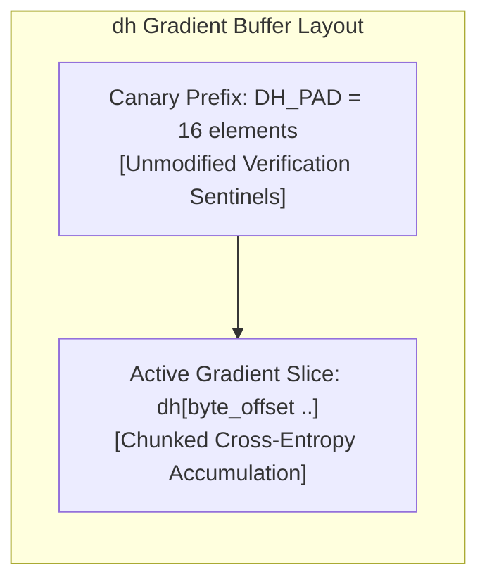

# ojas-metal

`ojas-metal` provides the native Apple Silicon GPU backend for **ojas**, executing the full deep learning training pipeline and inference directly on Apple M-series chips via **Metal 4**.

It bridges high-throughput GEMM, normalization, and flash-attention kernels from `tessl` with custom MSL (Metal Shading Language) shaders for attention output gating.

---

## Metal Execution & Memory Residency

Tensors remain device-resident across the entire forward, backward, and optimizer cycle, reading back only the final scalar loss (4 bytes) or greedy logits (8 bytes) to host memory:

---

## Hardware Shaders & Custom MSL

### 1. Per-Head Attention Gate (`kernels/per_head_gate.metal`)
Nanolab default GPT applies a linear gate with bias followed by sigmoid modulation to scale attention heads. `ojas-metal` implements dedicated Metal shaders:
* **Forward Kernel:** Computes $g = \sigma(x W_g + b_g)$ and evaluates $y = \text{attn} \odot g$.
* **Backward Kernel:** Computes analytic adjoint gradients $\frac{\partial \mathcal{L}}{\partial \text{attn}}$ and $\frac{\partial \mathcal{L}}{\partial W_g}$ on the device.

### 2. Backend Extension Shaders (`kernels/ojas_backend.metal`)
Implements elementwise operations, vector arithmetic, and reduction passes required by `ojas_core::Backend`, plus:
* **`permute`** (`ojas_permute`): a device-resident, bit-exact axis reorder up to rank 8, such as `[B, T, H, D]` to `[B, H, T, D]`. A NaN or infinity in the input is refused, as on the CPU reference, at the next sync point (see "Deferred faults" below).
* **AdamW** (`ojas_adamw_check`, `ojas_adamw_apply`): torch's single-tensor step in tessl's f32 arithmetic, with scalars from `ojas_core::check_adamw`. The step is in place and needs no scratch.
  * The check kernel decides the whole step: inputs and every new p, m and v must be finite.
  * The apply kernel, in the same command buffer, writes only if this call's status words are clear. A refused step leaves all three tensors bit-identical and is reported at the next sync point.
  * No wait, and no copies.
* **RMSNorm** (`ojas_rms_fwd`, `ojas_rms_bwd_rows`, `ojas_rms_bwd_w_{part,sum}`): one simdgroup per row.
  * The weight gradient is a two-stage, fixed-order reduction (64-row partials, then a sum per column), so it is deterministic.
* **Cross-entropy** (`ojas_ce_fused`): two passes per row (an online max/sum, then the gradient) instead of five.
  * The input and output finiteness checks are folded into those passes. Every element is still checked, including rows whose target is ignored.
* **Gradient accumulation** (`ojas_acc_check`, `ojas_acc_apply`): `accumulate_grad` adds in place, with no new memory, when `acc` solely owns its buffer, and is checked as AdamW is.
  * A non-finite input or sum is refused at the next sync point and leaves `acc`'s values bit-identical.
  * A shared `acc` gets a new buffer (holding the old values if the sum was refused); the other handles keep the old values.
* **Linear cross-entropy** (`ojas_lce_stats`, `ojas_lce_loss`, `ojas_lce_grad`, `ojas_add_into`): `linear_cross_entropy_mean` never holds more than one `[rows, cols]` logits tile.
  * tessl GEMMs make each tile, and a running (max, sum of exp) per row is merged across vocabulary tiles.
  * With gradients, a second pass remakes each tile (or, when one vocabulary tile covers V, reuses the tile the first pass left), turns it into the gradient of the logits, and adds both gradient GEMMs into the outputs.
  * The loss equals the unfused composition's. Gradients that the chunk does not split are bit-equal; split ones differ in summation order only.
* **KV cache** (`ojas_kv_write`, `ojas_cached_attn`):
  * `kv_cache_write` copies `[B, Tn, Hkv, D]` into a time-major `[B, Tcap, Hkv, D]` cache in place, only if the source is finite. A range error is refused on the host, before any dispatch.
  * `cached_attention_forward` is grouped-query causal attention of `Tq` queries against the first `kv_len` positions, one 1,024-thread threadgroup per (query, head).
  * A call with fewer than about 96 such threadgroups, such as one decode request, walks the cache in up to 96 / rows splits of at least 64 keys. `ojas_cached_attn_merge` then combines them in a fixed order, so results still repeat bit for bit. One request at 1024 keys runs about 22% less GPU time (`bench/results/2026-10-04-split/`).
  * Positions at or past `kv_len` are not read.
* **QK-norm** validates and places both pairs first, so a refused call records nothing. It then runs as one command when q's and k's outputs and scratch fit the budget together; otherwise it runs the two `rms_norm_*` calls, which hold one side's scratch at a time.
* **Causal attention** (`ojas_attn_fwd_d*`, `ojas_attn_bwd_dr` and `ojas_attn_bwd_{dq,dkv}_d*`, at head dims 16, 32, 64, 128 and 256): FlashAttention-2 on the TensorOps matrix units (MetalPerformancePrimitives `matmul2d`), after tessl's `qwen35_attn_tiled.metal` and `qwen35_attn_bwd.metal`. Grouped-query heads read their KV head in place: the forward and dQ index KV head `h / (Hq / Hkv)`, and dK/dV run one threadgroup per KV head that loops its query heads in a fixed order. Nothing is repeated or summed back.
  * The forward is one dispatch with an online softmax. It writes the output and the row log-sum-exp.
  * The backward takes the saved output and log-sum-exp and is three dispatches: `rowsum(dO * O)`, dQ, then dK/dV. Its only scratch is that row sum, `B * Hq * T` floats.
  * An optional sliding window `W` (query `t` sees keys `t - W < j <= t`) skips whole key tiles before the window and masks inside the edge tile.
  * Each threadgroup rebuilds 32 x 32 score blocks in about 8 KiB of threadgroup memory, so nothing T x T is stored.
  * Every output row is written once with no atomics, so results repeat bit for bit.
  * A `[T, D]` plane must fit i32 extents.
* **Qwen3.5 hybrid-layer ops** (`tests/hybrid.rs`, against the CPU within 1e-5 of each tensor's peak):
  * `causal_conv1d_silu_*` runs tessl's `qwen35::conv1d_silu` from a zero state and `qwen35_bwd::conv1d_silu_bwd`, whose weight gradient is a fixed-order sum of 256-row partials. Widths other than 2 to 8 are `Unsupported`.
  * `gated_rms_norm_*` runs tessl's `qwen35::gated_rms_norm` and `gated_rms_norm_bwd` with one head per row. The backward takes rows of at most 512 values; a wider row is `Unsupported`.
  * `rope_partial_*` runs `ojas_rope` with a rotary width: the leading `R` values of each head turn and the rest are copied bit for bit. At `R = D` it is `rope_half_split`, bit for bit.
  * tessl's kernels take a buffer and a column window, not a byte offset, so an operand that does not start its buffer is copied first. Every operand and output is checked for non-finite values, and a fault is deferred as for the other ops.
  * `sigmoid_*` (`ojas_sigmoid_fwd/bwd`) and `gdn_log_decay_*` (`ojas_gdn_decay_fwd`, `ojas_gdn_decay_bwd`, `ojas_gdn_decay_bwd_sum`) are ojas's own elementwise kernels; the softplus is tessl's `qwen35_softplus`, copied (a series below -3, where `log(1 + e^x)` loses most of the value). The `A_log` and `dt_bias` gradients are one thread per head summing the rows in ascending order. They bind operands at any byte offset, check their own operands and outputs, and defer a fault as the other elementwise kernels do.
  * `chunked_gdn_*` runs tessl's `gdn_train` (`tests/gdn.rs`). With the gates above these make up a linear-attention layer on the tape (`ojas-model/tests/metal_hybrid_tape.rs`), and the whole Qwen3.5 tower runs natively on Metal (`ojas-model/tests/qwen35_metal_tape.rs` on tessl's fixture against transformers; `ojas-qwen35/tests/gpu_tape_2b.rs` on the real 2B).

---

## Cross-Entropy Canary Offset Defense

> [!CAUTION]
> Legacy Metal implementations frequently overwrite memory preceding a buffer slice because internal kernels forcibly assume an offset of zero (`Cols::dense`). 
> 
> `ojas-metal` reserves `DH_PAD = 16` padding elements before the `dh` slice and rigorously verifies in test `ce_nonzero_dh_offset_keeps_prefix` that the leading prefix remains bit-identical after cross-entropy writes.

---

## Key Invariants & Refusal Policies

> [!IMPORTANT]
> 0. **Shape First** (`docs/shape-contract.md`): every op calls its `ojas_core::shapes` validator before placement, contiguity, token-id ranges, device limits or the budget, so a malformed call returns the validator's exact error whatever the budget holds and wherever its operands live. `tests/shape_first.rs` sweeps every op in four modes (Budget 0, a cap that holds only the inputs, a NaN operand, host operands).
> 1. **Strict Head Dimension Refusal:** `MetalBackend` refuses $d_{\text{head}} > 256$ (`ojas_core::METAL_MAX_HEAD_DIM`) with `Err(OjasError::UnsupportedHeadDim)`—never silently clamping or dropping high-index features. The attention kernels are compiled up to 256. The cap is a device limit, checked after the shape validator. Grouped-query causal SDPA repeats KV heads into that kernel and sums the KV gradients.
> 2. **AdamW Step Counter Safety:** Step increments use checked integer math. When `step` reaches `u64::MAX`, the kernel halts with an error instead of wrapping to zero.
> 3. **Device Residency Invariant:** No intermediate activations or gradients are downloaded to the host during `Step`. Only the 4-byte scalar loss is read back.
> 4. **Deferred Faults** (`docs/metal-deferred-faults.md`): an op whose kernels find a NaN or infinity returns `Ok`; the next `sync`, `download` or `clip_grad_norm` on the backend returns `OjasError::NonFinite` naming the first such op in recording order, once. Shape, dtype, placement, capacity, head-dim, range and token-id refusals stay immediate. Ops are recorded into one command buffer and wait only at those sync points, at reads and uploads made while work is recorded, and at memory and status-slab caps.
